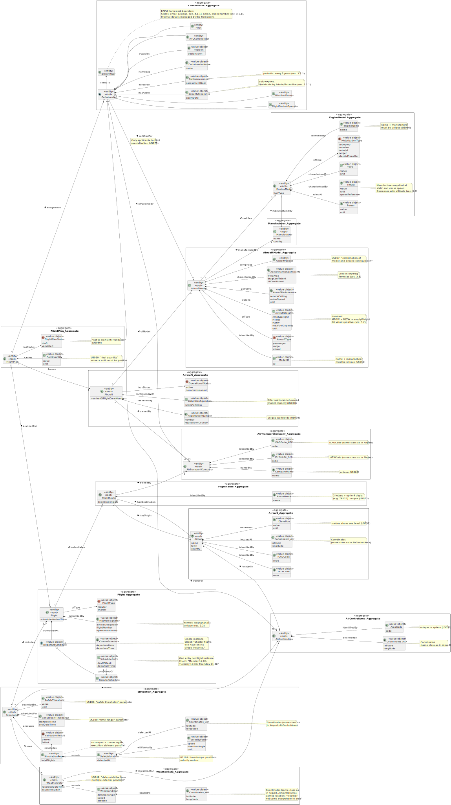

# US010 — Domain Model

## 1. Context

This task was assigned in Sprint 1 (Sprint A). It is the first time this task is being developed. The objective is to elaborate a Domain Model using Domain-Driven Design (DDD) that captures all the business concepts, rules, and relationships of the AISafe flight control system. The domain model serves as the foundation for all subsequent implementation sprints and must be kept as a living artefact throughout the project.

### 1.1 List of Issues

- Analysis: #19 (Domain Model), #12 (Glossary)
- Design: #19 (Domain Model)
- Implement: N/A — this is a design artefact
- Test: Validated against requirements, use cases, and client clarifications

---

## 2. Requirements

**US010** As Project Manager, I want the team to elaborate a Domain Model using DDD. Because AISafe domain is complex, involving distinct areas and complex business rules. We will adopt DDD as a framework for tackling complexity in our software solution, and ensure the software is a valid implementa tion of the business needs.

**Acceptance Criteria:**

- US010.1 All relevant business concepts from the requirements document and use cases must be identified and classified as entity or value object.
- US010.2 All associations must have navigability and cardinality indicated. No bidirectional associations are permitted.
- US010.3 Aggregates must be identified and bounded by business invariants. Cross-aggregate references must point only to aggregate roots.
- US010.4 All concepts in the diagram must have a corresponding entry in the glossary, and vice versa.
- US010.5 The domain model must be validated against all use cases — it must be possible to navigate the model to answer every use case.
- US010.6 Value objects must not hold references to entities outside their aggregate boundary.
- US010.7 No concepts may be added beyond what is explicitly stated in the requirements document or client clarifications.

**Dependencies/References:**

- US001 — Technical constraints (DDD methodology, PlantUML for diagrams)
- US002 — Project repository (diagrams stored in docs/ folder)
- US011 — Aggregate justification depends on this domain model
- All functional USs (US030–US114) — the domain model must support navigation of all these use cases

---

## 3. Analysis

### 3.1 Methodology

The domain model was elaborated following the process described in the *Processo de Engenharia de Aplicações* document (Paulo Gandra de Sousa, ISEP):

1. **First**, all business concepts and relationships were identified from the requirements document and use cases.
2. **Then**, each concept was classified as entity or value object.
3. **Only after** both steps were complete were the aggregates identified and bounded.

The model reflects the **EAPLI Java application scope only**. The following are explicitly outside scope: SystemUser internals (EAPLI framework), C simulation execution (SCOMP), DSL grammar and parser (LPROG), network protocols (RCOMP).

### 3.2 Entity vs Value Object Classification

The key criterion applied: **if a concept has a business rule (format, uniqueness, validation, invariant), it should be a value object — not a plain attribute.** A value object is the information expert for its own validation.

**Entities** — have business identity and an independent lifecycle:
Manufacturer, EngineModel, AircraftModel, AircraftVariant, Aircraft, AirControlArea, Airport, AirTransportCompany, Collaborator (abstract), ATCCollaborator, Pilot, FlightControlOperator, WeatherPerson, SystemUser (framework boundary), FlightRoute, Flight, FlightPlan, WeatherData, Simulation, SimulationReport, SafetyViolation.

**Value Objects — constitutive (composition \*--)** — characterise an entity, no independent lifecycle:
EngineName, Power, Thrust, TSFC, ModelID, AircraftWeights, AircraftPerformance, AerodynamicCoefficients, RegistrationNumber, CabinConfiguration, AreaCode, Coordinates, IATACode, ICAOCode, Elevation, CompanyName, CollaboratorName, Position, SecurityClearance, SkillsAssessment, RouteName, FlightDesignator, DepartureSchedule, RegularSchedule, CharterSchedule, FuelQuantity, SimulationTimeRange, SafetyThreshold, VelocityVector, WindCondition.

**Value Objects — enumerations (association -->)** — fixed sets of domain values:
MotorizationType, AircraftType, OperationalStatus, FlightType, FlightPlanStatus, ValidationResult.

### 3.3 Key Design Decisions

**Decision 1 — Enumerations use association (-->) not composition (\*--)**
Enumerations are referenced values, not parts owned by an entity. The entity references an enum value but does not manage its lifecycle. Applied to: MotorizationType, AircraftType, OperationalStatus, FlightType, FlightPlanStatus, ValidationResult.

**Decision 2 — Enum vs hierarchy of Value Objects**
When cases of a concept have different data structures, a hierarchy of VOs is used. When cases are only state values with no distinct structure, an enum is used.
- DepartureSchedule uses a hierarchy: RegularSchedule (daysOfWeek) and CharterSchedule (departureDate) have structurally different data. The requirements state explicitly: *"Departure day (or days of the week for regular flights and actual date for a charter)"* (sec. 3.2).
- FlightPlanStatus uses an enum: draft and validated are state values with no distinct structure.

**Decision 3 — Collaborator is abstract**
Collaborator is abstract because a generic collaborator never exists in the system — there is always a concrete specialisation: ATCCollaborator, Pilot, FlightControlOperator, or WeatherPerson. The requirements identify collaborators always by their specific role.

**Decision 4 — certifiedFor association on Collaborator root (not Pilot)**
US075 states: *"A pilot is certified to pilot one or more aircraft models."* The certification belongs semantically to Pilot. However, Pilot is an internal entity of the Collaborator aggregate. DDD rule: nothing outside the aggregate boundary can hold a reference to anything inside — cross-aggregate references must use the root. Therefore the association is declared on the Collaborator root with multiplicity \* (zero or more), knowing that in code only the Pilot class implements the certification list. ATCCollaborator, FCO, and WeatherPerson have empty lists.

**Decision 5 — Pilot is not a separate aggregate**
Although Pilot has specific behaviour (certifications, invariant from US077: cannot deactivate with assigned flight plans), the data of Pilot and Collaborator are always manipulated together. Creating a Pilot is creating a Collaborator with certifications in one operation. The DDD criterion for a separate aggregate — entities that must be manipulated together with their own invariants — is not met independently of the Collaborator context.

**Decision 6 — Admin and Backoffice Operator not modelled**
These are internal actors managed by the EAPLI framework with no domain-specific business rules beyond authentication and authorisation. They are not collaborators of external customers. Only the four collaborator types that belong to external customers (ATCCollaborator, Pilot, FCO, WeatherPerson) are modelled.

**Decision 7 — email and phoneNumber not in Collaborator**
Section 3.1.1 states: *"A user also has a name and phone number."* Section 3.1.3 states: *"Email, name and position will probably be enough."* These attributes belong to SystemUser (EAPLI framework). Duplicating them in Collaborator would violate the framework boundary. They are referenced in the SystemUser note.

**Decision 8 — SecurityClearance with expiryDate only**
Section 3.1.1 states: *"An AISafe user needs to have an active security clearance that automatically expires at a given date."* Only the expiry date is mentioned. No clearance level is mentioned in the requirements.

**Decision 9 — SkillsAssessment with assessmentDate only**
Section 3.1.1 states: *"They also need to have periodic (per regulations 5 years) skills assessment."* Only the date is needed to verify the 5-year period. No result is mentioned in the requirements.

**Decision 10 — AircraftVariant as internal entity**
US057 explicitly introduces this concept: *"An aircraft model might have several aircraft variants (combinations of model and engine configuration)."* AircraftVariant holds a reference to EngineModel by ID only (not by object reference), respecting aggregate boundaries. It exists only within AircraftModel and has no independent lifecycle — composition.

**Decision 11 — FlightLeg, Segment, Node, AltitudeSlot absent from model**
Client clarification: *"I sincerely doubt we will need Flight Legs in the DDD Domain Model."* On Segment/Node: *"Can they be only part of a flight plan specification? Storing and managing all segments would be a lot of pain... can we avoid that?"* and *"I believe we don't have any user story about managing nodes/junctions."* These concepts belong to the DSL specification (LPROG) and are not managed independently by the Java application.

**Decision 12 — departureDayOrDate in Flight, not FlightPlan**
Section 3.2 lists departure day/time as a characterising attribute of Flight: *"Departure day (or days of the week for regular flights and actual date for a charter) and time."* This is what distinguishes different flights of the same route. Promoted to DepartureSchedule VO hierarchy (see Decision 2).

**Decision 13 — WeatherData does not link to Collaborator**
No user story or requirement states the need to track which WeatherPerson registered each WeatherData record. sourceProvider covers the external data source. Adding a link to Collaborator would introduce a cross-aggregate dependency without justification in the requirements.

**Decision 14 — SimulationStatus not modelled**
US100 lists simulation parameters: *"time range, geographic area, included flights, weather conditions, safety thresholds, performance settings."* No lifecycle status is mentioned. Not in the requirements — not modelled.

**Decision 15 — generatedAt not in SimulationReport**
Not mentioned in any US or requirement. SimulationTimeRange already provides start and end datetime of the simulation, which is sufficient to know when the simulation occurred.

**Decision 16 — AirControlArea has no name attribute**
US050 states: *"The area code must be unique in the system. Geographic boundaries must be valid."* No name is mentioned. Not modelled.

**Decision 17 — One use case updates one aggregate (ACID/BASE)**
Each use case modifies exactly one aggregate. Cross-aggregate references are read-only (for validation or navigation). Consistency between aggregates is eventual (BASE), not transactional.

**Decision 18 — No Services or Repositories in the domain model**
The domain model is a conceptual model of the business domain. Services and Repositories are implementation concerns — they appear in code (Repositories as interfaces per CO3) and sequence diagrams, not in the conceptual domain model.

### 3.4 Client Clarifications Applied

| Clarification | Impact |
|---|---|
| *"A pilot only works for an ATC at a time."* | Collaborator --> AirTransportCompany multiplicity 0..1 |
| *"You cannot simulate an aircraft behaviour without the engines."* | AircraftVariant internal entity linking model to engine |
| *"Route - 1:N - Flight - 1:N - Flight Plan."* | FlightPlan --> Flight --> FlightRoute direction confirmed |
| *"A route is owned by an ATC. Its ID includes the company ID."* | FlightRoute --> AirTransportCompany, RouteName VO with format rule |
| *"A route has two endpoints."* | FlightRoute hasOrigin and hasDestination to Airport |
| *"Weather conditions are not the same everywhere inside an air control area."* | WindCondition carries Coordinates and altitude |
| *"I sincerely doubt we will need Flight Legs in the DDD Domain Model."* | FlightLeg absent |
| *"Storing and managing all segments would be a lot of pain."* | Segment, Node, AltitudeSlot absent |
| *"You have to send information to run the simulation and receive feedback."* | Simulation aggregate present with SimulationReport and SafetyViolation |
| *"You don't need to detail performance settings in sprint 1."* | Generic SafetyThreshold and SimulationTimeRange only |
| *"Yes, it [Manufacturer] can [be both aircraft and engine maker]."* | Single Manufacturer entity covers both roles |

---

## 4. Design

### 4.1. Realization

The domain model diagram was produced using PlantUML and is available at:



Source: `docs/Sprint1/us_010/domain_model_ddd.puml`

**Notation conventions:**
- Package named `X_Aggregate` = aggregate boundary (suffix required so PlantUML renders cross-aggregate arrows from root class, not from package border)
- `*--` = composition (part cannot exist without the whole)
- `-->` = association (enum referenced but not owned, or framework boundary)
- `<|--` = inheritance (specialisation)
- Cross-aggregate associations declared outside packages, root to root only, with `>` reading direction indicator

**Cross-aggregate associations:**

| From | Mult. | To | Mult. | Relation |
|---|---|---|---|---|
| EngineModel | \* | Manufacturer | 1 | manufacturedBy |
| AircraftModel | \* | Manufacturer | 1 | manufacturedBy |
| AircraftModel | \* | EngineModel | 1..* | certifies |
| Aircraft | \* | AircraftModel | 1 | ofModel |
| Aircraft | \* | AirTransportCompany | 1 | ownedBy |
| Airport | \* | AirControlArea | 1 | locatedIn |
| Collaborator | \* | AirTransportCompany | 0..1 | employedBy |
| Collaborator | \* | AirControlArea | 0..1 | worksFor |
| Collaborator | \* | AircraftModel | \* | certifiedFor |
| FlightRoute | \* | Airport | 1 | hasOrigin |
| FlightRoute | \* | Airport | 1 | hasDestination |
| FlightRoute | \* | AirTransportCompany | 1 | ownedBy |
| Flight | \* | FlightRoute | 1 | instantiates |
| FlightPlan | \* | Flight | 1 | plannedFor |
| FlightPlan | \* | Aircraft | 1 | uses |
| FlightPlan | \* | Collaborator | 1 | assignedTo |
| WeatherData | \* | AirControlArea | 1 | registeredFor |
| Simulation | \* | AirControlArea | 1 | covers |
| Simulation | \* | Flight | 1..* | includes |
| Simulation | \* | WeatherData | \* | uses |

### 4.2. Acceptance Tests

**Test 1 — All use cases navigable through the domain model**

Navigate each use case and confirm required concepts and relationships exist:

- US050 Register air control area → AirControlArea, AreaCode, Coordinates
- US052 Create airport → Airport, IATACode, ICAOCode, Coordinates, Elevation, AirControlArea
- US055 Create aircraft model → AircraftModel, ModelID, AircraftWeights, AircraftPerformance, AerodynamicCoefficients
- US056 Create engine model → EngineModel, EngineName, Power, Thrust, TSFC, MotorizationType
- US057 Add engine to aircraft model → AircraftVariant within AircraftModel, certifies
- US060 Register air transport company → AirTransportCompany, CompanyName, IATACode, ICAOCode
- US070 Add aircraft to fleet → Aircraft, RegistrationNumber, CabinConfiguration, OperationalStatus
- US073 Create flight route → FlightRoute, RouteName, Airport, AirTransportCompany
- US075 Add pilot → Pilot within Collaborator, certifiedFor AircraftModel
- US080 Create flight plan → FlightPlan, FuelQuantity, FlightPlanStatus, Flight, Aircraft, Collaborator
- US100 Simulate flights → Simulation, SimulationTimeRange, SafetyThreshold, AirControlArea, Flight, WeatherData
- US109 Generate simulation report → SimulationReport, SafetyViolation, VelocityVector, Coordinates, ValidationResult

**Test 2 — Checklist from Processo de Engenharia de Aplicações (section 4.4)**

1. No verb concepts — all concepts are nouns
2. All cross-aggregate associations have navigability and cardinality
3. No bidirectional associations
4. Cross-aggregate references point only to aggregate roots
5. All entities have a business identity
6. All concepts described in the glossary, synchronised with diagram
7. All names from requirements document — none invented
8. No technical/implementation names
9. No generic names
10. SystemUser boundary respected
11. All use cases navigable
12. Value objects do not hold cross-aggregate entity references
13. Enumerations use association not composition
14. No concepts added beyond requirements or client clarifications

---

## 5. Implementation

This user story produces design artefacts only. Deliverables:

- `docs/Sprint1/us_010/domain_model_ddd.puml` — PlantUML source
- `docs/Sprint1/us_010/domain-model.svg` — Vector diagram (generated via `generate-plantuml-diagrams.sh`)
- `docs/Sprint1/us_010/glossary.md` — Glossary of all domain concepts
- `docs/Sprint1/us_010/readme.md` — This file

Generate the diagram:
```sh
sh generate-plantuml-diagrams.sh
```

Major commits: (e41f07e5970bf6064cc802ba4cf23f37cd0e81d0)

---

## 6. Integration/Demonstration

The domain model is the foundation for all subsequent sprints. Before implementing any use case the team must:

1. Verify the domain model supports the use case by navigating it.
2. If new concepts are identified during implementation, update the domain model, glossary, and aggregate justification before writing code.
3. Java domain classes must remain synchronous with the domain model at all times (CO3 assessment criterion).

---

## 7. Observations

The domain model covers the EAPLI Java application scope only.

**On the _Aggregate suffix in PlantUML:** When a package name equals the root class name, PlantUML renders cross-aggregate arrows from the package border instead of from the root class. The `_Aggregate` suffix disambiguates the two, ensuring correct arrow rendering from root to root.

**On the one-aggregate-per-use-case rule:** Each use case modifies exactly one aggregate (ACID within aggregate, BASE between aggregates). Cross-aggregate references are read-only — for validation or navigation — never for writing to two aggregates in the same transaction.