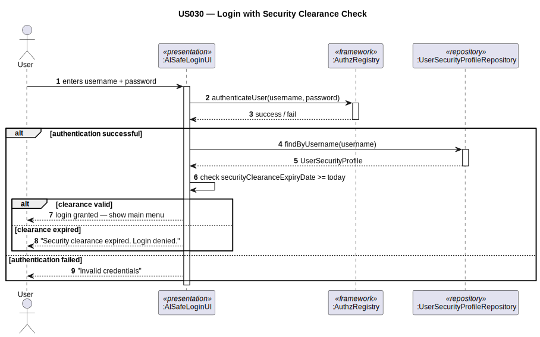
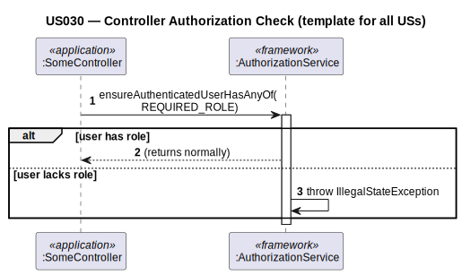

# US030 — Authentication and Authorization Infrastructure

## 1. Context

This task was assigned in Sprint 2 as shared infrastructure. It is the first time this task is being developed. The objective is to establish the authentication and authorization foundation that all other use cases depend on: role definitions, login flow, and security clearance enforcement at login.

**Assigned to:** Shared (all team members)

### 1.1 List of Issues

- Analysis: #22
- Design: #22
- Implement: #22
- Test: #22

---

## 2. Requirements

**US030** As the system, I want to enforce authentication and role-based authorization so that only users with the correct roles can access each feature.

### Acceptance Criteria

- **US030.1** The system must define all AISafe roles: `ADMIN`, `BACKOFFICE_OPERATOR`, `ATC_COLLABORATOR`, `FLIGHT_CONTROL_OPERATOR`, `WEATHER_PERSON`.
- **US030.2** Every controller method must call `AuthzRegistry.authorizationService().ensureAuthenticatedUserHasAnyOf(...)` before any business logic.
- **US030.3** An unauthenticated access attempt must be rejected.
- **US030.4** After successful framework authentication, the system must check the user's `securityClearanceExpiryDate`. If expired, login must be denied (account is NOT deactivated — just blocked). *(Client clarification: security clearance expired → cannot log in.)*
- **US030.5** Skills assessment expiry does **not** block login.

### Dependencies/References

- NFR09 — authentication and authorization.
- EAPLI framework — `AuthzRegistry`, `AuthorizationService`, `UserManagementService`.

---

## 3. Analysis

### 3.0 LLM Assistance

Generative AI (Claude, Anthropic) was used to support the analysis and design of this user story.

**Prompt 1:** "How does authentication and role-based authorization work in the EAPLI framework? How do I define custom roles and enforce them in controllers?"

**LLM suggestions adopted:**
- `AISafeRoles` class defines all roles as `public static final Role` constants, following the `ExemploRoles` pattern from `eapli.base`
- Every controller calls `AuthzRegistry.authorizationService().ensureAuthenticatedUserHasAnyOf(Role...)` as its first operation
- Login UI calls `AuthzRegistry.authorizationService().authenticateUser(username, password)` via the framework's `LoginUI`

**Decisions made by the team:**
- Security clearance check at login is performed after the framework authenticates the user, by loading `UserSecurityProfile` from its repository and comparing `securityClearanceExpiryDate` with today
- Skills assessment has no login effect (confirmed by client)

### 3.1 Framework Roles

```java
public class AISafeRoles {
    public static final Role ADMIN = Role.valueOf("ADMIN");
    public static final Role BACKOFFICE_OPERATOR = Role.valueOf("BACKOFFICE_OPERATOR");
    public static final Role ATC_COLLABORATOR = Role.valueOf("ATC_COLLABORATOR");
    public static final Role FLIGHT_CONTROL_OPERATOR = Role.valueOf("FLIGHT_CONTROL_OPERATOR");
    public static final Role WEATHER_PERSON = Role.valueOf("WEATHER_PERSON");

    public static Role[] nonUserValues() {
        return new Role[]{ADMIN, BACKOFFICE_OPERATOR, ATC_COLLABORATOR,
                          FLIGHT_CONTROL_OPERATOR, WEATHER_PERSON};
    }
}
```

---

## 4. Design

### 4.1 Realization

**Classes to create:**

| Class | Module | Responsibility |
|-------|--------|----------------|
| `AISafeRoles` | `aisafe.core` | Defines all role constants |
| `AISafePasswordPolicy` | `aisafe.core` | Password complexity rules |
| `UserSecurityProfile` | `aisafe.core` | Stores `securityClearanceExpiryDate` per user |
| `UserSecurityProfileRepository` | `aisafe.core` | Repository interface |
| `JpaUserSecurityProfileRepository` | `aisafe.persistence.impl` | JPA implementation |
| `InMemoryUserSecurityProfileRepository` | `aisafe.persistence.impl` | In-memory implementation |
| `AISafeLoginUI` | `aisafe.app.backoffice.console` | Extends framework login; adds clearance check |

**Sequence Diagram — Login with Security Clearance Check:**



**Sequence Diagram — Controller Authorization Check (template for all USs):**



### 4.2 Acceptance Tests

**AT1 — Expired security clearance blocks login (US030.4)**

Given a user whose `securityClearanceExpiryDate` was yesterday (in the past),
When the user attempts to log in with valid credentials,
Then the system denies access with a message indicating the security clearance has expired, without deactivating the account.

**AT2 — Valid security clearance allows login (US030.4)**

Given a user whose `securityClearanceExpiryDate` is 30 days in the future,
When the user logs in with valid credentials,
Then the system grants access and the user is directed to the main menu.

**AT3 — Unauthenticated access to a protected operation is blocked (US030.3)**

Given a session where no user is authenticated,
When any controller method protected by `ensureAuthenticatedUserHasAnyOf(...)` is invoked,
Then the system rejects the operation with an authorization error.

---

## 5. Implementation

**Key new files:**

- `eapli.aisafe.usermanagement.domain.AISafeRoles` — role constants
- `eapli.aisafe.usermanagement.domain.AISafePasswordPolicy` — password policy
- `eapli.aisafe.usermanagement.domain.UserSecurityProfile` — security clearance holder
- `eapli.aisafe.usermanagement.repositories.UserSecurityProfileRepository` — interface
- `eapli.aisafe.app.backoffice.console.presentation.authz.AISafeLoginUI` — extended login

*Major commits: (to be filled after implementation)*

---

## 6. Integration/Demonstration

1. Start application — bootstrap loads roles, valid domains, fuel types, manufacturers, countries
2. Log in with valid credentials and valid clearance → access granted
3. Log in with expired clearance → denied with message
4. Access any feature without login → rejected

---

## 7. Observations

`UserSecurityProfile` is a companion entity to the EAPLI framework's `SystemUser`. Because `SystemUser` is framework-managed and cannot be modified, the security clearance date is stored in a separate entity linked by `username` (the `SystemUser` natural key). This avoids coupling to the framework's internal structure.

The `AISafeRoles` class follows the `ExemploRoles` pattern exactly — the only change is the set of role constants and the `nonUserValues()` array.
