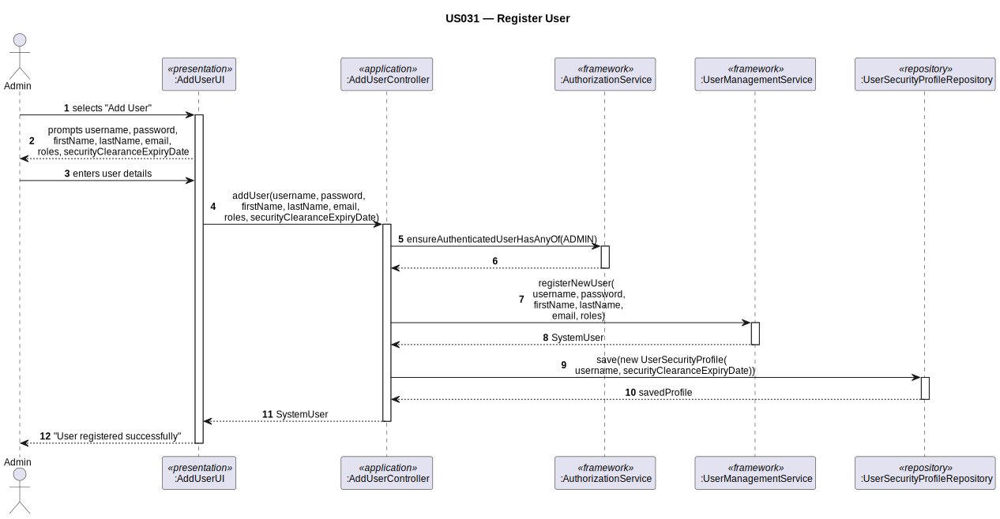

# US031 — Register Users

## 1. Context

This task was assigned in Sprint 2. It is the first time this task is being developed. The objective is to allow an Admin to register new system users with specific roles, collecting their security clearance expiry date. Builds on the auth infrastructure from US030.

**Assigned to:** Jaime Simões

### 1.1 List of Issues

- Analysis: #(to be assigned)
- Design: #(to be assigned)
- Implement: #(to be assigned)
- Test: #(to be assigned)

---

## 2. Requirements

**US031** As Admin, I want to register a new system user so that they can log in and use the system with their assigned role(s).

### Acceptance Criteria

- **US031.1** The system must require that the registering user has the `ADMIN` role.
- **US031.2** Each registered user must have: username (unique), password (compliant with policy), first name, last name, email, and at least one role.
- **US031.3** Attempting to register a duplicate username must be rejected.
- **US031.4** The password must comply with `AISafePasswordPolicy`.
- **US031.5** The system must allow assigning any role defined in `AISafeRoles`.
- **US031.6** For ADMIN and BACKOFFICE_OPERATOR roles, the email must belong to a bootstrapped list of valid AISafe internal domains. *(Client clarification: ATCC's and pilots use company email; ATC collaborators may use any domain.)*
- **US031.7** Every registered user must be assigned a `securityClearanceExpiryDate`. After that date the user cannot log in (account is not deactivated). *(Client clarification: security clearance applies to ALL users.)*

### Dependencies/References

- US030 — role definitions and auth infrastructure.
- NFR09 — authentication and authorization.

---

## 3. Analysis

### 3.0 LLM Assistance

Generative AI (Claude, Anthropic) was used to support the analysis and design of this user story.

**Prompt 1:** "How do I implement Register User following the EAPLI framework? The controller must use `AuthzRegistry.userService()` and the UI extends `AbstractUI`."

**LLM suggestions adopted:**
- Reuse `AddUserController` / `AddUserUI` pattern from `eapli.base` — structurally identical
- Controller delegates to `UserManagementService.registerNewUser(...)` for `SystemUser` creation
- After `SystemUser` is created, save a companion `UserSecurityProfile` with the clearance expiry date

**Decisions made by the team:**
- Changed roles from `ExemploRoles` to `AISafeRoles`
- Added `securityClearanceExpiryDate` collection to the UI
- Email domain validated against the bootstrapped `AISafeValidDomains` list for ADMIN/BACKOFFICE_OPERATOR roles
- `UserSecurityProfile` is a separate entity (linked by username) because `SystemUser` is framework-owned and cannot be extended

### 3.1 Framework Analysis

`UserManagementService` (from `AuthzRegistry.userService()`) provides:
- `registerNewUser(username, password, firstName, lastName, email, roles, createdOn)` — creates `SystemUser`, enforces password policy, throws `IntegrityViolationException` on duplicate

A second persistence call saves `UserSecurityProfile(username, securityClearanceExpiryDate)` after the framework user is created.

---

## 4. Design

### 4.1 Realization

**Classes to create/modify:**

| Class | Module | Responsibility |
|-------|--------|----------------|
| `AddUserUI` | `aisafe.app.backoffice.console` | Collects user data + clearance date; calls controller |
| `AddUserController` | `aisafe.core` | Auth; email domain check; delegates to `UserManagementService`; saves `UserSecurityProfile` |
| `UserManagementService` | EAPLI framework | Creates `SystemUser`; enforces uniqueness + password policy |
| `UserSecurityProfile` | `aisafe.core` | Entity holding `securityClearanceExpiryDate` per username |
| `UserSecurityProfileRepository` | `aisafe.core` | Repository interface |
| `AISafeRoles` | `aisafe.core` | Role constants |

**Sequence Diagram:**

### 4.2 Acceptance Tests

**AT1 — Duplicate username is rejected (US031.3)**

Given a user with username "user1" already registered in the system,
When the admin attempts to register a second user with the same username "user1",
Then the system rejects the second registration with an error indicating the username is already taken.

**AT2 — Only ADMIN can register users (US031.1)**

Given a user authenticated with the WEATHER_PERSON role,
When they attempt to register a new system user,
Then the system rejects the operation with an authorization error indicating the ADMIN role is required.

**AT3 — Security clearance expiry date is mandatory (US031.7)**

Given all required user fields are provided,
When the admin submits the user registration without a `securityClearanceExpiryDate`,
Then the system rejects the registration with an error indicating the security clearance expiry date is required.

---

## 5. Implementation

**Key files to create/modify:**

- `eapli.aisafe.usermanagement.application.AddUserController` — uses `AISafeRoles`; saves `UserSecurityProfile`
- `eapli.aisafe.app.backoffice.console.presentation.authz.AddUserUI` — collects clearance date
- `eapli.aisafe.usermanagement.domain.AISafeRoles` — role constants (shared with US030)
- `eapli.aisafe.usermanagement.domain.UserSecurityProfile` — entity
- `eapli.aisafe.usermanagement.repositories.UserSecurityProfileRepository` — interface
- JPA + InMemory implementations for `UserSecurityProfileRepository`

*Major commits: (to be filled after implementation)*

---

## 6. Integration/Demonstration

1. Log in as admin
2. Select "Add User" from backoffice menu
3. Enter username, password, name, email, security clearance expiry date, select roles
4. System validates email domain (for ADMIN/BACKOFFICE roles) and confirms registration
5. New user can log in if clearance has not expired

---

## 7. Observations

`UserSecurityProfile` is a companion entity linked to `SystemUser` by username only. This avoids modifying the EAPLI framework's `SystemUser` class. The `UserSecurityProfileRepository` follows the same wiring pattern as all other repositories: JPA implementation + InMemory implementation + method in `RepositoryFactory`.

Email domain validation applies only to ADMIN and BACKOFFICE_OPERATOR roles (bootstrapped AISafe internal domains, e.g., `@aisafe.com`). For other roles (operational collaborators), email domain is enforced by the company association in US061.
