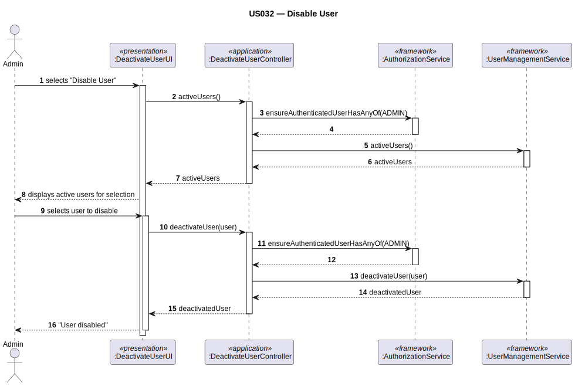
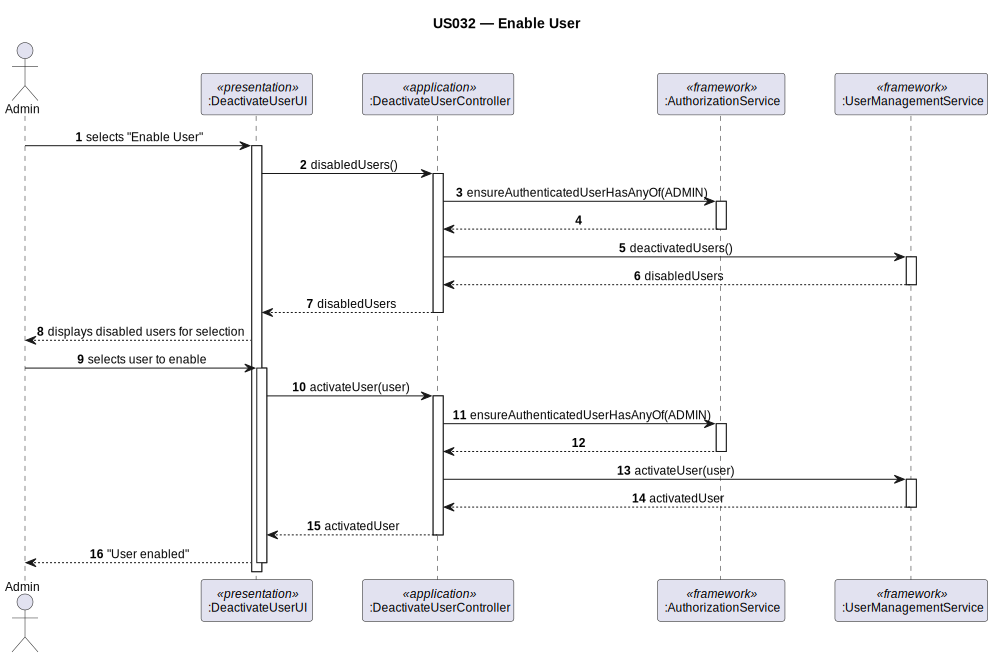

# US032 — Disable/Enable Users

## 1. Context

This task was assigned in Sprint 2. It is the first time this task is being developed. The objective is to allow an Admin to disable (deactivate) or re-enable a system user account. Disabling prevents login; enabling restores it. This operates exclusively on the EAPLI framework's `SystemUser` aggregate.

**Assigned to:** Fábio Costa

### 1.1 List of Issues

- Analysis: #24
- Design: #24
- Implement: #24
- Test: #24

---

## 2. Requirements

**US032** As Admin, I want to disable or enable a user account so that I can control system access.

### Acceptance Criteria

- **US032.1** The system must require the `ADMIN` role.
- **US032.2** Disabling a user prevents them from logging into the system.
- **US032.3** Enabling a previously disabled user restores their ability to log in.
- **US032.4** Disabling a `SystemUser` does **not** affect or cascade to the linked `Collaborator` aggregate. *(Client clarification: removing a collaborator was "definitely the wrong expression" — keep aggregates independent.)*
- **US032.5** The Admin cannot disable their own account.

### Dependencies/References

- US030 — auth infrastructure.
- US031 — users must have been registered.

---

## 3. Analysis

### 3.0 LLM Assistance

Generative AI (Claude, Anthropic) was used to support the analysis and design of this user story.

**Prompt 1:** "How do I implement Disable/Enable User in EAPLI? The framework has `UserManagementService.deactivateUser()` and `activateUser()`."

**LLM suggestions adopted:**
- `UserManagementService.activeUsers()` for listing candidates to disable
- `UserManagementService.deactivateUser(user)` / `activateUser(user)` for state change
- Framework handles `SystemUser.deactivatedOn()` / `SystemUser.activatedOn()` internally

**Decisions made by the team:**
- This use case operates entirely within the EAPLI `SystemUser` aggregate — no domain classes needed
- No cascade to `Collaborator` (confirmed by client: separate aggregates, separate lifecycle)
- Two separate UI actions: "Disable User" and "Enable User" (or a single UI that shows active/inactive separately)

### 3.1 Framework Analysis

`UserManagementService` provides:
- `activeUsers()` — returns `Iterable<SystemUser>` of currently active users
- `deactivatedUsers()` — returns `Iterable<SystemUser>` of currently disabled users
- `deactivateUser(SystemUser)` — marks user as inactive
- `activateUser(SystemUser)` — marks user as active again

---

## 4. Design

### 4.1 Realization

**Classes to create:**

| Class | Module | Responsibility |
|-------|--------|----------------|
| `DisableEnableUserUI` | `aisafe.app.backoffice.console` | Lists users; calls controller for disable or enable |
| `DisableEnableUserController` | `aisafe.core` | Auth; calls `UserManagementService` |
| `UserManagementService` | EAPLI framework | Deactivates / activates `SystemUser` |

**Sequence Diagram — Disable User:**

**Sequence Diagram — Enable User:**

### 4.2 Acceptance Tests

**AT1 — Disabling an active user prevents login (US032.2)**

Given an active system user with valid credentials,
When the admin disables that user account,
Then the user's account status becomes inactive and subsequent login attempts with those credentials are denied.

**AT2 — Re-enabling a disabled user restores login access (US032.3)**

Given a previously disabled system user,
When the admin enables that user account,
Then the user's account status becomes active again and the user can log in with their credentials.

**AT3 — Disabling a user does not affect their linked Collaborator (US032.4)**

Given a system user that is linked to a Collaborator aggregate,
When the admin disables the system user account,
Then the linked Collaborator aggregate remains unchanged — its status and data are not affected.

---

## 5. Implementation

**Key files to create:**

- `eapli.aisafe.usermanagement.application.DisableEnableUserController` — controller
- `eapli.aisafe.app.backoffice.console.presentation.authz.DisableEnableUserUI` — UI

*Major commits: (to be filled after implementation)*

---

## 6. Integration/Demonstration

1. Log in as admin
2. Select "Disable User" → system shows active users → select one → user is disabled
3. Attempt login as that user → rejected
4. Select "Enable User" → system shows disabled users → select one → user is enabled
5. Login as re-enabled user → succeeds

---

## 7. Observations

This use case operates entirely within the EAPLI framework's `SystemUser` aggregate. No AISafe domain classes are modified. The `Collaborator` aggregate is completely unaffected (confirmed by client: disabling a user does not cascade to collaborators).

Security clearance blocking (US030) and account disabling (US032) are independent mechanisms — a user may be blocked by both simultaneously.
