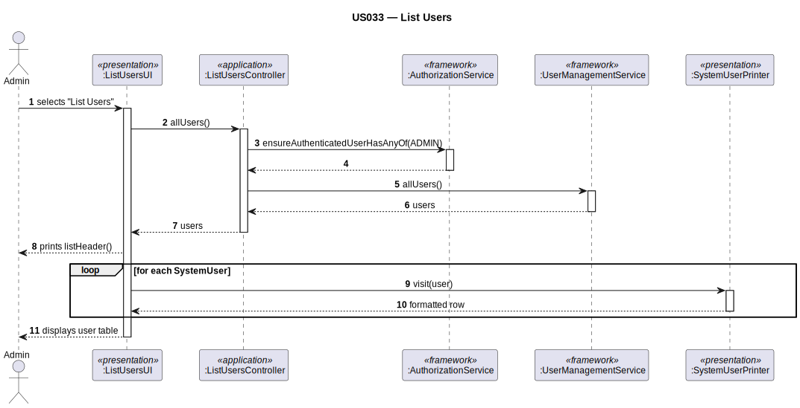

# US033 — List Users

## 1. Context

This task was assigned in Sprint 2. It is the first time this task is being developed. The objective is to allow an Admin to list all registered system users. This is a read-only query use case that relies entirely on the EAPLI framework's `UserManagementService`.

**Assigned to:** Fábio Costa

### 1.1 List of Issues

- Analysis: #(to be assigned)
- Design: #(to be assigned)
- Implement: #(to be assigned)
- Test: #(to be assigned)

---

## 2. Requirements

**US033** As Admin, I want to list all registered system users so that I can manage and monitor access to the system.

### Acceptance Criteria

- **US033.1** The system must require the `ADMIN` role to access this feature.
- **US033.2** The list must display all registered users regardless of their status (active or inactive).
- **US033.3** Each row must show at minimum: username, full name, email, assigned roles, and account status.
- **US033.4** If there are no registered users, an appropriate message must be shown.

### Dependencies/References

- US030 — auth infrastructure (role definitions).
- US031 — users must have been registered.

---

## 3. Analysis

### 3.0 LLM Assistance

Generative AI (Claude, Anthropic) was used to support the analysis and design of this user story.

**Prompt 1:** "How do I implement List Users in the EAPLI framework? What service method returns all users?"

**LLM suggestions adopted:**
- `UserManagementService.allUsers()` (via `AuthzRegistry.userService()`) returns `Iterable<SystemUser>`
- `AbstractListUI<SystemUser>` pattern: `elements()` delegates to the controller
- `SystemUserPrinter` as `Visitor<SystemUser>` formats each row

**Decisions made by the team:**
- List shows all users (active and inactive) — Admin needs full visibility
- `SystemUserPrinter` formats each user as a single line row

### 3.1 Framework Pattern

`ListUsersUI` uses the framework pattern `AbstractListUI<SystemUser>`. The `elements()` method calls `ListUsersController.allUsers()`. `SystemUserPrinter` implements `Visitor<SystemUser>` to format each row.

---

## 4. Design

### 4.1 Realization

| Class | Module | Responsibility |
|-------|--------|----------------|
| `ListUsersUI` | `aisafe.app.backoffice.console` | Extends `AbstractListUI<SystemUser>`; displays user table |
| `ListUsersController` | `aisafe.core` | Auth check; delegates to `UserManagementService.allUsers()` |
| `UserManagementService` | EAPLI framework | Returns all `SystemUser` instances from the repository |
| `SystemUserPrinter` | `aisafe.app.backoffice.console` | `Visitor<SystemUser>` — formats each row |

**Sequence Diagram:**

### 4.2 Acceptance Tests

**AT1 — Only ADMIN can list users (US033.1)**

Given a user authenticated with the WEATHER_PERSON role,
When they attempt to access the list of all system users,
Then the system rejects the operation with an authorization error indicating the ADMIN role is required.

**AT2 — Previously registered users appear in the list (US033.2)**

Given at least one user has been registered in the system,
When the admin requests the full user list,
Then the system returns a non-empty list containing the registered users with their username, full name, email, roles, and status.

**AT3 — Both active and inactive users are shown (US033.2)**

Given the system has both active and inactive user accounts,
When the admin requests the full user list,
Then all users are returned regardless of their account status.

---

## 5. Implementation

**Key files:**

- `eapli.exemplo.usermanagement.application.ListUsersController` — controller (framework pattern)
- `eapli.exemplo.app.backoffice.console.presentation.authz.ListUsersUI` — UI
- `eapli.exemplo.app.backoffice.console.presentation.authz.ListUsersAction` — menu action

*Major commits: (to be filled after implementation)*

---

## 6. Integration/Demonstration

1. Log in as admin
2. Select "List Users" from backoffice menu
3. System displays header then one row per registered user

---

## 7. Observations

This use case operates entirely within the EAPLI framework. No AISafe domain classes are needed — `UserManagementService` provides all required functionality. The `SystemUserPrinter` visitor is the only presentation-layer class beyond the UI.
