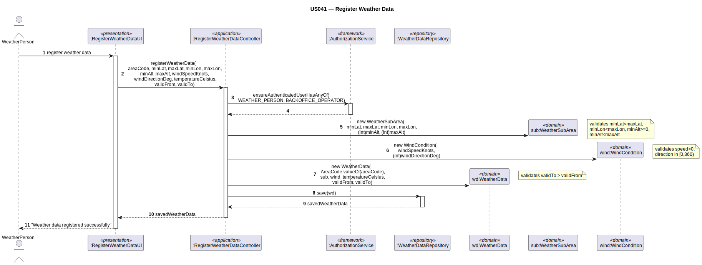

# US041 — Register Weather Data

## 1. Context

This task was assigned in Sprint 2. It is the first time this task is being developed. The objective is to allow a Weather Person to register meteorological data (wind, temperature, observation point) for an Air Control Area (ACA). Weather data is consumed by Flight Control Operators when assessing flight safety.

**Assigned to:** André Barcelos

### 1.1 List of Issues

- Analysis: #26
- Design: #26
- Implement: #26
- Test: #26

---

## 2. Requirements

**US041** As Weather Person, I want to register weather data for an air control area so that flight control operators can assess meteorological conditions.

### Acceptance Criteria

- **AC 041.1** The system must require the `WEATHER_PERSON` role.
- **AC 041.2** Weather data must be linked to an existing ACA by its `AreaCode`. The ACA must exist in the system.
- **AC 041.3** A `WindCondition` must be defined by a single observation point: `latitude ∈ [-90, 90]`, `longitude ∈ [-180, 180]`, `altitudeMetres ≥ 0`, `windSpeedKnots > 0`, `windDirectionDeg ∈ [0, 360)`.
- **AC 041.4** Wind data must include `windSpeedKnots > 0` and `windDirectionDeg ∈ [0, 360)`.
- **AC 041.5** `temperatureCelsius` must be provided (no range restriction — can be negative).
- **AC 041.6** `recordedDateTime` must be provided — represents the instant the observation was recorded.
- **AC 041.7** `sourceProvider` must be provided and not blank (e.g. "IPMA", "METAR LPPC", "EUROCONTROL").
- **AC 041.8** Registered data must be persisted and retrievable by `AreaCode`.

### Dependencies/References

- US030 — auth infrastructure.
- US050 — Air Control Area must exist before weather data can be registered.

---

## 3. Analysis

### 3.0 LLM Assistance

Generative AI (Claude, Anthropic) was used to support the analysis and design of this user story.

**Prompt 1:** "How do I model weather data as a DDD aggregate in the EAPLI framework? What value objects are needed?"

**LLM suggestions adopted:**
- `WeatherData` as the aggregate root — linked to an `AreaCode`
- `WindCondition` as a value object — encapsulates speed, direction and observation coordinates
- All invariants enforced in constructors

**Decisions made by the team:**
- `WindCondition` holds a single observation point (latitude, longitude, altitudeMetres) rather than a bounding box
- `WindCondition` direction is `int` degrees; speed is `double` knots
- `recordedDateTime` is `LocalDateTime` — represents the instant of the observation

### 3.1 Domain Model

| Concept | Type | Description |
|---------|------|-------------|
| `WeatherData` | Aggregate Root | Links ACA code, wind condition, temperature, source provider and recorded time |
| `WindCondition` | Value Object | Speed (knots) + direction (degrees) + observation coordinates (lat, lon, alt) |
| `AreaCode` | Value Object | Identifies the Air Control Area |

### 3.2 Invariants

- `WindCondition`: `speed > 0`, `direction ∈ [0, 360)`, `latitude ∈ [-90, 90]`, `longitude ∈ [-180, 180]`, `altitudeMetres ≥ 0`
- `WeatherData`: `recordedDateTime` must not be null; `sourceProvider` must not be blank; ACA identified by `areaCode` must exist in the system

---

## 4. Design

### 4.1 Realization

| Class | Module | Responsibility |
|-------|--------|----------------|
| `RegisterWeatherDataUI` | `aisafe.app` | Collects all inputs; calls controller |
| `RegisterWeatherDataController` | `aisafe.core` | Auth; validates ACA existence; creates VOs; delegates to repository |
| `WeatherData` | `aisafe.core` | Aggregate root holding all weather info |
| `WindCondition` | `aisafe.core` | Value object — speed, direction and observation point |
| `WeatherDataRepository` | `aisafe.core` | Repository interface |
| `AirControlAreaRepository` | `aisafe.core` | Used to validate ACA existence |

**Sequence Diagram:**

### 4.2 Acceptance Tests

**AT1 — WindCondition rejects direction out of [0, 360) range (AC 041.4)**

Given a `WindCondition` with a direction of 360 degrees (outside the valid range),
When the system attempts to create the `WindCondition` value object,
Then the system rejects the creation with an error indicating direction must be within [0, 360).

**AT2 — WeatherData rejects blank source provider (AC 041.7)**

Given weather data with a blank source provider,
When the system attempts to create the `WeatherData` aggregate,
Then the system rejects the creation with an error indicating source provider must not be blank.

**AT3 — WeatherData rejects non-existent ACA (AC 041.2)**

Given an area code that does not correspond to any registered ACA,
When the controller attempts to register weather data for that area,
Then the system rejects the operation with an error indicating the ACA was not found.

---

## 5. Implementation

**Key files:**

- `eapli.aisafe.weatherdata.application.RegisterWeatherDataController`
- `eapli.aisafe.weatherdata.domain.WeatherData`
- `eapli.aisafe.weatherdata.domain.WindCondition`
- `eapli.aisafe.weatherdata.repositories.WeatherDataRepository`
- `eapli.aisafe.ui.weatherdata.RegisterWeatherDataUI`

*Major commits: (to be filled after implementation)*

---

## 6. Integration/Demonstration

1. Log in as Weather Person
2. Select "Register Weather Data" from menu
3. Select an existing Air Control Area from the list
4. Enter observation coordinates (lat, lon, alt), wind data, temperature, source provider and recorded date/time
5. System validates and persists — confirms success
6. Flight Control Operator can then query weather data for that ACA

---

## 7. Observations

`WindCondition` is a pure value object — all validation logic is in its constructor. `WeatherData` delegates wind data to `WindCondition`, keeping the aggregate root thin. The `AreaCode` links to an ACA; the controller validates that the ACA exists before persisting the observation. The `AreaCode` holds only the code string, avoiding cross-aggregate object references.
