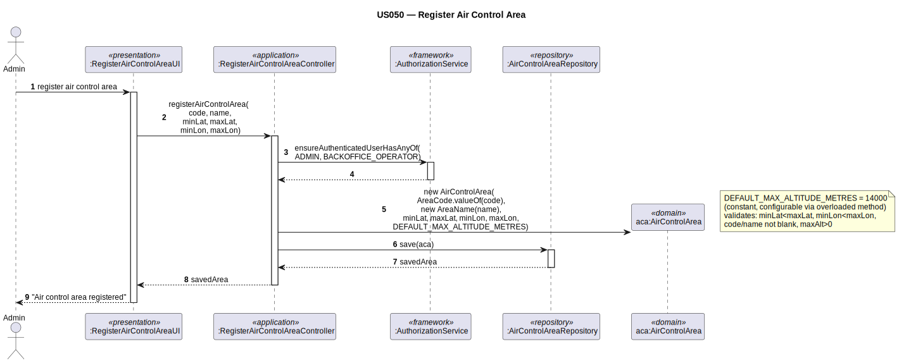

# US050 — Register Air Control Area

## 1. Context

This task was assigned in Sprint 2. It is the first time this task is being developed. The objective is to allow an Admin/Backoffice Operator to register an air control area with its boundary coordinates. The air control area is a foundational entity — airports, collaborators, and weather data are all linked to it.

**Assigned to:** Jaime Simões

### 1.1 List of Issues

- Analysis: #(to be assigned)
- Design: #(to be assigned)
- Implement: #(to be assigned)
- Test: #(to be assigned)

---

## 2. Requirements

**US050** As Admin/Backoffice Operator, I want to register an air control area so that it can be used as the spatial boundary for airports, weather data, and simulations.

### Acceptance Criteria

- **US050.1** The system must require the `ADMIN` or `BACKOFFICE_OPERATOR` role.
- **US050.2** Each ACA must have a unique area code (internal identifier, no format restriction).
- **US050.3** Each ACA must have a unique operational **name** (the name commonly used in air control operations). *(Client clarification: "Each area must have the name it's usually used in the air control business. It would be a mess if this name wasn't unique.")*
- **US050.4** The horizontal boundary is a rectangle: `minLatitude`, `maxLatitude`, `minLongitude`, `maxLongitude`.
- **US050.5** Latitude values in [-90, 90]; longitude values in [-180, 180]; `minLat < maxLat`; `minLon < maxLon` (no zero-area rectangle).
- **US050.6** No two ACAs may have overlapping horizontal boundaries. *(Client clarification: "obvious business rule.")*
- **US050.7** The ACA extends from altitude zero to a configurable maximum altitude. Default = 14 000 m. This value **must not be hardcoded** — it must come from application configuration. *(Client official simplification.)*

### Dependencies/References

- US030 — auth infrastructure.
- US052 — airports reference ACAs; ACAs must exist first.
- US041 — weather data is registered for ACAs.

---

## 3. Analysis

### 3.0 LLM Assistance

Generative AI (Claude, Anthropic) was used to support the analysis and design of this user story.

**Prompt 1:** "Design RegisterAirControlArea for EAPLI. Domain: AirControlArea (root), AreaCode (VO, unique), name (unique String), BoundingBox (VO, rectangle). Controller checks code uniqueness, name uniqueness, overlap, then creates entity."

**LLM suggestions adopted:**
- Controller performs three pre-creation checks: code uniqueness, name uniqueness, overlap
- `AreaCode` VO validates non-empty in constructor
- `BoundingBox` VO validates ranges and strict min < max in constructor
- `maxAltitudeMetres` read from `Application.settings()` at creation time

**Decisions made by the team:**
- `AreaCode` format: non-empty string, no further restriction (client confirmed)
- `name` is a plain String attribute on `AirControlArea`, non-empty, unique
- `maxAltitudeMetres`: passed as constructor argument read from configuration; never hardcoded
- Overlap check: `AirControlAreaRepository.findOverlapping(minLat, maxLat, minLon, maxLon)` at controller level (cross-aggregate invariant)

### 3.1 Domain Model Navigation

**Aggregate: AirControlArea**
- Root: `AirControlArea` — has `name` (unique operational name), `maxAltitudeMetres` (from config)
- VO: `AreaCode` — unique internal code; validates non-empty
- VO: `AreaName` — unique operational name; validates non-empty
- VO: `BoundingBox` — horizontal rectangle boundary; validates ranges and min < max

**Repository:** `AirControlAreaRepository` — one per aggregate

### 3.2 Invariants

| VO / Entity | Invariant |
|-------------|-----------|
| `AreaCode` | not null, not empty |
| `BoundingBox` | lat in [-90,90]; lon in [-180,180]; minLat < maxLat; minLon < maxLon |
| `AirControlArea` | `AreaCode` unique; `AreaName` unique (both enforced by controller) |
| `AirControlArea` | no rectangle overlap with existing ACAs (controller check) |
| `AirControlArea` | `maxAltitudeMetres > 0` |

---

## 4. Design

### 4.1 Realization

**Classes to create:**

| Class | Module | Responsibility |
|-------|--------|----------------|
| `RegisterAirControlAreaUI` | `aisafe.app.backoffice.console` | Collects input; calls controller |
| `RegisterAirControlAreaController` | `aisafe.core` | Auth; 3 uniqueness/overlap checks; creates ACA; saves |
| `AirControlArea` | `aisafe.core` | Aggregate root |
| `AreaCode` | `aisafe.core` | VO — validates code |
| `AreaName` | `aisafe.core` | VO — validates operational name |
| `BoundingBox` | `aisafe.core` | VO — validates rectangle boundary |
| `AirControlAreaRepository` | `aisafe.core` | Repository interface |
| `JpaAirControlAreaRepository` | `aisafe.persistence.impl` | JPA implementation |
| `InMemoryAirControlAreaRepository` | `aisafe.persistence.impl` | In-memory implementation |

**Sequence Diagram:**

### 4.2 Acceptance Tests

**AT1 — BoundingBox rejects invalid latitude order (US050.5)**

Given a `BoundingBox` where `minLatitude` is greater than or equal to `maxLatitude` (e.g., minLat=50, maxLat=40),
When the system attempts to create the `BoundingBox`,
Then the system rejects the creation with an error indicating that `minLatitude` must be strictly less than `maxLatitude`.

**AT2 — AreaCode rejects null or empty (US050.2)**

Given a null or empty string as the area code,
When the system attempts to create the `AreaCode` value object,
Then the system rejects the creation with an error indicating a valid non-empty code is required.

**AT3 — BoundingBox rejects latitude out of valid range (US050.5)**

Given a `BoundingBox` where a latitude value is outside the range [-90, 90] (e.g., -91.0),
When the system attempts to create the `BoundingBox`,
Then the system rejects the creation with an error indicating the latitude is out of the allowed range.

**AT4 — AirControlArea rejects non-positive maxAltitudeMetres (US050.7)**

Given an `AirControlArea` with a `maxAltitudeMetres` value of 0 or negative,
When the system attempts to create the air control area,
Then the system rejects the creation with an error indicating the maximum altitude must be a positive value.

---

## 5. Implementation

**Key new files:**

- `eapli.aisafe.aircontrolarea.domain.AirControlArea` — aggregate root with `maxAltitudeMetres`
- `eapli.aisafe.aircontrolarea.domain.AreaCode` — VO
- `eapli.aisafe.aircontrolarea.domain.AreaName` — VO
- `eapli.aisafe.aircontrolarea.domain.BoundingBox` — VO (rectangle boundary)
- `eapli.aisafe.aircontrolarea.repositories.AirControlAreaRepository` — interface with `findByAreaCode`, `findByName`, `findOverlapping`
- `eapli.aisafe.aircontrolarea.application.RegisterAirControlAreaController` — controller
- `eapli.aisafe.app.backoffice.console.presentation.aircontrolarea.RegisterAirControlAreaUI` — UI
- JPA + InMemory implementations

*Major commits: (to be filled after implementation)*

---

## 6. Integration/Demonstration

1. Log in as admin or backoffice operator
2. Select "Register Air Control Area"
3. Enter area code, operational name, and rectangle boundary coordinates
4. System validates code uniqueness, name uniqueness, no overlap, and confirms
5. ACA is available for US052 (Create Airport) and US041 (Register Weather Data)

---

## 7. Observations

The overlap check is a controller-level cross-aggregate invariant — `AirControlArea` itself cannot enforce it since it requires querying all existing areas. The `findOverlapping` query checks whether the new rectangle intersects any existing ACA rectangle.

`maxAltitudeMetres` must be sourced from `Application.settings()` (e.g., `Application.settings().getProperty("aisafe.aca.maxAltitudeMetres", "14000")`). It is passed as a constructor argument. Hardcoding 14 000 m in source code is not acceptable per client instruction.

`Coordinates_ACA` represents the 2D horizontal rectangle only; altitude is a separate scalar attribute on the root.
