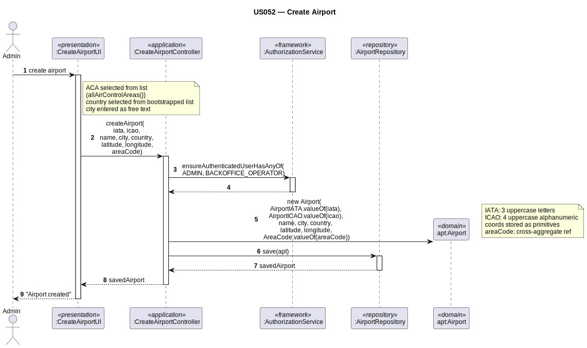

# US052 — Create Airport

## 1. Context

This task was assigned in Sprint 2. It is the first time this task is being developed. The objective is to allow an Admin/Backoffice Operator to create an airport and locate it within an air control area. Airports are required for flight routes (Sprint 3).

**Assigned to:** Jaime Simões

### 1.1 List of Issues

- Analysis: #(to be assigned)
- Design: #(to be assigned)
- Implement: #(to be assigned)
- Test: #(to be assigned)

---

## 2. Requirements

**US052** As Admin/Backoffice Operator, I want to create an airport with its IATA code, ICAO code, location, elevation, and associated air control area.

### Acceptance Criteria

- **US052.1** The system must require the `ADMIN` or `BACKOFFICE_OPERATOR` role.
- **US052.2** The IATA code must be unique worldwide (3 uppercase letters, e.g. `OPO`).
- **US052.3** The ICAO code must be unique worldwide (4 uppercase alphanumeric, e.g. `LPPR`).
- **US052.4** The airport must be associated with an existing air control area.
- **US052.5** The airport's coordinates must fall within the associated ACA's horizontal boundary. *(Client clarification: strict validation — if coordinates don't belong to the ACA, you cannot create the airport.)*
- **US052.6** Elevation must have a positive value and a unit (e.g. metres above sea level).
- **US052.7** The airport must have a name, a city (entered as free text), and a country (selected from bootstrapped list). *(Client clarification: country data loaded via bootstrap; city can be inserted freely.)*

### Dependencies/References

- US030 — auth infrastructure.
- US050 — air control areas must exist before airports can be created.

---

## 3. Analysis

### 3.0 LLM Assistance

Generative AI (Claude, Anthropic) was used to support the analysis and design of this user story.

**Prompt 1:** "Design CreateAirport for EAPLI. Domain: Airport (root), AirportIATA (VO, 3 uppercase letters), AirportICAO (VO, 4 uppercase alphanumeric), Coordinates (VO, lat/lon), Elevation (VO, value+unit). Controller: IATA unique, ICAO unique, ACA exists, coordinates inside ACA."

**LLM suggestions adopted:**
- Controller performs three checks: IATA uniqueness, ICAO uniqueness, ACA lookup + coordinate containment
- `AirportIATA` VO normalises input to uppercase; `AirportICAO` validates 4 uppercase alphanumeric

**Decisions made by the team:**
- `country` is selected from a bootstrapped list (client confirmed); `city` is free text
- Coordinate containment (US052.5) is a controller-level cross-aggregate check — the `Airport` itself cannot enforce it
- `Elevation` unit is a plain String (e.g., "m", "ft")

### 3.1 Domain Model Navigation

**Aggregate: Airport**
- Root: `Airport` — `name`, `city` (free text), `country` (bootstrapped); references `AirControlArea` by `AreaCode` only
- VO: `AirportIATA` — normalises to 3 uppercase letters
- VO: `AirportICAO` — validates 4 uppercase alphanumeric
- VO: `Coordinates` — shared VO; validates lat/lon ranges (used by Airport and Simulation)
- VO: `Elevation` — `value > 0`, unit not empty

### 3.2 Invariants

| VO / Entity | Invariant |
|-------------|-----------|
| `AirportIATA` | exactly 3 letters; normalised to uppercase |
| `AirportICAO` | exactly 4 uppercase alphanumeric; not null |
| `Coordinates` | lat in [-90, 90]; lon in [-180, 180] |
| `Elevation` | value > 0; unit not empty |
| `Airport` | IATA unique; ICAO unique; coordinates inside ACA boundary (all via controller) |

---

## 4. Design

### 4.1 Realization

**Classes to create:**

| Class | Module | Responsibility |
|-------|--------|----------------|
| `CreateAirportUI` | `aisafe.app.backoffice.console` | Collects input; shows country list; calls controller |
| `CreateAirportController` | `aisafe.core` | Auth; uniqueness checks; ACA lookup + coordinate containment; creates Airport; saves |
| `Airport` | `aisafe.core` | Aggregate root |
| `AirportIATA` | `aisafe.core` | VO — validates IATA format (3 letters, normalised uppercase) |
| `AirportICAO` | `aisafe.core` | VO — validates ICAO format (4 alphanumeric) |
| `Coordinates` | `aisafe.core` | Shared VO — lat/lon point (also used by Simulation) |
| `Elevation` | `aisafe.core` | VO — value + unit |
| `AirportRepository` | `aisafe.core` | Repository interface |
| `JpaAirportRepository` | `aisafe.persistence.impl` | JPA implementation |
| `InMemoryAirportRepository` | `aisafe.persistence.impl` | In-memory implementation |

**Sequence Diagram:**

### 4.2 Acceptance Tests

**AT1 — AirportIATA normalises lowercase input (US052.2)**

Given an IATA code entered in lowercase (e.g., "opo"),
When the system creates an `AirportIATA` value object with that code,
Then the system normalises it to uppercase "OPO" automatically — no exception is thrown.

**AT2 — AirportICAO rejects wrong length (US052.3)**

Given an ICAO code with fewer than 4 characters (e.g., "LPP"),
When the system attempts to create an `AirportICAO` value object,
Then the system rejects the creation with an error indicating the code must be exactly 4 alphanumeric characters.

**AT3 — Elevation rejects non-positive value (US052.6)**

Given an `Elevation` with a non-positive value (e.g., -10 metres),
When the system attempts to create the `Elevation` value object,
Then the system rejects the creation with an error indicating elevation must be a positive value.

**AT4 — Airport coordinates must fall within ACA boundary (US052.5)**

Given an airport whose latitude/longitude falls outside the boundary of the selected air control area,
When the admin submits the airport creation form,
Then the system rejects the creation with an error indicating the airport coordinates must be within the ACA's bounding box.

---

## 5. Implementation

**Key new files:**

- `eapli.aisafe.airport.domain.Airport` — aggregate root
- `eapli.aisafe.airport.domain.AirportIATA` — VO
- `eapli.aisafe.airport.domain.AirportICAO` — VO
- `eapli.aisafe.shared.domain.Coordinates` — shared VO (lat/lon point)
- `eapli.aisafe.airport.domain.Elevation` — VO
- `eapli.aisafe.airport.repositories.AirportRepository` — interface
- `eapli.aisafe.airport.application.CreateAirportController` — controller
- `eapli.aisafe.app.backoffice.console.presentation.airport.CreateAirportUI` — UI
- JPA + InMemory implementations
- Bootstrap: country list loaded at startup

*Major commits: (to be filled after implementation)*

---

## 6. Integration/Demonstration

1. Log in as admin
2. Select "Create Airport"
3. Enter name, free-text city, select country from bootstrapped list
4. Enter IATA code, ICAO code, coordinates, elevation, and select ACA
5. System validates and confirms
6. Airport is available for flight routes (Sprint 3)

---

## 7. Observations

Country data is bootstrapped at startup (list of country names or ISO codes). City/town is free text — no validation beyond non-empty. This was confirmed by the client.

The coordinate containment check (US052.5) is enforced at controller level — it retrieves the ACA and calls `aca.coordinates().contains(lat, lon)`. The `Airport` entity itself cannot perform this check.

`AirportIATA` and `AirportICAO` are distinct classes from `CompanyIATA` / `CompanyICAO` (used in US060), because airport and company codes have different format rules (airport IATA: 3 letters; company IATA: 2 letters). The shared `Coordinates` VO is also used by the `Simulation` aggregate.
