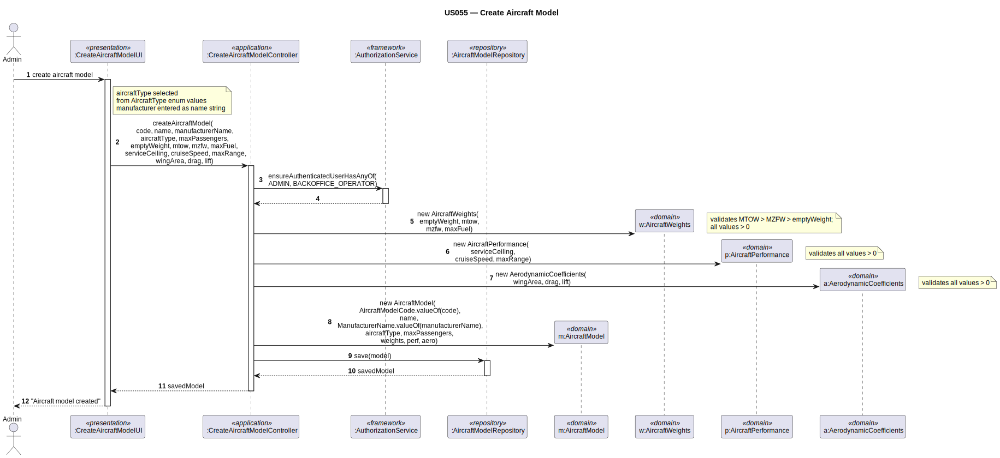

# US055 — Create Aircraft Model

## 1. Context

This task was assigned in Sprint 2. It is the first time this task is being developed. The objective is to allow an Admin to create an aircraft model with its physical and aerodynamic specifications. Aircraft models are referenced by aircraft instances (US070) and by pilots for certification (Sprint 3).

**Assigned to:** Cláudio Pinto

### 1.1 List of Issues

- Analysis: #(to be assigned)
- Design: #(to be assigned)
- Implement: #(to be assigned)
- Test: #(to be assigned)

---

## 2. Requirements

**US055** As Admin, I want to create an aircraft model with all its physical specifications so that it can be used to configure aircraft instances.

### Acceptance Criteria

- **US055.1** The system must require the `ADMIN` role.
- **US055.2** The combination of model name + manufacturer must be unique in the system.
- **US055.3** The model must specify its aircraft type (passenger, cargo, mixed).
- **US055.4** The model must specify weights: empty weight, MTOW, MZFW, max fuel capacity. Invariant: `MTOW > MZFW > emptyWeight`; all values positive.
- **US055.5** The model must specify performance: service ceiling, cruise speed, maximum range.
- **US055.6** The model must specify aerodynamic coefficients: wing area, drag coefficient, lift coefficient.
- **US055.7** The manufacturer must exist in the system. *(Client clarification: Manufacturer is a full aggregate — NOT a VO. Bootstrapped initially. Case-insensitive unique name.)*

### Dependencies/References

- US030 — auth infrastructure.
- Manufacturer aggregate must exist (bootstrapped for Sprint 2; a dedicated Register Manufacturer use case may be added).

---

## 3. Analysis

### 3.0 LLM Assistance

Generative AI (Claude, Anthropic) was used to support the analysis and design of this user story.

**Prompt 1:** "Design CreateAircraftModel for EAPLI. Domain: AircraftModel (root), AircraftModelCode (VO, unique), AircraftWeights (VO, MTOW>MZFW>emptyWeight invariant), AircraftPerformance (VO), AerodynamicCoefficients (VO). Manufacturer is a full aggregate."

**LLM suggestions adopted:**
- `AircraftWeights` validates all four values and the MTOW > MZFW > emptyWeight chain
- `AerodynamicCoefficients` groups wingArea + dragCoefficient + liftCoefficient — used together in physics formulas
- Controller looks up `Manufacturer` by name before creating the `AircraftModel`

**Decisions made by the team:**
- `Manufacturer` is a **full aggregate** (not a VO) — client confirmed "obviously, a manufacturer cannot be a VO"
- Manufacturer name uniqueness is **case-insensitive** — "Airbus" == "AIRBUS" (client clarification)
- Manufacturer is bootstrapped for Sprint 2 (Airbus, Boeing, Embraer, Bombardier, Cessna, Antonov)
- `AircraftVariant` (engine configuration) is NOT created here — added via US057
- `AircraftModelCode` is the identity VO of `AircraftModel`; `ManufacturerName` is the identity VO of `Manufacturer`

### 3.1 Domain Model Navigation

**Aggregate: AircraftModel**
- Root: `AircraftModel` — `name` (String), manufacturer name stored for display
- VO: `AircraftModelCode` — identity VO; validates non-empty
- Enum: `AircraftType` — passenger / cargo / mixed
- VO: `AircraftWeights` — emptyWeight, MTOW, MZFW, maxFuelCapacity
- VO: `AircraftPerformance` — serviceCeiling, cruiseSpeed, maximumRange
- VO: `AerodynamicCoefficients` — wingArea, dragCoefficient, liftCoefficient
- Entity: `AircraftVariant` — added via US057; not created here

**Aggregate: Manufacturer** *(referenced by ManufacturerName from AircraftModel)*
- Root: `Manufacturer` — `ManufacturerName` (VO, case-insensitive unique identity)

### 3.2 Invariants

| VO | Invariant |
|----|-----------|
| `AircraftModelCode` | not null, not empty |
| `AircraftWeights` | all values > 0; MTOW > MZFW > emptyWeight |
| `AircraftPerformance` | all values > 0 |
| `AerodynamicCoefficients` | all values > 0 |
| `ManufacturerName` | not null, not empty; unique case-insensitively |

---

## 4. Design

### 4.1 Realization

**Classes to create:**

| Class | Module | Responsibility |
|-------|--------|----------------|
| `CreateAircraftModelUI` | `aisafe.app.backoffice.console` | Collects input; shows manufacturer list; calls controller |
| `CreateAircraftModelController` | `aisafe.core` | Auth; manufacturer lookup; model code uniqueness; creates AircraftModel; saves |
| `AircraftModel` | `aisafe.core` | Aggregate root |
| `AircraftModelCode` | `aisafe.core` | VO — identity of AircraftModel |
| `AircraftWeights` | `aisafe.core` | VO — four weights with invariant chain |
| `AircraftPerformance` | `aisafe.core` | VO — three performance values |
| `AerodynamicCoefficients` | `aisafe.core` | VO — wing area + Cd + Cl |
| `Manufacturer` | `aisafe.core` | Aggregate root (bootstrapped) |
| `ManufacturerName` | `aisafe.core` | VO — case-insensitive unique name |
| `AircraftModelRepository` | `aisafe.core` | Repository interface |
| `ManufacturerRepository` | `aisafe.core` | Repository interface |
| `JpaAircraftModelRepository` | `aisafe.persistence.impl` | JPA implementation |
| `InMemoryAircraftModelRepository` | `aisafe.persistence.impl` | In-memory implementation |

**Sequence Diagram:**

### 4.2 Acceptance Tests

**AT1 — AircraftWeights rejects MTOW ≤ MZFW (US055.4)**

Given `AircraftWeights` where MTOW is less than or equal to MZFW (e.g., MTOW=60 000 kg, MZFW=70 000 kg),
When the system attempts to create the weight configuration,
Then the system rejects the creation with an error indicating MTOW must be strictly greater than MZFW.

**AT2 — AircraftWeights rejects non-positive empty weight (US055.4)**

Given `AircraftWeights` with a non-positive empty weight (e.g., -1 kg),
When the system attempts to create the weight configuration,
Then the system rejects the creation with an error indicating all weight values must be positive.

**AT3 — AerodynamicCoefficients rejects non-positive wing area (US055.6)**

Given `AerodynamicCoefficients` with a wing area of 0.0 m²,
When the system attempts to create the aerodynamic coefficients,
Then the system rejects the creation with an error indicating the wing area must be a positive value.

---

## 5. Implementation

**Key new files:**

- `eapli.aisafe.aircraftmodel.domain.AircraftModel` — aggregate root
- `eapli.aisafe.aircraftmodel.domain.AircraftModelCode` — VO (identity)
- `eapli.aisafe.aircraftmodel.domain.AircraftWeights` — VO with MTOW invariant
- `eapli.aisafe.aircraftmodel.domain.AircraftPerformance` — VO
- `eapli.aisafe.aircraftmodel.domain.AerodynamicCoefficients` — VO
- `eapli.aisafe.aircraftmodel.domain.AircraftType` — enum
- `eapli.aisafe.manufacturer.domain.Manufacturer` — aggregate root
- `eapli.aisafe.manufacturer.domain.ManufacturerName` — VO (case-insensitive)
- `eapli.aisafe.manufacturer.repositories.ManufacturerRepository` — interface
- `eapli.aisafe.aircraftmodel.repositories.AircraftModelRepository` — interface
- `eapli.aisafe.aircraftmodel.application.CreateAircraftModelController` — controller
- `eapli.aisafe.app.backoffice.console.presentation.aircraftmodel.CreateAircraftModelUI` — UI
- JPA + InMemory implementations for both repositories

*Major commits: (to be filled after implementation)*

---

## 6. Integration/Demonstration

1. Log in as admin
2. Select "Create Aircraft Model"
3. Enter model name, select manufacturer from bootstrapped list, select type
4. Enter weights, performance values, aerodynamic coefficients
5. System validates all invariants and confirms
6. Model available for US057 (add engine) and US070 (add aircraft)

---

## 7. Observations

`Manufacturer` is a **full aggregate** (client confirmation: "obviously, a manufacturer cannot be a VO"). It has its own repository, JPA entity, and persistence table. The manufacturer list is bootstrapped at startup. A future "Register Manufacturer" use case (not in Sprint 2 scope) would allow adding new entries.

`ManufacturerName` uniqueness is case-insensitive — the repository method `findByNameIgnoreCase(String)` must be used. Storing the name in uppercase in the database is one valid approach.

`AircraftVariant` is an internal entity added via US057. At this point, `AircraftModel` is valid with zero variants.
