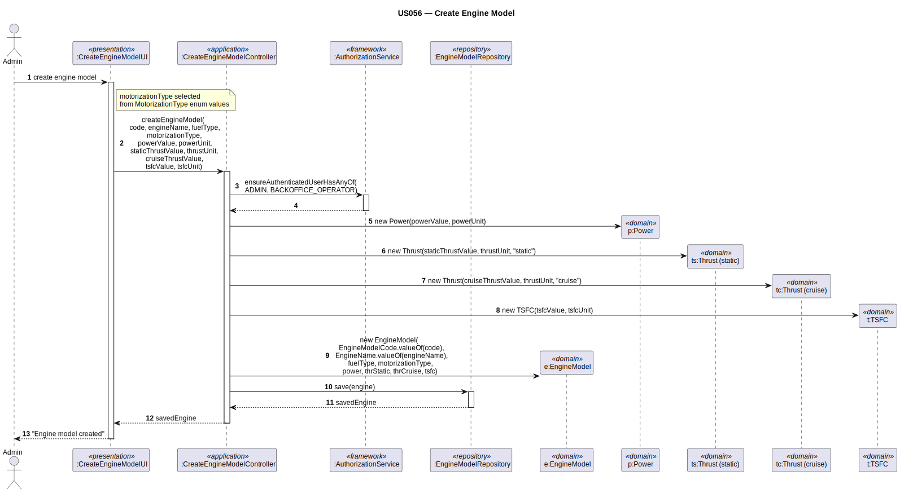

# US056 — Create Aircraft Engine Model

## 1. Context

This task was assigned in Sprint 2. It is the first time this task is being developed. The objective is to allow an Admin to register an engine model with its technical specifications. Engine models are linked to aircraft models via variants (US057).

**Assigned to:** Cláudio Pinto

### 1.1 List of Issues

- Analysis: #30
- Design: #30
- Implement: #30
- Test: #30

---

## 2. Requirements

**US056** As Admin, I want to create an aircraft engine model with its technical specifications so that it can be linked to aircraft model variants.

### Acceptance Criteria

- **US056.1** The system must require the `ADMIN` role.
- **US056.2** The engine name + manufacturer combination must be unique.
- **US056.3** The engine must specify its motorization type: turboprop, turbofan, turbojet, ramjet, or electricPropeller.
- **US056.4** The engine must specify its rated power (value + unit).
- **US056.5** The engine must specify static and cruise thrust (value + unit + speed reference).
- **US056.6** The engine must specify its TSFC — Thrust-Specific Fuel Consumption (value + unit).
- **US056.7** The manufacturer must exist in the system (see US055 / bootstrap).
- **US056.8** Fuel type is selected from a bootstrapped list of fuel types (e.g., JET A-1, AVGAS 100LL, SAF). *(Client clarification: "pre-loading available fuel types is a good solution for an MVP.")*

### Dependencies/References

- US030 — auth infrastructure.
- Manufacturer aggregate must exist (bootstrapped).
- US057 — engine models are linked to aircraft models after creation.

---

## 3. Analysis

### 3.0 LLM Assistance

Generative AI (Claude, Anthropic) was used to support the analysis and design of this user story.

**Prompt 1:** "Design CreateEngineModel for EAPLI. Domain: EngineModel (root), EngineName (VO), Power (VO, value+unit), Thrust (×2: static and cruise, VO), TSFC (VO), MotorizationType (enum). Fuel type selected from bootstrapped list."

**LLM suggestions adopted:**
- `EngineName` VO validates non-empty; uniqueness per manufacturer checked by controller
- Two `Thrust` VOs required: static and cruise
- `fuelType` stored as a String on `EngineModel` corresponding to the selected bootstrapped fuel

**Decisions made by the team:**
- `fuelType` is NOT a free-text field — the UI presents the bootstrapped fuel list and stores the selected name as a `String` on `EngineModel`
- All VO numeric values must be positive (physical measurements)
- `Manufacturer` is referenced by ID only (cross-aggregate; full aggregate per US055 analysis)

### 3.1 Domain Model Navigation

**Aggregate: EngineModel**
- Root: `EngineModel` — `fuelType` (String, from bootstrapped list)
- VO: `EngineName` — unique per manufacturer (controller check)
- Enum: `MotorizationType` — turboprop / turbofan / turbojet / ramjet / electricPropeller
- VO: `Power` — value + unit
- VO: `Thrust` (×2) — value + unit + speedReference (static, cruise)
- VO: `TSFC` — value + unit

Cross-aggregate: `EngineModel` → `Manufacturer` (by ID only)

### 3.2 Invariants

| VO | Invariant |
|----|-----------|
| `EngineName` | not null, not empty |
| `Power` | value > 0; unit not empty |
| `Thrust` | value > 0; unit not empty; speedReference not empty |
| `TSFC` | value > 0; unit not empty |
| `EngineModel` | EngineName + manufacturer unique (controller check) |

---

## 4. Design

### 4.1 Realization

**Classes to create:**

| Class | Module | Responsibility |
|-------|--------|----------------|
| `CreateEngineModelUI` | `aisafe.app.backoffice.console` | Collects input; shows manufacturer + fuel type lists; calls controller |
| `CreateEngineModelController` | `aisafe.core` | Auth; manufacturer lookup; uniqueness check; creates EngineModel; saves |
| `EngineModel` | `aisafe.core` | Aggregate root |
| `EngineName` | `aisafe.core` | VO — validates name |
| `Power` | `aisafe.core` | VO — value + unit |
| `Thrust` | `aisafe.core` | VO — value + unit + speedReference |
| `TSFC` | `aisafe.core` | VO — value + unit |
| `MotorizationType` | `aisafe.core` | Enum |
| `EngineModelRepository` | `aisafe.core` | Repository interface |
| `JpaEngineModelRepository` | `aisafe.persistence.impl` | JPA implementation |
| `InMemoryEngineModelRepository` | `aisafe.persistence.impl` | In-memory implementation |

**Sequence Diagram:**

### 4.2 Acceptance Tests

**AT1 — EngineName rejects null (US056.2)**

Given a null value for the engine name,
When the system attempts to create the `EngineName` value object,
Then the system rejects the creation with an error indicating the engine name must not be null or empty.

**AT2 — Power rejects non-positive value (US056.4)**

Given a `Power` value of 0.0 kW,
When the system attempts to create the `Power` value object,
Then the system rejects the creation with an error indicating the power value must be positive.

**AT3 — Thrust rejects non-positive value (US056.5)**

Given a static `Thrust` value of -100 kN,
When the system attempts to create the `Thrust` value object,
Then the system rejects the creation with an error indicating the thrust value must be positive.

**AT4 — TSFC rejects empty unit (US056.6)**

Given a `TSFC` value object with an empty unit string,
When the system attempts to create the `TSFC` value object,
Then the system rejects the creation with an error indicating the unit must not be empty.

---

## 5. Implementation

**Key new files:**

- `eapli.aisafe.enginemodel.domain.EngineModel` — aggregate root
- `eapli.aisafe.enginemodel.domain.EngineName` — VO
- `eapli.aisafe.enginemodel.domain.Power` — VO
- `eapli.aisafe.enginemodel.domain.Thrust` — VO (two instances per EngineModel: static, cruise)
- `eapli.aisafe.enginemodel.domain.TSFC` — VO
- `eapli.aisafe.enginemodel.domain.MotorizationType` — enum
- `eapli.aisafe.enginemodel.repositories.EngineModelRepository` — interface
- `eapli.aisafe.enginemodel.application.CreateEngineModelController` — controller
- `eapli.aisafe.app.backoffice.console.presentation.enginemodel.CreateEngineModelUI` — UI
- Bootstrap: fuel type list (JET A-1, AVGAS 100LL, SAF, etc.)
- JPA + InMemory implementations

*Major commits: (to be filled after implementation)*

---

## 6. Integration/Demonstration

1. Log in as admin
2. Select "Create Engine Model"
3. Enter engine name, select manufacturer (bootstrapped list)
4. Select motorization type, select fuel type (bootstrapped list)
5. Enter power, static thrust, cruise thrust, TSFC values and units
6. System validates and confirms
7. Engine model available for US057 (link to aircraft model variant)

---

## 7. Observations

Two `Thrust` instances are required per engine (static and cruise). In JPA they are stored as two separate embedded fields on `EngineModel`: `staticThrust` and `cruiseThrust`, each with their own `@Embedded` mapping.

`fuelType` is stored as a plain `String` on `EngineModel` (the selected fuel name, e.g., `"JET A-1"`). The UI restricts input to the bootstrapped list. Future sprints could promote `FuelType` to a full domain entity if dynamic management is needed.
