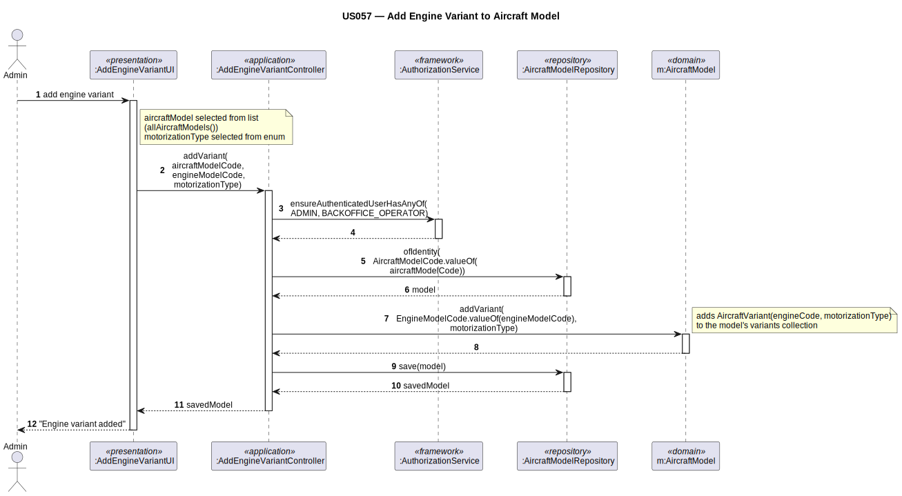

# US057 — Add Engine Model to Aircraft Model

## 1. Context

This task was assigned in Sprint 2. It is the first time this task is being developed. The objective is to allow an Admin to associate an engine model with an aircraft model, creating an `AircraftVariant`. Each variant represents a specific engine configuration for that model.

**Assigned to:** Dinis Silva

### 1.1 List of Issues

- Analysis: #(to be assigned)
- Design: #(to be assigned)
- Implement: #(to be assigned)
- Test: #(to be assigned)

---

## 2. Requirements

**US057** As Admin, I want to add an engine model to an aircraft model so that the aircraft model has a valid variant for simulation.

### Acceptance Criteria

- **US057.1** The system must require the `ADMIN` role.
- **US057.2** Both the aircraft model and the engine model must exist.
- **US057.3** The same engine model cannot be added twice to the same aircraft model.
- **US057.4** All variants of an aircraft model must use the same motorization type.

### Dependencies/References

- US030 — auth infrastructure.
- US055 — aircraft model must exist.
- US056 — engine model must exist.

---

## 3. Analysis

### 3.0 LLM Assistance

Generative AI (Claude, Anthropic) was used to support the analysis and design of this user story.

**Prompt 1:** "Design AddEngineToAircraftModel for EAPLI. The AircraftModel aggregate has internal AircraftVariant entities. Invariants: no duplicate engine; all variants same motorization type."

**LLM suggestions adopted:**
- `AircraftModel.addVariant(engineModelId, motorizationType)` enforces both invariants internally
- `AircraftVariant` is an internal entity (not an aggregate root) — it holds the `engineModelId` reference and the `motorizationType`

**Decisions made by the team:**
- `AircraftVariant` stores only the `engineModelId` (cross-aggregate reference by ID, not a `@ManyToOne`)
- Both invariant checks happen inside `AircraftModel.addVariant()` before appending to the variant list

### 3.1 Domain Model Navigation

**Aggregate: AircraftModel (modified)**
- Entity: `AircraftVariant` — internal entity; `engineModelId`, `motorizationType`
- Invariants enforced by `AircraftModel.addVariant(engineModelId, motorizationType)`:
  1. No duplicate `engineModelId` in existing variants
  2. All variants have the same `motorizationType`

### 3.2 Invariants

| Entity | Invariant |
|--------|-----------|
| `AircraftModel` | No two variants with the same `engineModelId` |
| `AircraftModel` | All `AircraftVariant` entries share the same `motorizationType` |

---

## 4. Design

### 4.1 Realization

**Classes to create/modify:**

| Class | Module | Responsibility |
|-------|--------|----------------|
| `AddEngineToAircraftModelUI` | `aisafe.app.backoffice.console` | Selects aircraft model + engine model; calls controller |
| `AddEngineToAircraftModelController` | `aisafe.core` | Auth; lookups; calls `addVariant()`; saves |
| `AircraftModel` (modified) | `aisafe.core` | Adds `addVariant(engineModelId, motorizationType)` |
| `AircraftVariant` | `aisafe.core` | Internal entity — engineModelId + motorizationType |

**Sequence Diagram:**

### 4.2 Acceptance Tests

**AT1 — Duplicate engine variant is rejected (US057.3)**

Given an `AircraftModel` that already has a variant for a specific engine model,
When the admin attempts to add the same engine model again to the same `AircraftModel`,
Then the system rejects the addition with an error indicating that the engine model is already associated with this aircraft model.

**AT2 — Mixed motorization types are rejected (US057.4)**

Given an `AircraftModel` that already has a TURBOFAN variant,
When the admin attempts to add a TURBOPROP engine as a second variant to the same model,
Then the system rejects the addition with an error indicating that all variants of an aircraft model must share the same motorization type.

---

## 5. Implementation

**Key modified files:**

- `eapli.aisafe.aircraftmodel.domain.AircraftModel` — add `addVariant()` method
- `eapli.aisafe.aircraftmodel.domain.AircraftVariant` — new internal entity
- `eapli.aisafe.aircraftmodel.application.AddEngineToAircraftModelController` — new controller
- `eapli.aisafe.app.backoffice.console.presentation.aircraftmodel.AddEngineToAircraftModelUI` — new UI

*Major commits: (to be filled after implementation)*

---

## 6. Integration/Demonstration

1. Log in as admin
2. Select "Add Engine to Aircraft Model"
3. Select aircraft model; select engine model
4. System validates invariants and confirms
5. Aircraft model now has a valid variant for use in US070

---

## 7. Observations

`AircraftVariant` stores only the `engineModelId` (cross-aggregate reference by ID, not a JPA `@ManyToOne`). The `motorizationType` is stored redundantly on `AircraftVariant` to allow invariant validation without loading the full `EngineModel`.
