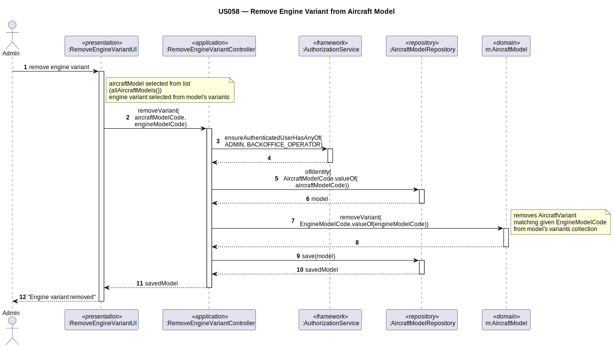

# US058 — Remove Engine Model from Aircraft Model (Extra)

## 1. Context

This task was assigned in Sprint 2 as an extra user story. It is the first time this task is being developed. The objective is to allow an Admin to remove an engine model from an aircraft model's variant list — the inverse of US057.

**Assigned to:** Dinis Silva (extra)

### 1.1 List of Issues

- Analysis: #(to be assigned)
- Design: #(to be assigned)
- Implement: #(to be assigned)
- Test: #(to be assigned)

---

## 2. Requirements

**US058** As Admin, I want to remove an engine model from an aircraft model so that outdated variants can be cleaned up.

### Acceptance Criteria

- **US058.1** The system must require the `ADMIN` role.
- **US058.2** The aircraft model must exist.
- **US058.3** The engine model being removed must be present in the aircraft model's variant list.
- **US058.4** Removing a variant does not delete the `EngineModel` aggregate — only the association is removed.

### Dependencies/References

- US030 — auth infrastructure.
- US057 — variant must have been added first.

---

## 3. Analysis

### 3.0 LLM Assistance

Generative AI (Claude, Anthropic) was used to support the analysis and design of this user story.

**LLM suggestions adopted:**
- `AircraftModel.removeVariant(engineModelId)` checks the variant exists before removing it
- Guard: throws `IllegalArgumentException` if variant not found

**Decisions made by the team:**
- Inverse of US057 — symmetric design
- `EngineModel` is not deleted — only the `AircraftVariant` entry is removed from the `AircraftModel` aggregate

### 3.2 Invariants

| Entity | Invariant |
|--------|-----------|
| `AircraftModel` | `removeVariant()` requires the `engineModelId` to exist in variants list |

---

## 4. Design

### 4.1 Realization

**Classes to create/modify:**

| Class | Module | Responsibility |
|-------|--------|----------------|
| `RemoveEngineFromAircraftModelUI` | `aisafe.app.backoffice.console` | Lists variants; calls controller |
| `RemoveEngineFromAircraftModelController` | `aisafe.core` | Auth; lookup; calls `removeVariant()`; saves |
| `AircraftModel` (modified) | `aisafe.core` | Adds `removeVariant(engineModelId)` |

**Sequence Diagram:**

### 4.2 Acceptance Tests

**AT1 — Removing a non-existent variant is rejected (US058.3)**

Given an `AircraftModel` with no engine variants (or without the specified engine),
When the admin attempts to remove a variant that does not exist in the model,
Then the system rejects the operation with an error indicating the variant was not found.

**AT2 — Successful variant removal (US058.4)**

Given an `AircraftModel` with one engine variant previously added,
When the admin removes that variant,
Then the variant is no longer present in the `AircraftModel`'s variant list, and the `EngineModel` aggregate itself remains undeleted and fully operational.

---

## 5. Implementation

**Key modified files:**

- `eapli.aisafe.aircraftmodel.domain.AircraftModel` — add `removeVariant()` method
- `eapli.aisafe.aircraftmodel.application.RemoveEngineFromAircraftModelController` — new controller
- `eapli.aisafe.app.backoffice.console.presentation.aircraftmodel.RemoveEngineFromAircraftModelUI` — new UI

*Major commits: (to be filled after implementation)*

---

## 6. Integration/Demonstration

1. Log in as admin
2. Select "Remove Engine from Aircraft Model"
3. Select aircraft model; system shows current variants; select one to remove
4. System validates and confirms removal
5. Variant no longer appears in US055 model details

---

## 7. Observations

Removing a variant does not delete the `EngineModel` aggregate. The `EngineModel` has its own independent lifecycle. Only the `AircraftVariant` internal entity is removed from the `AircraftModel`'s collection.
