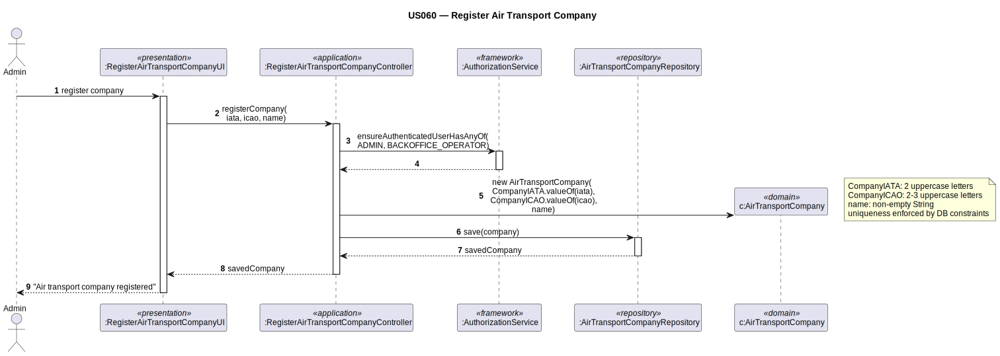

# US060 — Register Air Transport Company

## 1. Context

This task was assigned in Sprint 2. It is the first time this task is being developed. The objective is to allow an Admin to register an air transport company in the system. Companies are linked to collaborators (US061) and aircraft (US070).

**Assigned to:** Cláudio Pinto

### 1.1 List of Issues

- Analysis: #(to be assigned)
- Design: #(to be assigned)
- Implement: #(to be assigned)
- Test: #(to be assigned)

---

## 2. Requirements

**US060** As Admin, I want to register an air transport company so that it can be linked to collaborators and aircraft.

### Acceptance Criteria

- **US060.1** The system must require the `ADMIN` role.
- **US060.2** Company name must be unique in the system. *(Client clarification: "strange to have two companies with the same name — any of them must be unique.")*
- **US060.3** IATA code (2 letters) must be unique in the system. *(Client clarification: "no two airlines can have the same IATA code.")*
- **US060.4** ICAO code (2–3 letters) must be unique in the system. *(Client clarification: "no two airlines can have the same ICAO code.")*
- **US060.5** Each of the three fields (`CompanyName`, `IATACode`, `ICAOCode`) is individually unique — not just in combination.

### Dependencies/References

- US030 — auth infrastructure.
- US061 — collaborators will be linked to companies after creation.
- US070 — aircraft will be linked to companies after creation.

---

## 3. Analysis

### 3.0 LLM Assistance

Generative AI (Claude, Anthropic) was used to support the analysis and design of this user story.

**Prompt 1:** "Design RegisterAirTransportCompany for EAPLI. Three individually-unique fields: name (plain String), CompanyIATA (VO, 2 letters), CompanyICAO (VO, 2-3 letters). Controller checks all three uniqueness constraints."

**LLM suggestions adopted:**
- Three separate repository queries before creation: `findByName`, `findByIata`, `findByIcao`
- `CompanyIATA` and `CompanyICAO` as VOs validating format in constructors

**Decisions made by the team:**
- Three independent uniqueness checks — client confirmed each field must be individually unique
- `CompanyIATA` for companies is 2 letters (different from `AirportIATA` which is 3)
- `CompanyICAO` for companies is 2–3 letters (different from `AirportICAO` which is 4)
- Company name is a plain String attribute (non-empty, unique — enforced by controller)

### 3.1 Domain Model Navigation

**Aggregate: AirTransportCompany**
- Root: `AirTransportCompany` — `name` (plain String, non-empty, unique)
- VO: `CompanyIATA` — validates 2 uppercase letters; unique identity
- VO: `CompanyICAO` — validates 2–3 uppercase letters; unique

### 3.2 Invariants

| VO / Field | Invariant |
|------------|-----------|
| `name` | not null, not empty; unique in system (controller check) |
| `CompanyIATA` | exactly 2 uppercase letters; unique |
| `CompanyICAO` | 2–3 uppercase letters; unique |

---

## 4. Design

### 4.1 Realization

**Classes to create:**

| Class | Module | Responsibility |
|-------|--------|----------------|
| `RegisterAirTransportCompanyUI` | `aisafe.app.backoffice.console` | Collects input; calls controller |
| `RegisterAirTransportCompanyController` | `aisafe.core` | Auth; 3 uniqueness checks; creates company; saves |
| `AirTransportCompany` | `aisafe.core` | Aggregate root |
| `CompanyIATA` | `aisafe.core` | VO — validates 2 uppercase letters (company IATA, distinct from AirportIATA) |
| `CompanyICAO` | `aisafe.core` | VO — validates 2–3 uppercase letters (company ICAO, distinct from AirportICAO) |
| `AirTransportCompanyRepository` | `aisafe.core` | Repository interface |
| `JpaAirTransportCompanyRepository` | `aisafe.persistence.impl` | JPA implementation |
| `InMemoryAirTransportCompanyRepository` | `aisafe.persistence.impl` | In-memory implementation |

**Sequence Diagram:**

### 4.2 Acceptance Tests

**AT1 — CompanyIATA rejects wrong length (US060.3)**

Given a company IATA code with 3 characters (e.g., "TAP"),
When the system attempts to create a `CompanyIATA` value object,
Then the system rejects the creation with an error indicating company IATA codes must be exactly 2 uppercase letters.

**AT2 — Company name rejects empty (US060.2)**

Given an empty string as the company name,
When the system attempts to register the air transport company,
Then the system rejects the creation with an error indicating the company name must not be empty.

**AT3 — CompanyICAO rejects code longer than 3 letters (US060.4)**

Given a company ICAO code with 4 characters (e.g., "TAPC"),
When the system attempts to create a `CompanyICAO` value object,
Then the system rejects the creation with an error indicating company ICAO codes must be 2–3 uppercase letters.

---

## 5. Implementation

**Key new files:**

- `eapli.aisafe.company.domain.AirTransportCompany` — aggregate root
- `eapli.aisafe.company.domain.CompanyIATA` — VO (2 letters, distinct from AirportIATA)
- `eapli.aisafe.company.domain.CompanyICAO` — VO (2–3 letters, distinct from AirportICAO)
- `eapli.aisafe.airtransportcompany.repositories.AirTransportCompanyRepository` — interface
- `eapli.aisafe.airtransportcompany.application.RegisterAirTransportCompanyController` — controller
- `eapli.aisafe.app.backoffice.console.presentation.airtransportcompany.RegisterAirTransportCompanyUI` — UI
- JPA + InMemory implementations

*Major commits: (to be filled after implementation)*

---

## 6. Integration/Demonstration

1. Log in as admin
2. Select "Register Air Transport Company"
3. Enter company name, IATA code (2 letters), ICAO code (2–3 letters)
4. System performs three independent uniqueness checks and confirms registration
5. Company available for US061 (add collaborator) and US070 (add aircraft)

---

## 7. Observations

The IATA and ICAO codes for air transport companies have different lengths than airport codes (airport: 3 + 4 letters; company: 2 + 2–3 letters). These are implemented as separate VO classes — `CompanyIATA` / `CompanyICAO` in package `eapli.aisafe.company.domain`, distinct from `AirportIATA` / `AirportICAO` in `eapli.aisafe.airport.domain`.

All three fields are individually unique — three separate controller-level checks with three separate repository queries.
