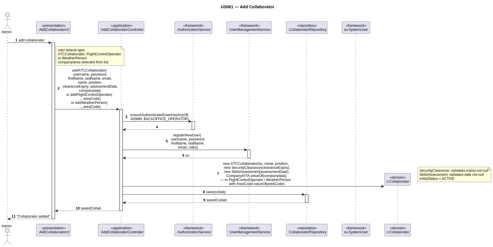

# US061 — Add Customer's Collaborator

## 1. Context

This task was assigned in Sprint 2. It is the first time this task is being developed. The objective is to allow an Admin to add a collaborator (of type ATC, FCO, or WEATHER) to the system, linking them to a system user and associating them with a company or air control area.

**Assigned to:** Dinis Silva

### 1.1 List of Issues

- Analysis: #35
- Design: #35
- Implement: #35
- Test: #35

---

## 2. Requirements

**US061** As Admin, I want to add a collaborator for a customer's company or air control area so that they can perform their role in the system.

### Acceptance Criteria

- **US061.1** The system must require the `BACKOFFICE_OPERATOR` role.
- **US061.2** The collaborator must be one of three types: `ATC`, `FCO` (Flight Control Operator), or `WEATHER`.
- **US061.3** Each collaborator must have: name, position (= professional role, confirmed by client), and a linked `SystemUser`.
- **US061.4** An `ATC` collaborator must be associated with an existing `AirTransportCompany` (by IATA code).
- **US061.5** `FCO` and `WEATHER` collaborators must be associated with an existing `AirControlArea` (by area code). *(Client clarification: "a FCO is responsible for managing air traffic in just one ACA.")*
- **US061.6** A collaborator must have an active `SecurityClearance` (expiry date in the future).
- **US061.7** A collaborator must have a `SkillsAssessment` (assessment date, not in the future).
- **US061.8** The linked `SystemUser` must have the appropriate role: `ATC_COLLABORATOR`, `FLIGHT_CONTROL_OPERATOR`, or `WEATHER_PERSON`.

### Dependencies/References

- US030 — auth infrastructure.
- US031 — the linked `SystemUser` must be registered first.
- US060 — `AirTransportCompany` must exist for ATC type.
- US050 — `AirControlArea` must exist for FCO and WEATHER types.

---

## 3. Analysis

### 3.0 LLM Assistance

Generative AI (Claude, Anthropic) was used to support the analysis and design of this user story.

**Prompt 1:** "Design AddCollaborator for EAPLI using DDD. Single Collaborator aggregate root with role variant via enum (ATC/FCO/WEATHER) — no inheritance. SecurityClearance (VO, expiryDate must be future). SkillsAssessment (VO, assessmentDate). ATC → AirTransportCompany; FCO/WEATHER → AirControlArea."

**LLM suggestions adopted:**
- Single `Collaborator` aggregate root with `CollaboratorType` enum field — no class inheritance
- Factory methods (`ofATC`, `ofFlightControlOperator`, `ofWeatherPerson`) enforce type-specific preconditions
- `SecurityClearance` VO validates `expiryDate` is in the future
- Cross-aggregate references by value-object ID only (no `@ManyToOne`)

**LLM suggestions rejected/overridden:**
- Originally suggested abstract class with subclasses — **rejected** by the professor: inheritance does not make sense here since the collaborator type is a role variant, not a structural difference. A single table with an enum discriminator is cleaner and avoids JPA inheritance complexity.

**Decisions made by the team:**
- `position` attribute = professional role (client confirmed: "Position = Role")
- `SystemUser` is created first (US031) and linked via `@OneToOne CascadeType.NONE`
- `CollaboratorRepository` covers all types in one table — simpler schema, single JPQL per query
- FCO and WEATHER are linked to one `AirControlArea` (client confirmed as default for Sprint 2)

### 3.1 Domain Model Navigation

**Aggregate: Collaborator**

Single concrete class — `Collaborator` — no inheritance.  
Type variant is identified by the `CollaboratorType` enum field.

| Field | Type | Applies to |
|-------|------|------------|
| `name` | String | all |
| `position` | String | all |
| `active` | boolean | all |
| `phone` | String (optional) | all |
| `collaboratorType` | `CollaboratorType` | all |
| `companyId` | `CompanyIATA` (embedded) | ATC only |
| `areaCode` | `AreaCode` (embedded) | FCO + WEATHER only |
| `securityClearance` | `SecurityClearance` (embedded VO) | all |
| `skillsAssessment` | `SkillsAssessment` (embedded VO) | all |
| `systemUser` | `SystemUser` (@OneToOne) | all |

Factory methods enforce cross-aggregate ref requirements at construction time.

### 3.2 Invariants

| Entity / VO | Invariant |
|-------------|-----------|
| `SecurityClearance` | `expiryDate` not null; must be today or in the future |
| `SkillsAssessment` | `assessmentDate` not null; not in the future |
| `Collaborator` | `name` non-blank, contains at least one letter |
| `Collaborator` | `position` non-blank, contains at least one letter |
| `Collaborator` (ATC type) | `companyId` must not be null |
| `Collaborator` (FCO/WEATHER) | `areaCode` must not be null |

---

## 4. Design

### 4.1 Realization

**Classes created:**

| Class | Module | Responsibility |
|-------|--------|----------------|
| `AddCollaboratorUI` | `aisafe.app` | Selects type; collects fields; calls controller method for that type |
| `AddCollaboratorController` | `aisafe.core` | Auth; creates `SystemUser`; saves `UserSecurityProfile`; builds `Collaborator` via factory method; saves |
| `Collaborator` | `aisafe.core` | Single aggregate root; `CollaboratorType` enum field; private constructor; three public factory methods |
| `CollaboratorType` | `aisafe.core` | Enum: `ATC`, `FCO`, `WEATHER` |
| `SecurityClearance` | `aisafe.core` | VO — `expiryDate` in the future |
| `SkillsAssessment` | `aisafe.core` | VO — `assessmentDate` not in the future |
| `CollaboratorRepository` | `aisafe.core` | Repository interface |
| `JpaCollaboratorRepository` | `aisafe.persistence` | JPA implementation — single `COLLABORATOR` table |
| `InMemoryCollaboratorRepository` | `aisafe.persistence` | In-memory implementation for tests |

**Sequence Diagram:**

### 4.2 Acceptance Tests

**AT1 — SecurityClearance rejects past expiry date (US061.6)**

Given a `SecurityClearance` with an expiry date set to yesterday (a date in the past),
When the system attempts to create the `SecurityClearance` value object,
Then the system rejects the creation with an error indicating the expiry date must be in the future.

**AT2 — Collaborator requires non-empty name (US061.3)**

Given an attempt to register a collaborator with an empty name,
When the system attempts to create the `Collaborator`,
Then the system rejects the creation with an error indicating the collaborator name must not be empty.

**AT3 — ATC collaborator must have a company ID (US061.4)**

Given an admin attempts to create an ATC collaborator with a null company IATA code,
When the factory method `Collaborator.ofATC(...)` is called,
Then the system rejects the creation with an error indicating a company is required for ATC type.

**AT4 — FCO / WEATHER collaborator must have an area code (US061.5)**

Given an admin attempts to create an FCO collaborator with a null area code,
When the factory method `Collaborator.ofFlightControlOperator(...)` is called,
Then the system rejects the creation with an error indicating an area code is required.

---

## 5. Implementation

**Key files:**

- `eapli.aisafe.collaborator.domain.Collaborator` — single aggregate root, factory methods
- `eapli.aisafe.collaborator.domain.CollaboratorType` — enum: ATC, FCO, WEATHER
- `eapli.aisafe.collaborator.domain.SecurityClearance` — VO: expiryDate in the future
- `eapli.aisafe.collaborator.domain.SkillsAssessment` — VO: assessmentDate not in the future
- `eapli.aisafe.collaborator.repositories.CollaboratorRepository` — interface
- `eapli.aisafe.collaborator.application.AddCollaboratorController` — controller
- `eapli.aisafe.ui.collaborator.AddCollaboratorUI` — UI

*Major commits: (to be filled after implementation)*

---

## 6. Integration/Demonstration

1. Log in as Backoffice Operator
2. Select "Add Collaborator" from the menu
3. Select type: 1 = ATC, 2 = FCO, 3 = WEATHER
4. Enter system credentials (username, password), personal data (first name, last name, email)
5. Enter collaborator data (full name, position)
6. Enter security clearance expiry date (format: yyyy-MM-dd) and skills assessment date
7. Select the associated company (ATC) or air control area (FCO / WEATHER) from the numbered list
8. System validates all invariants and saves. Confirmation displayed.

---

## 7. Observations

The `Collaborator` aggregate uses a **factory method pattern** instead of class inheritance:

- `Collaborator.ofATC(...)` — creates an ATC collaborator and enforces `companyId != null`
- `Collaborator.ofFlightControlOperator(...)` — creates an FCO collaborator and enforces `areaCode != null`
- `Collaborator.ofWeatherPerson(...)` — creates a WEATHER collaborator and enforces `areaCode != null`

The `CollaboratorType` enum is stored as `@Enumerated(EnumType.STRING)` in the single `COLLABORATOR` table. This is simpler than JPA `@Inheritance(SINGLE_TABLE)` with `@DiscriminatorColumn`, avoids framework quirks with polymorphic queries, and aligns with the domain model (CollaboratorType as a role variant, not a structural subtype).

The `SystemUser` is linked with `@OneToOne CascadeType.NONE` — the system user has its own lifecycle managed by the EAPLI framework. This use case also saves a `UserSecurityProfile` to satisfy the security clearance check (AC 031.7-equivalent).
