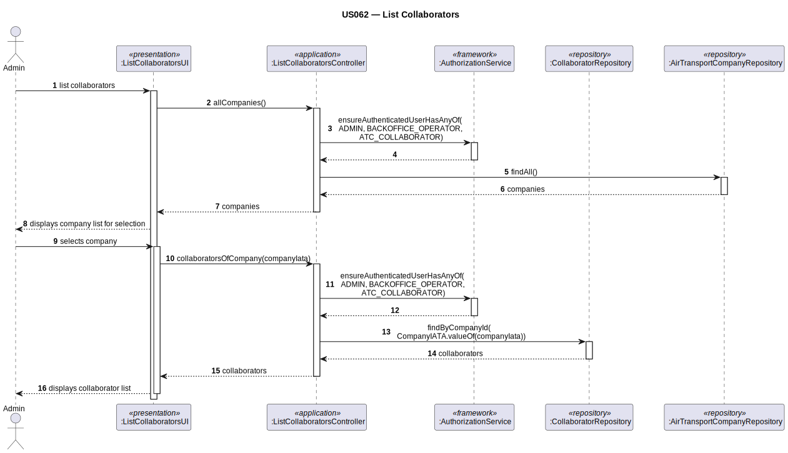

# US062 — List Customer's Collaborators

## 1. Context

This task was assigned in Sprint 2. It is the first time this task is being developed. The objective is to allow an Admin to list all collaborators of a specific air transport company. This is a query use case using the `AbstractListUI` pattern.

**Assigned to:** Fábio Costa

### 1.1 List of Issues

- Analysis: #(to be assigned)
- Design: #(to be assigned)
- Implement: #(to be assigned)
- Test: #(to be assigned)

---

## 2. Requirements

**US062** As Admin, I want to list all collaborators of a customer's company so that I can see who is employed there.

### Acceptance Criteria

- **US062.1** The system must require the `ADMIN` role.
- **US062.2** The Admin must be able to filter collaborators by company.
- **US062.3** The list must show at minimum: name, position, type (ATCCollaborator/FCO/WeatherPerson), security clearance expiry date.
- **US062.4** If the company has no collaborators, an appropriate message must be shown.

### Dependencies/References

- US030 — auth infrastructure.
- US060 — company must exist.
- US061 — collaborators must have been added.

---

## 3. Analysis

### 3.0 LLM Assistance

Generative AI (Claude, Anthropic) was used to support the analysis and design of this user story.

**Prompt 1:** "How do I implement List Collaborators with AbstractListUI in EAPLI filtering by company?"

**LLM suggestions adopted:**
- `AbstractListUI<Collaborator>` — UI first selects company, then calls controller
- `CollaboratorRepository.findByCompanyId(companyId)` returns `Iterable<Collaborator>` filtered by company
- `CollaboratorPrinter` as `Visitor<Collaborator>` formats each row

**Decisions made by the team:**
- List shows all collaborators associated with a company regardless of type

### 3.1 Framework Pattern

UI extends `AbstractListUI<Collaborator>`. The `elements()` method calls the controller with the selected company ID. The filter (selected company) is collected by the UI before calling `elements()`.

---

## 4. Design

### 4.1 Realization

| Class | Module | Responsibility |
|-------|--------|----------------|
| `ListCollaboratorsUI` | `aisafe.app.backoffice.console` | Selects company; extends `AbstractListUI<Collaborator>` |
| `ListCollaboratorsController` | `aisafe.core` | Auth; queries by company |
| `CollaboratorPrinter` | `aisafe.app.backoffice.console` | `Visitor<Collaborator>` — formats each row |

**Sequence Diagram:**



### 4.2 Acceptance Tests

**Test 1:** Only collaborators of the specified company are returned.

```java
@Test
public void ensureOnlyCollaboratorsOfCompanyAreReturned() {
    Iterable<Collaborator> result = controller.collaboratorsOfCompany(companyId);
    for (Collaborator c : result) {
        assertEquals(companyId, ((ATCCollaborator) c).companyId());
    }
}
```

**Test 2:** Empty list when company has no collaborators.

```java
@Test
public void ensureEmptyListForCompanyWithNoCollaborators() {
    Iterable<Collaborator> result = controller.collaboratorsOfCompany(newCompanyId);
    assertFalse(result.iterator().hasNext());
}
```

---

## 5. Implementation

- `eapli.aisafe.collaborator.application.ListCollaboratorsController`
- `eapli.aisafe.app.backoffice.console.presentation.collaborator.ListCollaboratorsUI`
- `eapli.aisafe.app.backoffice.console.presentation.collaborator.CollaboratorPrinter`
- `eapli.aisafe.collaborator.repositories.CollaboratorRepository` — add `findByCompanyId(companyId)`

*Major commits: (to be filled after implementation)*

---

## 6. Integration/Demonstration

1. Log in as admin → "List Collaborators" → select company → view table

---

## 7. Observations

Pure query — no aggregate modified. `CollaboratorRepository.findByCompanyId()` requires a custom JPQL query filtering on the `companyId` field.
