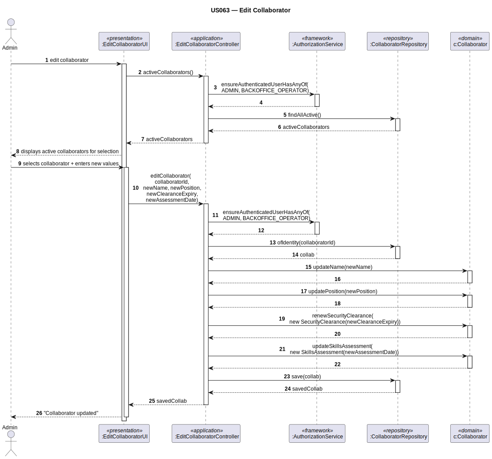

# US063 — Edit Customer's Collaborator (Extra)

## 1. Context

This task was assigned in Sprint 2 as an extra user story. The objective is to allow an Admin to edit a collaborator's mutable attributes: name, position, security clearance, and skills assessment.

**Assigned to:** Fábio Costa (extra)

### 1.1 List of Issues

- Analysis: #(to be assigned)
- Design: #(to be assigned)
- Implement: #(to be assigned)
- Test: #(to be assigned)

---

## 2. Requirements

**US063** As Admin, I want to edit a collaborator's details so that their information remains accurate.

### Acceptance Criteria

- **US063.1** The system must require the `ADMIN` role.
- **US063.2** The Admin must select a collaborator to edit.
- **US063.3** The following may be updated: name, position (role), security clearance expiry date, skills assessment date.
- **US063.4** VOs are immutable — updating means creating new VO instances.
- **US063.5** All invariants of the affected VOs must still hold after editing.

### Dependencies/References

- US030 — auth infrastructure.
- US061 — collaborator must exist.

---

## 3. Analysis

### 3.0 LLM Assistance

Generative AI (Claude, Anthropic) was used to support the analysis and design of this user story.

**LLM suggestions adopted:**
- `Collaborator.updateName(newName)` / `updatePosition(newPosition)` as plain setters
- `Collaborator.renewSecurityClearance(newExpiryDate)` creates a NEW `SecurityClearance` VO and replaces the reference
- `Collaborator.updateSkillsAssessment(newDate)` creates a NEW `SkillsAssessment` VO and replaces the reference

**Decisions made by the team:**
- The collaborator type (ATCCollaborator / FCO / WeatherPerson) cannot be changed
- The linked `SystemUser` cannot be changed via this use case
- `position` = professional role string (client clarification confirmed)

### 3.1 Domain Model Context

VOs are immutable. To update a VO attribute on `Collaborator`:
1. Create a new VO instance with the new data (constructor validates invariants)
2. Call a method on the `Collaborator` root to replace the old VO reference

---

## 4. Design

### 4.1 Realization

| Class | Module | Responsibility |
|-------|--------|----------------|
| `EditCollaboratorUI` | `aisafe.app.backoffice.console` | Selects collaborator; collects new values; calls controller |
| `EditCollaboratorController` | `aisafe.core` | Auth; finds collaborator; calls update methods; saves |
| `Collaborator` (modified) | `aisafe.core` | Adds `updateName()`, `updatePosition()`, `renewSecurityClearance()`, `updateSkillsAssessment()` |

**Sequence Diagram:**

### 4.2 Acceptance Tests

**AT1 — Security clearance renewal with past date is rejected (US063.5)**

Given an admin attempts to renew a collaborator's security clearance with an expiry date in the past,
When the system processes the renewal,
Then the system rejects the operation with an error indicating the new expiry date must be in the future.

**AT2 — Name update is persisted correctly (US063.3)**

Given an existing collaborator with a known name,
When the admin updates the collaborator's name to a new valid non-empty string and saves,
Then the system confirms the update and the collaborator's name reflects the new value.

---

## 5. Implementation

- `eapli.aisafe.collaborator.domain.Collaborator` — add update methods
- `eapli.aisafe.collaborator.application.EditCollaboratorController`
- `eapli.aisafe.app.backoffice.console.presentation.collaborator.EditCollaboratorUI`

---

## 7. Observations

`renewSecurityClearance()` does not mutate the existing `SecurityClearance` VO — it replaces the reference with a newly created instance. This follows EAPLI's VO immutability principle.
