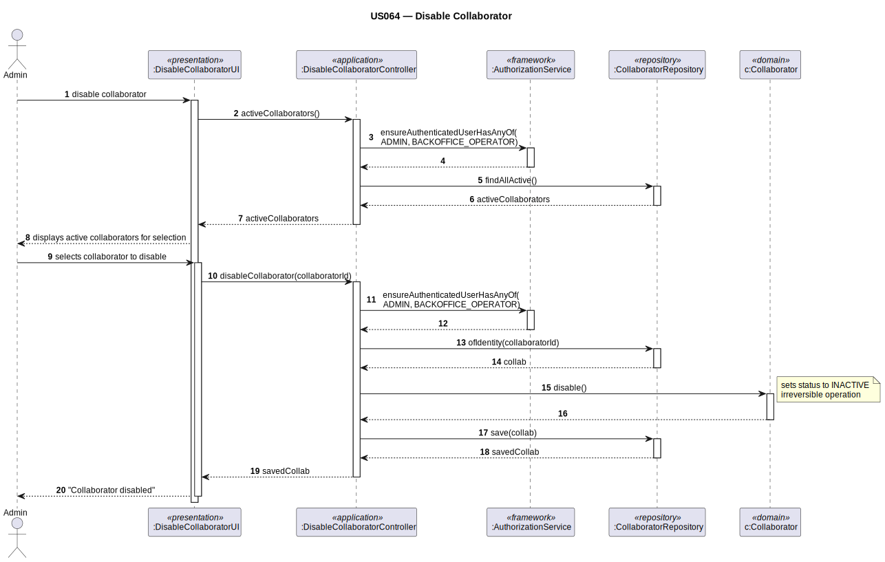

# US064 — Disable Collaborator

## 1. Context

This task was assigned in Sprint 2. It is the first time this task is being developed. The objective is to allow an Admin or Backoffice Operator to disable (deactivate) a collaborator, preventing them from operating within the system. This operation acts on the `Collaborator` aggregate and is irreversible.

**Assigned to:** Fábio Costa

### 1.1 List of Issues

- Analysis: #(to be assigned)
- Design: #(to be assigned)
- Implement: #(to be assigned)
- Test: #(to be assigned)

---

## 2. Requirements

**US064** As Admin (or Backoffice Operator), I want to disable a collaborator so that they can no longer operate within the system.

### Acceptance Criteria

- **US064.1** The system must require the `ADMIN` or `BACKOFFICE_OPERATOR` role.
- **US064.2** The system must display a list of active collaborators for selection.
- **US064.3** Once disabled, the collaborator's status must be set to `INACTIVE`.
- **US064.4** Disabling a collaborator does **not** affect the linked `SystemUser` account — they are independent aggregates. *(Client clarification: removing a collaborator was "definitely the wrong expression" — keep aggregates independent.)*
- **US064.5** The disable operation is irreversible — there is no "enable collaborator" counterpart.

### Dependencies/References

- US030 — auth infrastructure.
- US061 — collaborators must have been added.

---

## 3. Analysis

### 3.0 LLM Assistance

Generative AI (Claude, Anthropic) was used to support the analysis and design of this user story.

**Prompt 1:** "How do I implement a disable/deactivate operation on a DDD aggregate in the EAPLI framework?"

**LLM suggestions adopted:**
- `Collaborator.disable()` is an aggregate method that sets the internal status to `INACTIVE`
- The controller fetches the collaborator by identity, calls `disable()`, then saves back
- `CollaboratorRepository.findAllActive()` filters only active collaborators for the selection list

**Decisions made by the team:**
- Disable is irreversible (no enable operation)
- The `SystemUser` linked to the collaborator is NOT affected (separate aggregate lifecycle)

### 3.1 Domain Model

| Concept | Type | Description |
|---------|------|-------------|
| `Collaborator` | Aggregate Root | Can be disabled (status → `INACTIVE`) |
| `CollaboratorRepository` | Repository | `findAllActive()` + `ofIdentity()` + `save()` |

### 3.2 Invariants

- A collaborator can only be disabled if currently `ACTIVE`.
- Once `INACTIVE`, the state cannot be reversed through this system.

---

## 4. Design

### 4.1 Realization

| Class | Module | Responsibility |
|-------|--------|----------------|
| `DisableCollaboratorUI` | `aisafe.app.backoffice.console` | Lists active collaborators; calls controller |
| `DisableCollaboratorController` | `aisafe.core` | Auth; fetches collaborator; calls `disable()`; saves |
| `Collaborator` | `aisafe.core` | Aggregate root — `disable()` sets status to `INACTIVE` |
| `CollaboratorRepository` | `aisafe.core` | `findAllActive()` and `save()` |

**Sequence Diagram:**



### 4.2 Acceptance Tests

**Test 1:** Disabling an active collaborator sets status to INACTIVE.

**Refers to:** US064.3

```java
@Test
public void ensureDisabledCollaboratorIsInactive() {
    Collaborator collab = createActiveCollaborator();
    controller.disableCollaborator(collab.identity());
    assertFalse(collab.isActive());
}
```

**Test 2:** Only active collaborators appear in the selection list.

**Refers to:** US064.2

```java
@Test
public void ensureOnlyActiveCollaboratorsAreListedForDisable() {
    Iterable<Collaborator> active = controller.activeCollaborators();
    for (Collaborator c : active) {
        assertTrue(c.isActive());
    }
}
```

**Test 3:** Non-existent collaborator throws exception.

```java
@Test(expected = IllegalArgumentException.class)
public void ensureDisablingNonExistentCollaboratorThrows() {
    controller.disableCollaborator(-999L);
}
```

---

## 5. Implementation

**Key files:**

- `eapli.aisafe.collaborator.application.DisableCollaboratorController`
- `eapli.aisafe.collaborator.domain.Collaborator` — `disable()` method
- `eapli.aisafe.collaborator.repositories.CollaboratorRepository` — `findAllActive()`
- `eapli.aisafe.app.backoffice.console.presentation.collaborator.DisableCollaboratorUI`

*Major commits: (to be filled after implementation)*

---

## 6. Integration/Demonstration

1. Log in as Admin or Backoffice Operator
2. Select "Disable Collaborator" from menu
3. System displays list of active collaborators
4. Select a collaborator → system calls `disable()` and saves
5. Collaborator no longer appears in active lists; their linked `SystemUser` is unaffected

---

## 7. Observations

`Collaborator.disable()` is a domain method that enforces the business rule in the aggregate itself, following the rich-domain model pattern. The `SystemUser` aggregate is intentionally not modified — these are separate lifecycle concerns (US032 handles `SystemUser` enable/disable independently). The `CollaboratorRepository.findAllActive()` method requires a custom JPQL query filtering on the status field.
