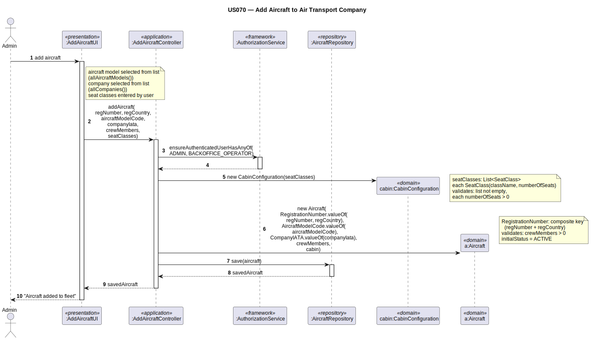

# US070 — Add Aircraft to Air Transport Company

## 1. Context

This task was assigned in Sprint 2. It is the first time this task is being developed. The objective is to allow an Admin to add an aircraft to an air transport company's fleet. Aircraft is a new aggregate root with a unique registration number.

**Assigned to:** Dinis Silva

### 1.1 List of Issues

- Analysis: #(to be assigned)
- Design: #(to be assigned)
- Implement: #(to be assigned)
- Test: #(to be assigned)

---

## 2. Requirements

**US070** As Admin, I want to add an aircraft to an air transport company so that the company can operate it.

### Acceptance Criteria

- **US070.1** The system must require the `ADMIN` role.
- **US070.2** The registration number must be unique worldwide.
- **US070.3** The aircraft must be associated with an existing aircraft model.
- **US070.4** The aircraft must be associated with an existing air transport company.
- **US070.5** The cabin configuration must specify at least one seat class with a positive number of seats.
- **US070.6** The total number of seats cannot exceed the aircraft model's capacity (if defined).
- **US070.7** The aircraft is initially in `ACTIVE` operational status.
- **US070.8** The number of flight crew members must be positive.

### Dependencies/References

- US030 — auth infrastructure.
- US055 — aircraft model must exist.
- US060 — air transport company must exist.

---

## 3. Analysis

### 3.0 LLM Assistance

Generative AI (Claude, Anthropic) was used to support the analysis and design of this user story.

**Prompt 1:** "Design AddAircraft for EAPLI. Domain: Aircraft (root), RegistrationNumber (VO, unique worldwide), CabinConfiguration (VO containing 1..* SeatClass VOs), OperationalStatus (enum, ACTIVE/DECOMMISSIONED)."

**LLM suggestions adopted:**
- `RegistrationNumber` VO validates non-empty
- `CabinConfiguration` VO contains 1..* `SeatClass` VOs; validates non-empty collection
- `SeatClass` VO validates `numberOfSeats > 0`
- Controller checks uniqueness before creation; initial status is always `ACTIVE`

**Decisions made by the team:**
- `numberOfFlightCrewMembers` is a plain `int` (no VO needed)
- `CabinConfiguration` and `SeatClass` are VOs — replaced entirely on change

### 3.1 Domain Model Navigation

**Aggregate: Aircraft**
- Root: `Aircraft` — `numberOfFlightCrewMembers`; `OperationalStatus` starts `ACTIVE`
- VO: `RegistrationNumber` — unique worldwide
- VO: `CabinConfiguration` — contains 1..* `SeatClass`
- VO: `SeatClass` — `className` + `numberOfSeats`
- Enum: `OperationalStatus` — ACTIVE / DECOMMISSIONED

Cross-aggregate refs: `AircraftModelId`, `AirTransportCompanyId`

### 3.2 Invariants

| VO / Entity | Invariant |
|-------------|-----------|
| `RegistrationNumber` | not null, not empty; unique (controller) |
| `SeatClass` | `numberOfSeats > 0`; `className` not empty |
| `CabinConfiguration` | at least one `SeatClass` |
| `Aircraft` | `numberOfFlightCrewMembers > 0` |

---

## 4. Design

### 4.1 Realization

| Class | Module | Responsibility |
|-------|--------|----------------|
| `AddAircraftUI` | `aisafe.app.backoffice.console` | Collects input; calls controller |
| `AddAircraftController` | `aisafe.core` | Auth; refs check; uniqueness; creates Aircraft; saves |
| `Aircraft` | `aisafe.core` | Aggregate root |
| `RegistrationNumber` | `aisafe.core` | VO — unique worldwide |
| `CabinConfiguration` | `aisafe.core` | VO — contains SeatClass VOs |
| `SeatClass` | `aisafe.core` | VO — className + numberOfSeats |
| `OperationalStatus` | `aisafe.core` | Enum |
| `AircraftRepository` | `aisafe.core` | Repository interface |
| `JpaAircraftRepository` | `aisafe.persistence.impl` | JPA implementation |
| `InMemoryAircraftRepository` | `aisafe.persistence.impl` | In-memory implementation |

**Sequence Diagram:**

### 4.2 Acceptance Tests

**AT1 — SeatClass rejects non-positive seat count (US070.5)**

Given a `SeatClass` with a seat count of 0 (or negative),
When the system attempts to create the `SeatClass` value object,
Then the system rejects the creation with an error indicating the number of seats must be a positive integer.

**AT2 — CabinConfiguration rejects empty seat class list (US070.5)**

Given an empty list of seat classes for the cabin configuration,
When the system attempts to create the `CabinConfiguration` value object,
Then the system rejects the creation with an error indicating at least one seat class must be provided.

**AT3 — RegistrationNumber rejects null (US070.2)**

Given a null registration number,
When the system attempts to create the `RegistrationNumber` value object,
Then the system rejects the creation with an error indicating the registration number must not be null or empty.

---

## 5. Implementation

- `eapli.aisafe.aircraft.domain.Aircraft`, `RegistrationNumber`, `CabinConfiguration`, `SeatClass`, `OperationalStatus`
- `eapli.aisafe.aircraft.repositories.AircraftRepository`
- `eapli.aisafe.aircraft.application.AddAircraftController`
- `eapli.aisafe.app.backoffice.console.presentation.aircraft.AddAircraftUI`
- JPA + InMemory implementations

---

## 7. Observations

`CabinConfiguration` is a VO containing a list of `SeatClass` VOs. In JPA this requires `@ElementCollection` with `@Embeddable SeatClass`. Cross-aggregate references `aircraftModelId` and `companyId` are stored as plain IDs (not `@ManyToOne`).
