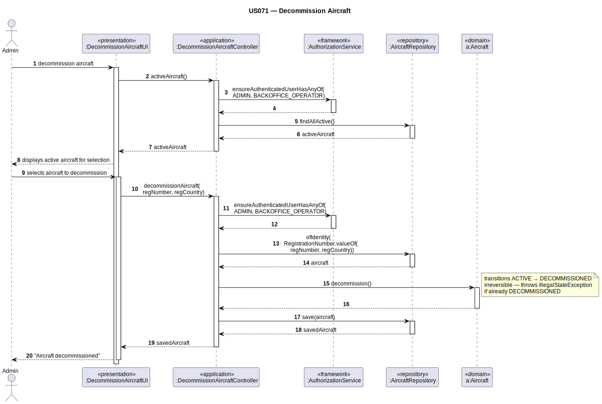

# US071 — Decommission Aircraft

## 1. Context

This task was assigned in Sprint 2. The objective is to allow an Admin to decommission an aircraft, changing its operational status from `ACTIVE` to `DECOMMISSIONED`. A decommissioned aircraft cannot be assigned to future flights.

**Assigned to:** Fábio Costa

### 1.1 List of Issues

- Analysis: #40
- Design: #40
- Implement: #40
- Test: #40

---

## 2. Requirements

**US071** As Admin, I want to decommission an aircraft so that it can no longer be assigned to flights.

### Acceptance Criteria

- **US071.1** The system must require the `ADMIN` role.
- **US071.2** The Admin must select an active aircraft to decommission.
- **US071.3** Decommissioning changes `OperationalStatus` from `ACTIVE` to `DECOMMISSIONED`.
- **US071.4** An already-decommissioned aircraft cannot be decommissioned again.
- **US071.5** Decommissioning does not delete the aircraft record.
- **US071.6** A decommissioned aircraft must be distinguishable in the fleet list (US072).

### Dependencies/References

- US030 — auth infrastructure.
- US070 — aircraft must exist.

---

## 3. Analysis

### 3.0 LLM Assistance

Generative AI (Claude, Anthropic) was used to support the analysis and design of this user story.
Below are the main prompts used, the suggestions adopted, and the decisions made
independently or where we deviated from the AI output.

---

#### Prompt 1 — Domain design of the decommission operation

> "We are developing the AISafe flight control system using DDD and the EAPLI framework. We need to
> implement US071 — Decommission Aircraft. An Admin changes an aircraft's operational status from
> ACTIVE to DECOMMISSIONED. The operation is irreversible and cannot be applied to an already-
> decommissioned aircraft. Where should the state transition logic live, what invariant guards it,
> and what repository method is needed to support listing only active aircraft for selection?"

**LLM suggestions adopted:**
- `Aircraft.decommission()` sets `operationalStatus = DECOMMISSIONED`; throws `IllegalStateException` if already decommissioned
- `AircraftRepository.findAllActive()` shows only ACTIVE aircraft in selection step

**Decisions:**
- Irreversible state transition in Sprint 2 (no `recommission()`)
- Initial status `ACTIVE` enforced in `Aircraft` constructor (US070.7)

### 3.2 Invariants

| Entity | Invariant |
|--------|-----------|
| `Aircraft` | `ACTIVE → DECOMMISSIONED` only; no re-commission |

---

## 4. Design

### 4.1 Realization

| Class | Module | Responsibility |
|-------|--------|----------------|
| `DecommissionAircraftUI` | `aisafe.app.backoffice.console` | Lists active aircraft; calls controller |
| `DecommissionAircraftController` | `aisafe.core` | Auth; lists active; calls `decommission()`; saves |
| `Aircraft` (modified) | `aisafe.core` | Adds `decommission()`, `isActive()`, `operationalStatus()` |
| `AircraftRepository` (modified) | `aisafe.core` | Adds `findAllActive()` |

**Sequence Diagram:**

### 4.2 Acceptance Tests

**AT1 — Double decommission is rejected (US071.4)**

Given an aircraft that has already been decommissioned,
When the admin attempts to decommission it a second time,
Then the system rejects the operation with an error indicating the aircraft is already in DECOMMISSIONED status.

**AT2 — Status transitions correctly from ACTIVE to DECOMMISSIONED (US071.3)**

Given an active aircraft in the system,
When the admin selects it and confirms the decommission action,
Then the aircraft's operational status changes to DECOMMISSIONED and `isActive()` returns false.

**AT3 — New aircraft starts in ACTIVE status (US070.7)**

Given a newly created aircraft added via US070,
When the system persists it,
Then the aircraft's initial operational status is ACTIVE and `isActive()` returns true.

---

## 5. Implementation

- `eapli.aisafe.aircraft.domain.Aircraft` — add `decommission()`, `isActive()`, `operationalStatus()`
- `eapli.aisafe.aircraft.repositories.AircraftRepository` — add `findAllActive()`
- `eapli.aisafe.aircraft.application.DecommissionAircraftController`
- `eapli.aisafe.app.backoffice.console.presentation.aircraft.DecommissionAircraftUI`

---

## 7. Observations

`decommission()` is irreversible in Sprint 2. `AircraftRepository.findAllActive()` filters by `operationalStatus = ACTIVE`. Decommissioned aircraft records are retained in the database.
