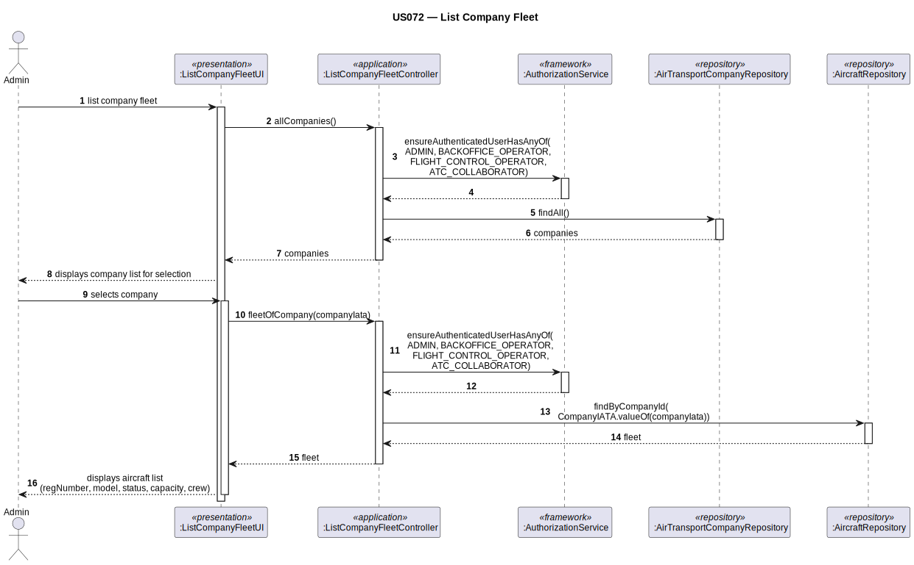

# US072 — List Company Fleet

## 1. Context

This task was assigned in Sprint 2. The objective is to allow an ATC Collaborator or Flight Control Operator to list all aircraft belonging to an air transport company's fleet, with optional filters by model, maker, capacity, or age.

**Assigned to:** André Barcelos

### 1.1 List of Issues

- Analysis: #42
- Design: #42 #43 #44 #45 #46
- Implement: #43 #44 #45 #46
- Test: #43 #44 #45 #46

---

## 2. Requirements

**US072** As an Air Transport Company Collaborator, I want to list my company's aircraft fleet.

### Acceptance Criteria

- **US072.1** The system must require the `ATC_COLLABORATOR` or `FLIGHT_CONTROL_OPERATOR` role.
- **US072.2** The user must be able to filter aircraft by company, or show all aircraft across all companies.
- **US072.3** The list must show at minimum: registration number, aircraft model code, operational status, total capacity (number of passengers), and number of flight crew members.
- **US072.4** If the company has no aircraft, an appropriate message must be shown.
- **US072.5** Both `ACTIVE` and `DECOMMISSIONED` aircraft must be shown (full fleet history).
- **US072a** The user must be able to filter the fleet by aircraft model code.
- **US072b** The user must be able to filter the fleet by aircraft maker/manufacturer name.
- **US072c** The user must be able to filter the fleet by **exact** passenger capacity (number of seats equal to the given value).
- **US072d** The user must be able to filter the fleet by aircraft age in years (aircraft whose age equals the given number of years).

### Dependencies/References

- US030 — auth infrastructure.
- US060 — company must exist.
- US070 — aircraft must have been added.

---

## 3. Analysis

### 3.0 LLM Assistance

Generative AI (Claude, Anthropic) was used to support the analysis and design of this user story.

**LLM suggestions adopted:**
- `AbstractListUI<Aircraft>` — company selection first, then filter selection, then `findByCompanyId()`
- Inline `Visitor<Aircraft>` lambda formats each row
- US072b filter done in memory in the controller (maker is stored on `AircraftModel`, not on `Aircraft`)
- US072c filter done in memory in the controller (capacity is computed from `CabinConfiguration`, not a stored column)
- US072d filter done in memory in the controller using `Aircraft.ageInYears()` computed from `registrationDate`

**Decisions made by the team:**
- Both ACTIVE and DECOMMISSIONED aircraft shown (full fleet history, US072.5)
- US072b, US072c, and US072d filters applied in memory after fetching fleet from repository
- US072a filter delegated to repository (`findByCompanyIdAndModel`)
- **US072c uses exact match** (not minimum/range): filter returns only aircraft whose `totalCapacity()` equals the given number. This was corrected from an initial minimum-capacity implementation to match the requirement precisely.
- **US072d uses exact age match**: `Aircraft.ageInYears()` is computed as `Period.between(registrationDate, LocalDate.now()).getYears()` and compared for equality to the given value. Filtering by age range is out of scope.

### 3.1 Domain Model

| Concept | Type | Description |
|---------|------|-------------|
| `Aircraft` | Aggregate Root | Registration, model code, company, cabin config, status, registrationDate |
| `CabinConfiguration` | Value Object | List of `SeatClass` VOs; `totalCapacity()` = sum of all seats |
| `RegistrationNumber` | Value Object | Unique worldwide; number + country |
| `AircraftModelCode` | Value Object | Cross-aggregate ref to `AircraftModel` |
| `CompanyIATA` | Value Object | Cross-aggregate ref to `AirTransportCompany` |

**Domain methods used by this use case:**

| Method | Class | Used by |
|--------|-------|---------|
| `totalCapacity()` | `CabinConfiguration` | US072c — exact capacity filter |
| `ageInYears()` | `Aircraft` | US072d — exact age filter |

`Aircraft.ageInYears()` is a pure computed method: `Period.between(registrationDate, LocalDate.now()).getYears()`. It requires no stored column — `registrationDate` is stored and age is derived at runtime.

---

## 4. Design

### 4.1 Realization

| Class | Module | Responsibility |
|-------|--------|----------------|
| `ListCompanyFleetUI` | `aisafe.app` | Selects company and filter (none/model/maker/capacity/age); formats list with age column |
| `ListCompanyFleetController` | `aisafe.core` | Auth; lists companies; queries fleet; applies in-memory filters |
| `AircraftRepository` | `aisafe.core` | `findByCompanyId`, `findByCompanyIdAndModel`, `findAll` |
| `AircraftModelRepository` | `aisafe.core` | Used by US072b to resolve manufacturer name |

**Sequence Diagram:**

### 4.2 Acceptance Tests

**AT1 — Only aircraft of the selected company are returned (US072.2)**

Given two companies each with at least one aircraft in the system,
When the user selects one company and requests the fleet list,
Then the system returns only aircraft registered to that company.

**AT2 — Empty fleet message shown when company has no aircraft (US072.4)**

Given a company that has been registered but has no aircraft added to its fleet,
When the user requests the fleet list for that company,
Then the system displays an appropriate message indicating no aircraft are found.

**AT3 — Both ACTIVE and DECOMMISSIONED aircraft are included (US072.5)**

Given a company that has both an active and a decommissioned aircraft,
When the user requests the fleet list for that company,
Then the system returns both aircraft regardless of operational status.

**AT4 — Filter by model returns only matching aircraft (US072a)**

Given a company fleet with aircraft of different models,
When the user filters by model code "A320",
Then only aircraft of that model are returned.

**AT5 — Filter by maker returns only matching aircraft (US072b)**

Given a company fleet with aircraft from different manufacturers,
When the user filters by maker "Airbus",
Then only aircraft whose model is manufactured by Airbus are returned.

**AT6 — Filter by capacity returns only aircraft with exact matching capacity (US072c)**

Given a company fleet with aircraft of different capacities (150, 200, 300 seats),
When the user filters by capacity 200,
Then only aircraft with `totalCapacity() == 200` are returned.

> **Note:** This was corrected from an initial minimum-capacity implementation. The filter uses exact match (`==`), not minimum (`>=`).

**AT7 — Filter by age returns only aircraft of matching age in years (US072d)**

Given a company fleet with aircraft registered in different years,
When the user filters by age 5 years,
Then only aircraft whose `ageInYears()` equals 5 are returned.

---

## 5. Implementation

**Key files:**

- `eapli.aisafe.aircraft.application.ListCompanyFleetController`
- `eapli.aisafe.ui.aircraft.ListCompanyFleetUI`
- `eapli.aisafe.aircraft.repositories.AircraftRepository`
- `eapli.aisafe.persistence.jpa.JpaAircraftRepository`
- `eapli.aisafe.persistence.inmemory.InMemoryAircraftRepository`

*Major commits: (to be filled after implementation)*

---

## 6. Integration/Demonstration

1. Log in as ATC Collaborator or Flight Control Operator
2. Select "Aircraft" → "List Company Fleet"
3. Select a company (or 0 for all)
4. Select a filter: none / by model (US072a) / by maker (US072b) / by exact capacity (US072c) / by age in years (US072d)
5. If filtering by capacity, enter exact number of seats
6. If filtering by age, enter age in years (integer)
7. System displays matching aircraft with: registration number, model code, status, total capacity, crew members, and age in years

---

## 7. Observations

US072b, US072c, and US072d filters are all applied in memory in the controller:
- **US072b (maker):** `AircraftModel.manufacturerName` is not on `Aircraft`, so the controller fetches all fleet aircraft, then resolves each model via `AircraftModelRepository`, and filters by manufacturer name.
- **US072c (capacity):** `totalCapacity()` is computed from `CabinConfiguration` at runtime — not a stored column. Filter uses **exact match**.
- **US072d (age):** `ageInYears()` is computed from `registrationDate` at runtime using `Period.between(registrationDate, LocalDate.now()).getYears()` — not a stored column. Filter uses **exact match**.

US072a (model) is delegated to the repository via JPQL on `aircraftModelCode.code` — this is a stored field, so a DB-level query is efficient.

The list header displayed by the UI was updated to include an "Age" column (years) when results are shown, regardless of which filter was applied.
