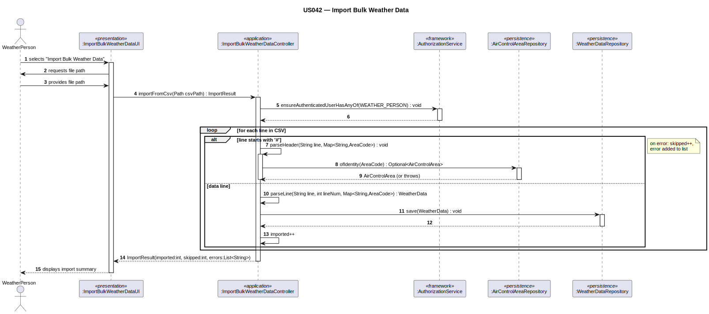

# US042 — Import Bulk Weather Data

## 1. Context

This task was assigned in Sprint 3. The objective is to allow a Weather Person to import bulk
weather data from a file into the system. The system must support multiple external weather service
providers and be easily extensible to new data formats without modifying existing code.

**Assigned to:** Cláudio Pinto

### 1.1 List of Issues

- Analysis: #71 (US042 — Import Bulk Weather Data)
- Design: #71 (US042 — Import Bulk Weather Data)
- Implement: #71 (US042 — Import Bulk Weather Data)
- Test: #71 (US042 — Import Bulk Weather Data)

---

## 2. Requirements

**US042** As a Weather Person, I want to import bulk weather data into the system so that weather
information from multiple external providers can be aggregated for better accuracy.

### Acceptance Criteria

- **US042.1** The system must require the WEATHER_PERSON role.
- **US042.2** The system must support CSV as the initial import format.
- **US042.3** Each record in the file must be validated before being persisted.
- **US042.4** Invalid records must be reported without interrupting the import of valid ones.
- **US042.5** The system must be extensible to new data formats without modifying existing code.
- **US042.6** The source provider must be recorded for each imported WeatherData record.

### Dependencies/References

- US030 — auth infrastructure.
- US041 — Register weather data (Sprint 2): WeatherData domain object and repository already exist.
- US050 — AirControlArea must exist (WeatherData is registered for an area).

---

## 3. Analysis

### 3.0 LLM Assistance

Generative AI (Claude, Anthropic) was used to support the analysis and design of this user story.
Below are the main prompts used, the suggestions adopted, and the decisions the team made
independently or where we deviated from the AI output.

---

#### Prompt 1 — Extensible importer design

> "We are implementing a bulk weather data import feature in Java using DDD and the EAPLI framework.
> The initial format is CSV. The system must be easy to extend to new formats without modifying
> existing code. Suggest a design that supports this extensibility requirement."

**LLM suggestions adopted:**
- `WeatherDataImporter` interface with a single `parse(filePath)` method — each format is a
  separate implementation (Strategy pattern)
- `WeatherDataImporterFactory` selects the correct importer by file extension, so adding a new
  format only requires a new implementation and registering it in the factory (Open/Closed
  Principle)
- Invalid records are collected and reported at the end rather than aborting the whole import

**Decisions made by the team / deviations from LLM output:**
- The LLM suggested auto-detecting the source provider from the file contents — the team reads it
  from the CSV header, consistent with the `sourceProvider` attribute already on the WeatherData
  domain object (US041)
- The LLM proposed a batch `saveAll()` — replaced with individual `save()` per record so that
  partial imports succeed even when some records are invalid

---

### 3.1 Key Design Decisions

**Strategy pattern for importers** — `WeatherDataImporter` is an interface. `CSVWeatherDataImporter`
is the first concrete implementation. Adding a new format in a future sprint only requires a new
class — no changes to the controller or factory logic.

**Validation before persistence** — each parsed record is validated by the `WeatherData` domain
constructor before being passed to the repository. Invalid records are skipped and collected for
reporting.

**Reuse of existing domain objects** — `WeatherData` and `WeatherDataRepository` were created in
Sprint 2 (US041) and are reused directly. No domain changes are required.

---

## 4. Design

### 4.1 Realization

| Class | Module | Responsibility |
|-------|--------|----------------|
| `ImportWeatherDataUI` | `aisafe.app.backoffice.console` | Prompts for file path; displays import summary |
| `ImportWeatherDataController` | `aisafe.core` | Auth; delegates to factory and importer; saves records |
| `WeatherDataImporter` | `aisafe.core` | Interface — `parse(filePath): List<WeatherData>` |
| `WeatherDataImporterFactory` | `aisafe.core` | Selects importer by file extension |
| `CSVWeatherDataImporter` | `aisafe.core` | Parses CSV; validates each record |
| `WeatherDataRepository` | `aisafe.core` | Persists each valid `WeatherData` record (existing) |

**Sequence Diagram:**

### 4.2 Acceptance Tests

**AT1 — Valid CSV imported successfully (US042.2, US042.3)**

Given a valid CSV file with multiple weather data records,
When the Weather Person imports the file,
Then all valid records are persisted and the system reports the count of imported records.

**AT2 — Invalid records skipped, valid ones persisted (US042.4)**

Given a CSV file where some records have missing or malformed fields,
When the Weather Person imports the file,
Then valid records are persisted and invalid ones are listed in the error summary without
interrupting the import.

**AT3 — Unauthorised user rejected (US042.1)**

Given a user without the WEATHER_PERSON role,
When they attempt to access the import feature,
Then the system rejects the operation.

---

## 5. Implementation

- `eapli.aisafe.weatherdata.application.ImportWeatherDataController`
- `eapli.aisafe.weatherdata.application.WeatherDataImporterFactory`
- `eapli.aisafe.weatherdata.application.importers.WeatherDataImporter`
- `eapli.aisafe.weatherdata.application.importers.CSVWeatherDataImporter`
- `eapli.aisafe.app.backoffice.console.presentation.weatherdata.ImportWeatherDataUI`

---

## 6. Integration/Demonstration

To demonstrate this user story:

1. Bootstrap or manually register an air control area (US050).
2. Bootstrap or manually register weather data for that area (US041) to confirm the domain object
   and repository are working.
3. Prepare a valid CSV file with multiple weather data records, including at least one invalid
   record.
4. Log in as a Weather Person.
5. Select "Import Weather Data", provide the CSV file path.
6. Verify that valid records are persisted and the import summary lists the invalid ones without
   interrupting the import.

To demonstrate extensibility (US042.5):

1. Implement a new `WeatherDataImporter` for a different format (e.g. JSON).
2. Register it in `WeatherDataImporterFactory`.
3. Verify that no existing class was modified and the new format is accepted by the system.

---

## 7. Observations

Adding a new import format in a future sprint requires only: (1) implementing `WeatherDataImporter`,
(2) registering the new implementation in `WeatherDataImporterFactory`. No other class is modified.