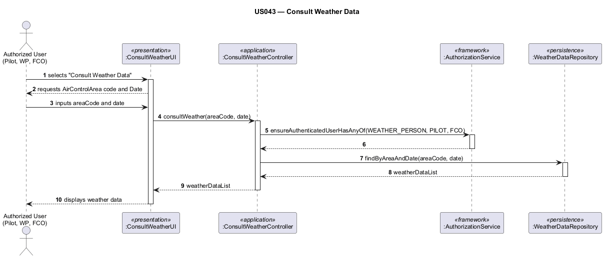

# US043 — Consult Weather Data

## 1. Context

This task was assigned in Sprint 3 within the Applications Engineering (EAPLI) scope. The objective is to allow authorized users to query and view weather data for a specific area and time, which is critical for flight planning and simulation.

**Assigned to:** Jaime Simões

### 1.1 List of Issues

- Analysis: #67
- Design: #67
- Implement: #67
- Test: #67

---

## 2. Requirements

**US043** As a Weather Person, a Pilot, or a Flight Control operator, I want to consult weather data in the system in a given day and in a specific air control area.

### Acceptance Criteria

- **US043.1** The system must allow querying weather data by providing a specific date and a specific air control area.
- **US043.2** Access must be restricted to users with the `WEATHER_PERSON`, `PILOT`, or `FLIGHT_CONTROL_OPERATOR` roles.
- **US043.3** The returned data must accurately reflect the information previously registered or imported for that specific area and day.

### Dependencies/References

- US041 — Register weather data
- US042 — Import bulk weather data
- US050 — Register an air control area

---

## 3. Analysis

### 3.0 LLM Assistance

Generative AI was used to support the analysis and design of this user story.

**Prompt 1:** "In a DDD application using JPA, I have a WeatherData aggregate root with a recordedDateTime stored as a LocalDateTime. How should I declare and implement a query method in WeatherDataRepository to retrieve all weather data for a given AreaCode on a specific LocalDate (spanning from 00:00:00 to 23:59:59)?"

**LLM suggestions adopted:**
- Query database using a date range (recordedDateTime BETWEEN date.atStartOfDay() AND date.atTime(LocalTime.MAX)) to handle time components in a date-only search.

**Decisions made by the team:**
- The controller method consultWeatherData(String areaCode, LocalDate date) should accept standard Java types (String, LocalDate) and construct domain Value Objects internally.

### 3.1 Domain Connections

The query requires traversing or filtering the `WeatherData` entity (or aggregate) using the `AirControlArea` identifier and a standard `Date` object.

---

## 4. Design

### 4.1 Realization

**Classes to create/modify:**
| Class | Module | Responsibility |
|-------|--------|----------------|
| `ConsultWeatherDataUI` | `eapli.aisafe.ui.weatherdata` | Prompts user for area and date, displays results |
| `ConsultWeatherDataController` | `eapli.aisafe.weatherdata.application` | Orchestrates the query, enforces authorization |
| `WeatherDataRepository` | `eapli.aisafe.weatherdata.repositories` | Added `findByAreaCodeAndDate(AreaCode, LocalDate)` method |
| `JpaWeatherDataRepository` | `eapli.aisafe.persistence.jpa` | JPQL implementation using parameterized `BETWEEN` query |
| `InMemoryWeatherDataRepository` | `eapli.aisafe.persistence.inmemory` | In-memory implementation with lambda predicate |
| `ConsultWeatherDataControllerTest` | `eapli.aisafe.weatherdata.application` (test) | 6 CSV-driven parameterized tests |

**Sequence Diagram — Consult Weather Data:**

### 4.2 Acceptance Tests

**AT1 — Authorized user successfully queries weather data**
Given an authenticated user with the `PILOT` role,
And weather data exists for Area "A1" on "2026-10-12",
When the user queries weather for Area "A1" on "2026-10-12",
Then the system displays the correct weather parameters for that day and area.

**AT2 — Unauthorized access is blocked**
Given an authenticated user with the `BACKOFFICE_OPERATOR` role,
When the user attempts to access the Consult Weather Data feature,
Then the system rejects the operation with an authorization error.

**AT3 — Querying a day with no data**
Given an authenticated user with the `WEATHER_PERSON` role,
When the user queries weather for an area and date that has no recorded data,
Then the system displays a clear message indicating no data is available.

---

## 5. Implementation

**Key new/modified files:**

- `aisafe.base/core/src/main/java/eapli/aisafe/weatherdata/application/ConsultWeatherDataController.java` — Controller with production and testing constructors, authorizes `WEATHER_PERSON`, `PILOT`, `FLIGHT_CONTROL_OPERATOR`
- `aisafe.base/app/src/main/java/eapli/aisafe/ui/weatherdata/ConsultWeatherDataUI.java` — Console UI prompting area code and date (`yyyy-MM-dd`), displays observations
- `aisafe.base/core/src/main/java/eapli/aisafe/weatherdata/repositories/WeatherDataRepository.java` — Added `findByAreaCodeAndDate(AreaCode, LocalDate)` method declaration
- `aisafe.base/persistence/src/main/java/eapli/aisafe/persistence/jpa/JpaWeatherDataRepository.java` — JPQL implementation using parameterized `match()` with `:areaCode`, `:start`, `:end` parameters (avoids Hibernate 6 `SemanticException` from string concatenation)
- `aisafe.base/persistence/src/main/java/eapli/aisafe/persistence/inmemory/InMemoryWeatherDataRepository.java` — In-memory implementation using stream filter with `LocalDate` range predicate
- `aisafe.base/app/src/main/java/eapli/aisafe/ui/MainMenu.java` — Weather submenu now visible to `PILOT` and `FLIGHT_CONTROL_OPERATOR`; Consult option registered
- `aisafe.base/core/src/test/java/eapli/aisafe/weatherdata/application/ConsultWeatherDataControllerTest.java` — 6 parameterized tests driven by `consult_weather_test.csv`
- `aisafe.base/core/src/test/java/eapli/aisafe/weatherdata/application/consult_weather_test.csv` — Test scenarios for all authorized roles + unauthorized + empty results

**Key implementation decisions:**

- JPQL uses parameterized `match(whereClause, Map)` instead of string concatenation because Hibernate 6 throws `SemanticException: Cannot interpret expression` when comparing `LocalDateTime` columns with string literals
- Date range uses `recordedDateTime BETWEEN :start AND :end` where `start = date.atStartOfDay()` and `end = date.atTime(LocalTime.MAX)`
- Controller accepts primitive types (`String`, `LocalDate`) and constructs domain `AreaCode` value objects internally

---

## 6. Integration/Demonstration

1. Log in as a Pilot, Weather Person, or Flight Control Operator.
2. Navigate to the Weather menu and select "Consult Weather Data".
3. Input an existing Air Control Area code and a valid Date.
4. Verify the output matches the expected registered data.

---

## 7. Observations

- Hibernate 6 rejects string-concatenated JPQL date comparisons — the `JpaWeatherDataRepository.findByAreaCodeAndDate` method was initially implemented with `"e.areaCode.code = '" + areaCode + "'"` style concatenation, which caused a `SemanticException`. The fix uses parameterized queries via `match("e.areaCode.code = :areaCode AND e.recordedDateTime BETWEEN :start AND :end", params)`.
- Parameterized tests use CSV data source for clean separation of test logic from test data.
- The `InMemoryWeatherDataRepository.findByAreaCodeAndDate` uses a simple lambda: `w -> w.areaCode().equals(areaCode) && w.recordedDateTime().toLocalDate().equals(date)` — suitable for unit tests but does not match the exact `BETWEEN` semantics of the JPA version (the in-memory version compares only the date portion, while JPA uses the full timestamp range).