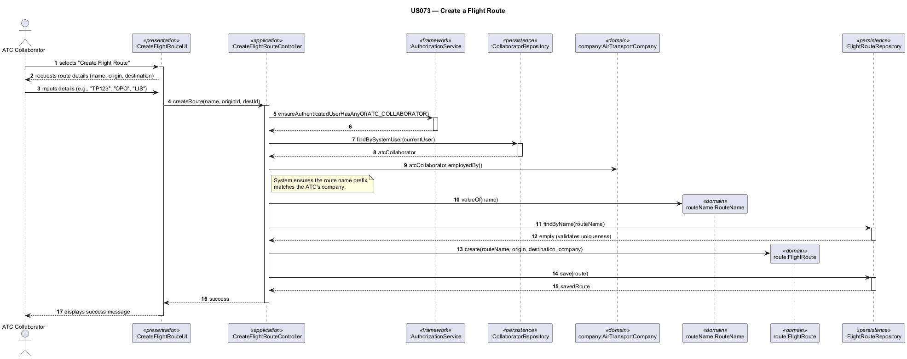

# US073 — Create a Flight Route

## 1. Context

This task was assigned in Sprint 3 within the Applications Engineering (EAPLI) scope. It establishes the foundational flight routes that will later be instantiated into actual flight plans.

**Assigned to:** Jaime Simões

### 1.1 List of Issues

- Analysis: #68
- Design: #68
- Implement: #68
- Test: #68

---

## 2. Requirements

**US073** As an Air Transport Company Collaborator, I want to add a flight route for my company.

### Acceptance Criteria

- **US073.1** A route is between two airports (start and end).
- **US073.2** The route name must be formatted with exactly 2 letters (representing the company's initials) followed by up to 4 numbers (e.g., "TP123").
- **US073.3** The route's name must be strictly unique within the system.
- **US073.4** The user performing the action must have the `ATC_COLLABORATOR` role.

### Dependencies/References

- US052 — Create an airport (Start and end airports must exist).
- US060 — Register an air transport company (To validate company initials).

---

## 3. Analysis

### 3.0 LLM Assistance

Generative AI was used to support the analysis and design of this user story.

**Prompt 1:** "Design a CreateFlightRouteController where the route name (e.g., 'TP123') must begin with the 2-letter IATA code of the logged-in user's company (e.g., 'TP'). The logged-in user is an ATC_COLLABORATOR (represented by a Collaborator entity containing a CompanyIATA companyId reference). How do I securely retrieve the logged-in user session, fetch their collaborator record, and validate the route name prefix?"

**LLM suggestions adopted:**
- Use regex [A-Z]{2}\\d{1,4} in the FlightRouteName Value Object to enforce structural validation on creation, and check uniqueness via the repository before persisting.

**Decisions made by the team:**
- Ensure the origin and destination airports are loaded from the AirportRepository to confirm they exist in the database before instantiating the FlightRoute.

### 3.1 Domain Connections

The `FlightRoute` aggregate root will need to reference two `Airport` entities (origin and destination) and belong to an `AirTransportCompany`. The `RouteName` must be an enforced Value Object utilizing regex for format validation.

---

## 4. Design

### 4.1 Realization

**Classes to create/modify:**

| Class | Module | Responsibility |
|-------|--------|----------------|
| `CreateFlightRouteUI` | `eapli.aisafe.ui.flightroute` | Captures route details from the user |
| `CreateFlightRouteController` | `eapli.aisafe.flightroute.application` | Coordinates creation, validates uniqueness |
| `FlightRoute` | `eapli.aisafe.flightroute.domain` | Aggregate root representing the route |
| `FlightRouteName` | `eapli.aisafe.flightroute.domain` | Value Object enforcing the 2-letter, 1 to 4-number format |
| `FlightRouteRepository` | `eapli.aisafe.flightroute.repositories` | Interface for persistence |
| `JpaFlightRouteRepository`| `eapli.aisafe.persistence.jpa` | JPA implementation |
| `CreateFlightRouteControllerTest` | test | 3 parameterized tests: save, reject existing, check authorization |
| `FlightRouteTest` | test | Domain unit tests for FlightRoute |
| `DeleteFlightRouteControllerTest` | test | Tests for deactivation (US074) |

**Sequence Diagram — Create Flight Route:**

### 4.2 Acceptance Tests

**AT1 — Route name formatting enforcement**
Given an Air Transport Company Collaborator for company "TP",
When the user attempts to create a route named "T123" or "TP12345",
Then the system rejects the input due to invalid formatting.

**AT2 — Route uniqueness enforcement**
Given a flight route named "TP123" already exists,
When the user attempts to create a new route with the name "TP123",
Then the system rejects the creation stating the name must be unique.

**AT3 — Successful route creation**
Given valid start and end airports,
When the user creates a route named "TP123",
Then the system successfully saves the `FlightRoute` and it becomes available for flight plans.

---

## 5. Implementation

**Key new/modified files:**

- `aisafe.base/core/src/main/java/eapli/aisafe/flightroute/domain/FlightRoute.java` — Aggregate root with origin/destination airports, company reference, active status
- `aisafe.base/core/src/main/java/eapli/aisafe/flightroute/domain/FlightRouteName.java` — Value Object validating format `[A-Z]{2}\d{1,4}`
- `aisafe.base/core/src/main/java/eapli/aisafe/flightroute/repositories/FlightRouteRepository.java` — Repository interface
- `aisafe.base/core/src/main/java/eapli/aisafe/flightroute/application/CreateFlightRouteController.java` — Controller with authorization (`ATC_COLLABORATOR`), validates route name prefix matches company IATA, checks uniqueness
- `aisafe.base/app/src/main/java/eapli/aisafe/ui/flightroute/CreateFlightRouteUI.java` — Console UI with airport selection and route name input
- `aisafe.base/persistence/src/main/java/eapli/aisafe/persistence/jpa/JpaFlightRouteRepository.java` — JPA implementation
- `aisafe.base/persistence/src/main/java/eapli/aisafe/persistence/inmemory/InMemoryFlightRouteRepository.java` — In-memory implementation
- `aisafe.base/core/src/test/java/eapli/aisafe/flightroute/application/CreateFlightRouteControllerTest.java` — 3 tests: save, reject existing, verify auth
- `aisafe.base/core/src/test/java/eapli/aisafe/flightroute/domain/FlightRouteTest.java` — Domain tests
- `aisafe.base/core/src/test/java/eapli/aisafe/flightroute/application/DeleteFlightRouteControllerTest.java` — Deactivation tests

---

## 6. Integration/Demonstration

1. Log in as an Air Transport Company Collaborator.
2. Navigate to the Route Management menu and select "Create Flight Route".
3. Select an origin and destination airport from the available lists.
4. Input a route name matching the company's initials and a number (e.g., TP123).
5. Verify the route is successfully saved to the database.

---

## 7. Observations

- The route name format validation (`[A-Z]{2}\d{1,4}`) is enforced both in the `FlightRouteName` value object and client-side in the RCOMP ATCC client app.
- The `CreateFlightRouteController` was already complete in Sprint 2 — only the `CreateFlightRouteControllerTest` was added in Sprint 3.
- The `DeleteFlightRouteController` (US074) was reused for the `DELETE_ROUTE` remote command in US078.