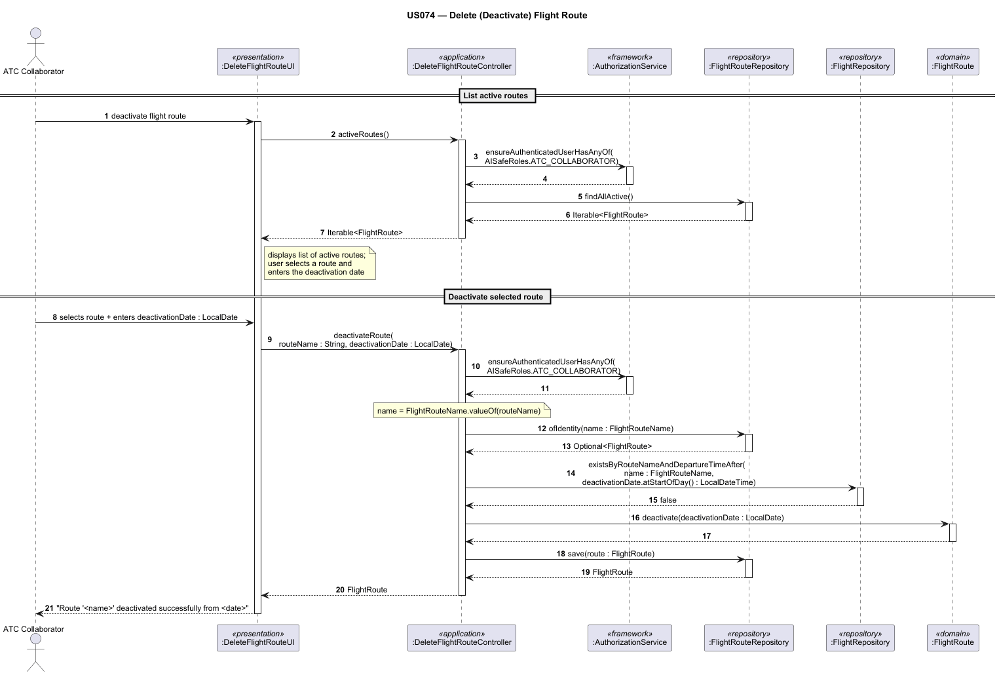
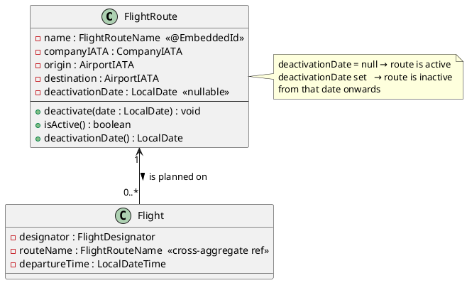

# US074 — Delete a Flight Route

## 1. Context

This user story is assigned to **Sprint 3** as part of the EAPLI-related work. It is the first time this feature is being developed. The objective is to allow an Air Transport Company Collaborator (ATCC) to deactivate a flight route from a given date onwards, preventing new flights from being created on that route while respecting existing planned flights.

**Assigned to:** Air Transport Company Collaborator feature set

### 1.1 List of Issues

- Analysis: #87
- Design: #87
- Implement: #87
- Test: #87

---

## 2. Requirements

**US074** As an Air Transport Company Collaborator, I want to deactivate a flight route from a given date onwards.

### Acceptance Criteria

- **US074.1** A route that is deactivated must not allow new flights to be created on it from the deactivation date onwards.
- **US074.2** A route **cannot** be deactivated if there are planned (future) flights scheduled after the chosen deactivation date.
- **US074.3** The deactivation date must be provided by the user and must be a valid calendar date.
- **US074.4** Only an authenticated Air Transport Company Collaborator may deactivate a route.
- **US074.5** The system must confirm the deactivation to the user upon success.

### Dependencies/References

- **US073** — Create a flight route (the route must exist before it can be deactivated).
- **US080** — Create a flight plan (flights on the route must be checked before deactivation; `isActive()` is used by US080 to block scheduling on deactivated routes).
- **US030** — Authentication and authorization infrastructure.
- **NFR08** — Database by configuration (in-memory vs RDBMS); the JPA repository implementation must support both persistence modes.
- **NFR09** — Authentication and authorization must be enforced.

---

## 3. Analysis

### 3.0 LLM Assistance

Generative AI (Claude, Anthropic) was used to support the analysis and design of this user story.

**Prompt 1:** "How should a 'soft delete' or deactivation pattern be modelled in a DDD aggregate? What is the best way to represent a deactivation date on a FlightRoute entity?"

**LLM suggestions adopted:**
- Use a `deactivationDate` field (`LocalDate`, nullable) on `FlightRoute` — `null` means active, a date value means deactivated from that date onwards.
- The business rule check (no planned flights after deactivation date) belongs in the application controller, since it requires querying the `FlightRepository` (cross-aggregate query — not suitable for the domain layer alone).

**Decisions made by the team:**
- The route is **not physically deleted** from the database — it is soft-deactivated by setting `deactivationDate`.
- The check for planned flights is done in the controller before invoking the domain method, querying `FlightRepository.existsByRouteNameAndDepartureTimeAfter(routeName, dateTime)`.

### 3.1 Domain Rules

| Rule | Where enforced |
|------|---------------|
| No planned flights exist after deactivation date | `DeleteFlightRouteController` — via `FlightRepository` query before calling `deactivate()` |
| Deactivation date must be a valid calendar date | Input validation in `DeleteFlightRouteUI` layer |
| A deactivated route cannot be deactivated again | `FlightRoute.deactivate()` — guard clause via `Invariants.ensure(isActive(), ...)` |
| New flights cannot be created on a deactivated route | `FlightRoute.isActive()` — checked by US080 controller |
| Route name format: 2 letters + up to 4 digits (e.g. TP123) | `FlightRouteName` value object — enforced at creation (US073); read-only in this US |

### 3.2 Key Domain Concepts

- **FlightRoute** — Aggregate root. Has a `FlightRouteName` identity (e.g. `TP123`), `CompanyIATA`, `AirportIATA` origin, `AirportIATA` destination, and an optional `deactivationDate` (`LocalDate`, null = active).
- **FlightRepository** — Cross-aggregate query repository used to check for planned flights on a route before deactivation.

---

## 4. Design

### 4.1 Classes Involved

| Class | Package | Responsibility |
|-------|---------|----------------|
| `FlightRoute` | `eapli.aisafe.flightroute.domain` | Aggregate root; holds `deactivationDate`; exposes `deactivate(LocalDate)` and `isActive()` |
| `FlightRouteName` | `eapli.aisafe.flightroute.domain` | Value object; identity of `FlightRoute`; format 2 letters + up to 4 digits |
| `FlightRouteRepository` | `eapli.aisafe.flightroute.repositories` | Repository interface; `findAllActive()`, `ofIdentity(name)`, `save(route)` |
| `FlightRepository` | `eapli.aisafe.flight.repositories` | Repository interface; `existsByRouteNameAndDepartureTimeAfter(routeName, dateTime)` |
| `DeleteFlightRouteController` | `eapli.aisafe.flightroute.application` | Application controller; enforces authorization, checks business rules, invokes domain |
| `DeleteFlightRouteUI` | `eapli.aisafe.ui.flightroute` | Console UI; collects route selection and deactivation date from the user |

### 4.2 Sequence Diagram



The sequence diagram source is in `sds/uml/SD_US074_DeleteFlightRoute.puml`.

### 4.3 Domain Model — Relevant Fragment



### 4.4 FlightRoute — Key Domain Methods

Actual implementation in `eapli.aisafe.flightroute.domain.FlightRoute`:

```java
// Mark the route as deactivated from the given date onwards (US074)
public void deactivate(final LocalDate date) {
    Preconditions.noneNull(date);
    Invariants.ensure(isActive(), "Route is already deactivated");
    this.deactivationDate = date;
}

// Returns true if the route is currently active (not yet deactivated)
public boolean isActive() {
    return deactivationDate == null;
}

public LocalDate deactivationDate() {
    return deactivationDate;
}
```

### 4.5 Controller — Core Logic

Actual implementation in `eapli.aisafe.flightroute.application.DeleteFlightRouteController`:

```java
public Iterable<FlightRoute> activeRoutes() {
    authz.ensureAuthenticatedUserHasAnyOf(AISafeRoles.ATC_COLLABORATOR);
    return repo.findAllActive();
}

public FlightRoute deactivateRoute(final String routeName, final LocalDate deactivationDate) {
    Preconditions.noneNull(routeName, deactivationDate);
    authz.ensureAuthenticatedUserHasAnyOf(AISafeRoles.ATC_COLLABORATOR);

    final FlightRouteName name = FlightRouteName.valueOf(routeName);

    final FlightRoute route = repo.ofIdentity(name)
            .orElseThrow(() -> new IllegalArgumentException(
                    "Flight route not found: " + routeName));

    // Business rule US074.2: no planned flights on or after deactivation date
    if (flightRepo.existsByRouteNameAndDepartureTimeAfter(name,
            deactivationDate.atStartOfDay())) {
        throw new IllegalStateException(
                "Cannot deactivate route " + routeName
                        + ": planned flights exist on or after " + deactivationDate);
    }

    route.deactivate(deactivationDate);
    return repo.save(route);
}
```

---

## 5. Implementation

**Key files:**

| File | Package |
|------|---------|
| `FlightRoute.java` | `eapli.aisafe.flightroute.domain` |
| `FlightRouteName.java` | `eapli.aisafe.flightroute.domain` |
| `FlightRouteRepository.java` | `eapli.aisafe.flightroute.repositories` |
| `FlightRepository.java` | `eapli.aisafe.flight.repositories` |
| `DeleteFlightRouteController.java` | `eapli.aisafe.flightroute.application` |
| `DeleteFlightRouteUI.java` | `eapli.aisafe.ui.flightroute` |
| `FlightRouteTest.java` | `eapli.aisafe.flightroute.domain` (test) |
| `DeleteFlightRouteControllerTest.java` | `eapli.aisafe.flightroute.application` (test) |

**Major commits:**

- `49a0011` — Readme of US74 : references #87
- `da0cdcc` — Design of US74 : references #87
- `cb3626a` — Design of US74 : references #87
- `204474c` — TDD and start of implementation of US74 : references #87
- `ff1f1f3` — flight route test update References #68

---

## 6. Acceptance Tests

**AT1 — Successful deactivation (no future flights)**

Given an active route `TP123` with no planned flights after 2026-06-01,
When the ATCC deactivates the route with deactivation date 2026-06-01,
Then `route.isActive()` returns `false`, `route.deactivationDate()` equals 2026-06-01, and a success message is shown.

**AT2 — Deactivation blocked by planned flights**

Given an active route with a planned flight departing on 2026-06-15,
When the ATCC tries to deactivate the route with deactivation date 2026-06-01,
Then the system rejects the operation with: *"Cannot deactivate route: planned flights exist on or after the selected date."*

**AT3 — New flight creation blocked on deactivated route**

Given a route where `isActive()` returns `false`,
When a collaborator attempts to create a new flight on that route,
Then the US080 controller rejects the creation because the route is inactive.

**AT4 — Deactivation of already-deactivated route is rejected**

Given a route already deactivated (deactivationDate is set),
When the ATCC tries to deactivate it again,
Then the domain throws `IllegalStateException`: *"Route is already deactivated."*

**AT5 — Unauthenticated access is rejected**

Given a user not authenticated as `ATC_COLLABORATOR`,
When they attempt to deactivate a route,
Then the system denies access with an authorization error (enforced by `AuthorizationService`).

**AT6 — Non-existent route is rejected**

Given a route name that does not exist in the repository,
When the ATCC attempts to deactivate it,
Then the system throws `IllegalArgumentException`: *"Flight route not found: <name>"*

---

## 7. Observations

- The term "delete" in the user story is interpreted as a **logical/soft deactivation**, not a physical removal, consistent with DDD practices and the requirement that existing planned flights must be preserved.
- The `deactivationDate` field makes it possible to schedule deactivation in the future (e.g., deactivate from next month), which is explicitly supported by the requirement *"from a given date onwards"*.
- The check for planned flights uses `FlightRepository.existsByRouteNameAndDepartureTimeAfter(routeName, dateTime)` (cross-aggregate query). `FlightRouteRepository` also declares `hasPlannedFlightsAfter(name, date)` but this method is not used by the current controller — `FlightRepository` is the authoritative source for this check.
- Per NFR08, both JPA and in-memory implementations of `FlightRouteRepository` must support the `findAllActive()` query.
