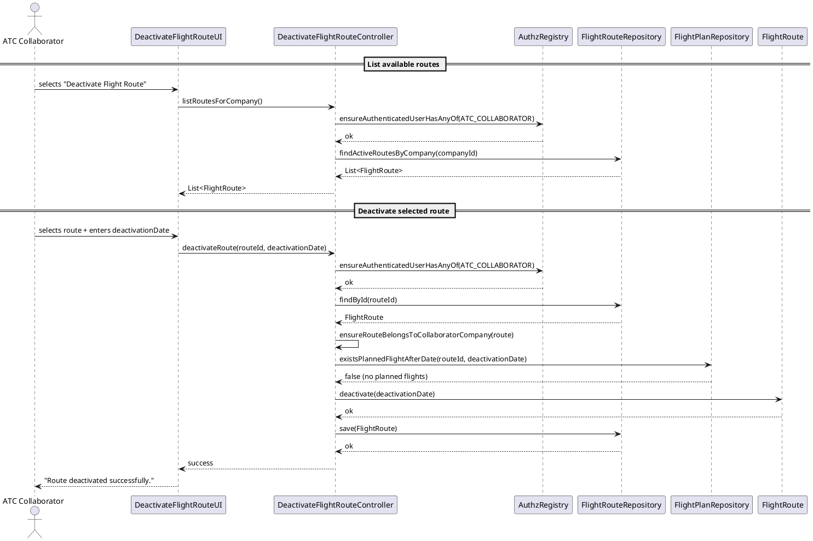
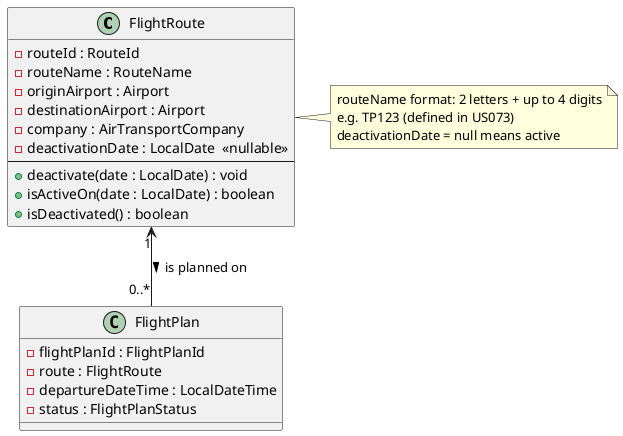

# US074 — Delete a Flight Route

## 1. Context

This user story is assigned to **Sprint 3** as part of the EAPLI-related work. It is the first time this feature is being developed. The objective is to allow an Air Transport Company Collaborator (ATCC) to deactivate a flight route from a given date onwards, preventing new flights from being created on that route while respecting existing planned flights.

**Assigned to:** Air Transport Company Collaborator feature set

### 1.1 List of Issues

- Analysis: #87
- Design: #87
- Implement: #87
- Test: #87

---

## 2. Requirements

**US074** As an Air Transport Company Collaborator, I want to deactivate a flight route from a given date onwards.

### Acceptance Criteria

- **US074.1** A route that is deactivated must not allow new flights to be created on it from the deactivation date onwards.
- **US074.2** A route **cannot** be deactivated if there are planned (future) flights scheduled after the chosen deactivation date.
- **US074.3** The deactivation date must be provided by the user and must be a valid calendar date.
- **US074.4** Only an authenticated Air Transport Company Collaborator belonging to the route's company may deactivate a route.
- **US074.5** The system must confirm the deactivation to the user upon success.

### Dependencies/References

- **US073** — Create a flight route (the route must exist before it can be deactivated).
- **US080** — Create a flight plan (flights on the route must be checked before deactivation; `isActiveOn(date)` is used by US080 to block scheduling on deactivated routes).
- **US030** — Authentication and authorization infrastructure.
- **NFR08** — Database by configuration (in-memory vs RDBMS); the JPA repository implementation must support both persistence modes.
- **NFR09** — Authentication and authorization must be enforced.

---

## 3. Analysis

### 3.0 LLM Assistance

Generative AI (Claude, Anthropic) was used to support the analysis and design of this user story.

**Prompt 1:** "How should a 'soft delete' or deactivation pattern be modelled in a DDD aggregate? What is the best way to represent a deactivation date on a FlightRoute entity?"

**LLM suggestions adopted:**
- Use a `deactivationDate` field (`LocalDate`, nullable) on `FlightRoute` — `null` means active, a date value means deactivated from that date onwards.
- The business rule check (no planned flights after deactivation date) belongs in the application controller, since it requires querying the `FlightPlan` repository (cross-aggregate query — not suitable for the domain layer alone).

**Decisions made by the team:**
- The route is **not physically deleted** from the database — it is soft-deactivated by setting `deactivationDate`.
- The check for planned flights is done in the controller before invoking the domain method, querying `FlightPlanRepository.existsPlannedFlightAfterDate(routeId, deactivationDate)`.
- The ATCC can only deactivate routes belonging to their own company; the controller resolves the authenticated user's company via `UserSession` and compares it against the route's owning company.

### 3.1 Domain Rules

| Rule | Where enforced |
|------|---------------|
| Route must belong to the ATCC's company | `DeactivateFlightRouteController` — company resolved from authenticated session |
| No planned flights exist after deactivation date | `DeactivateFlightRouteController` (via `FlightPlanRepository` query) |
| Deactivation date must be a valid calendar date | Input validation in UI layer |
| A deactivated route cannot be deactivated again | `FlightRoute.deactivate()` — guard clause |
| New flights cannot be created on a deactivated route | `FlightRoute.isActiveOn(date)` — used by US080 |
| Route name format: 2 letters + up to 4 digits (e.g. TP123) | `RouteName` value object — enforced at creation (US073); read-only in this US |

### 3.2 Key Domain Concepts

- **FlightRoute** — Aggregate root. Has a `routeName` (2 letters + up to 4 digits, e.g. TP123, unique per company as per US073), origin airport, destination airport, owning `AirTransportCompany`, and an optional `deactivationDate`.
- **FlightPlan** — References a `FlightRoute`. A flight plan's departure date is compared against the route's deactivation date to determine if scheduling is still permitted.
- **AirTransportCompany** — The owning company of the route and its collaborators. The authenticated ATCC's company is resolved at runtime via `UserSession` to enforce ownership.

---

## 4. Design

### 4.1 Classes Involved

| Class | Module | Responsibility |
|-------|--------|----------------|
| `FlightRoute` | `aisafe.core` | Domain aggregate; holds `deactivationDate`; exposes `deactivate(LocalDate)`, `isActiveOn(LocalDate)`, `isDeactivated()` |
| `FlightRouteRepository` | `aisafe.core` | Repository interface; `findActiveRoutesByCompany(companyId)`, `findById(routeId)`, `save(route)` |
| `FlightPlanRepository` | `aisafe.core` | Repository interface; `existsPlannedFlightAfterDate(routeId, date)` |
| `DeactivateFlightRouteController` | `aisafe.core.application` | Application controller; resolves company from session, enforces authorization, checks business rules, invokes domain |
| `DeactivateFlightRouteUI` | `aisafe.app.backoffice.console` | Console UI; collects route selection and deactivation date from the user |
| `JpaFlightRouteRepository` | `aisafe.persistence.impl` | JPA implementation of `FlightRouteRepository` (supports NFR08 — in-memory and RDBMS modes) |
| `InMemoryFlightRouteRepository` | `aisafe.persistence.impl` | In-memory implementation of `FlightRouteRepository` (used during development/testing per NFR08) |

### 4.2 Sequence Diagram (PlantUML)



> **Alternative flow:** If `existsPlannedFlightAfterDate(...)` returns `true`, the controller throws a `BusinessRulesException` and the UI displays: *"Cannot deactivate route: there are planned flights after the selected date."*

> **Alternative flow 2:** If the route does not belong to the ATCC's company, the controller throws an `IllegalArgumentException` and the UI displays: *"You are not authorized to deactivate this route."*

### 4.3 Domain Model — Relevant Fragment



### 4.4 FlightRoute — Key Domain Methods

```java
// Mark the route as deactivated from the given date onwards
public void deactivate(final LocalDate deactivationDate) {
    Preconditions.nonNull(deactivationDate, "Deactivation date must not be null");
    if (this.deactivationDate != null) {
        throw new IllegalStateException("Route is already deactivated.");
    }
    this.deactivationDate = deactivationDate;
}

// Used by US080 and other USs to check if new flights may be scheduled
public boolean isActiveOn(final LocalDate date) {
    return deactivationDate == null || date.isBefore(deactivationDate);
}

public boolean isDeactivated() {
    return deactivationDate != null;
}
```

### 4.5 Controller — Core Logic

```java
public void deactivateRoute(final RouteId routeId, final LocalDate deactivationDate) {
    // Authorization check (enforced on every entry point per US030)
    authz.ensureAuthenticatedUserHasAnyOf(AISafeRoles.ATC_COLLABORATOR);

    final FlightRoute route = routeRepository.findById(routeId)
        .orElseThrow(() -> new IllegalArgumentException("Route not found."));

    // Ensure the route belongs to the logged-in collaborator's company.
    // The company is resolved from the authenticated SystemUser's username,
    // looked up via the AirTransportCompanyCollaboratorRepository.
    final AirTransportCompany collaboratorCompany = resolveCompanyFromSession();
    if (!route.company().equals(collaboratorCompany)) {
        throw new IllegalArgumentException(
            "You are not authorized to deactivate this route.");
    }

    // Business rule: no planned flights after deactivation date (US074.2)
    if (flightPlanRepository.existsPlannedFlightAfterDate(routeId, deactivationDate)) {
        throw new BusinessRulesException(
            "Cannot deactivate route: there are planned flights after " + deactivationDate);
    }

    route.deactivate(deactivationDate);
    routeRepository.save(route);
}

private AirTransportCompany resolveCompanyFromSession() {
    final String username = authz.session().get().authenticatedUser().username().value();
    return collaboratorRepository.findCompanyByUsername(username)
        .orElseThrow(() -> new IllegalStateException("Collaborator company not found."));
}
```

---

## 5. Acceptance Tests

**AT1 — Successful deactivation (no future flights)**

Given an active route with no planned flights after 2026-06-01,
When the ATCC deactivates the route with deactivation date 2026-06-01,
Then the route's `deactivationDate` is set to 2026-06-01 and a success message is shown.

**AT2 — Deactivation blocked by planned flights**

Given an active route with a planned flight on 2026-06-15,
When the ATCC tries to deactivate the route with deactivation date 2026-06-01,
Then the system rejects the operation with the message: *"Cannot deactivate route: there are planned flights after the selected date."*

**AT3 — New flight creation blocked on deactivated route**

Given a route deactivated from 2026-06-01,
When a pilot tries to create a flight on that route with departure date 2026-06-10,
Then the system rejects the flight creation (checked via `isActiveOn(date)` returning `false`).

**AT4 — Deactivation of already-deactivated route is rejected**

Given a route already deactivated on 2026-05-01,
When the ATCC tries to deactivate it again,
Then the system rejects with: *"Route is already deactivated."*

**AT5 — Unauthorized deactivation is rejected (wrong company)**

Given an ATCC authenticated for company "TAP",
When they attempt to deactivate a route belonging to company "RYA",
Then the system denies the operation with: *"You are not authorized to deactivate this route."*

**AT6 — Unauthenticated access is rejected**

Given a user not authenticated as ATC_COLLABORATOR,
When they attempt to deactivate a route,
Then the system denies access with an authorization error (enforced by `AuthzRegistry`).

---

## 6. Implementation Notes

- `deactivationDate` is stored as a nullable `LocalDate` column in the `flight_route` table (`DEACTIVATION_DATE DATE NULL`), consistent with NFR08 (both in-memory H2 and remote RDBMS must support this schema).
- `FlightRoute.isActiveOn(date)` must be used by **US080** (Create flight plan) to prevent scheduling on deactivated routes — this is a cross-cutting enforcement point that should be verified in the US080 implementation.
- `FlightPlanRepository.existsPlannedFlightAfterDate(routeId, date)` should be implemented as a JPQL query:
  ```jpql
  SELECT COUNT(fp) > 0 FROM FlightPlan fp
  WHERE fp.route.id = :routeId
  AND fp.departureDateTime > :date
  AND fp.status NOT IN ('CANCELLED')
  ```
- Both `JpaFlightRouteRepository` and `InMemoryFlightRouteRepository` must be provided per NFR08.

---

## 7. Observations

- The term "delete" in the user story is interpreted as a **logical/soft deactivation**, not a physical removal, consistent with DDD practices and the requirement that existing planned flights must be preserved.
- The `deactivationDate` field makes it possible to schedule deactivation in the future (e.g., deactivate from next month), which is explicitly supported by the requirement *"from a given date onwards"*.
- The `resolveCompanyFromSession()` helper depends on a link between the framework's `SystemUser` (identified by username) and the domain's `AirTransportCompanyCollaborator`. This is the same pattern used in other ATCC user stories (e.g., US073, US070).
