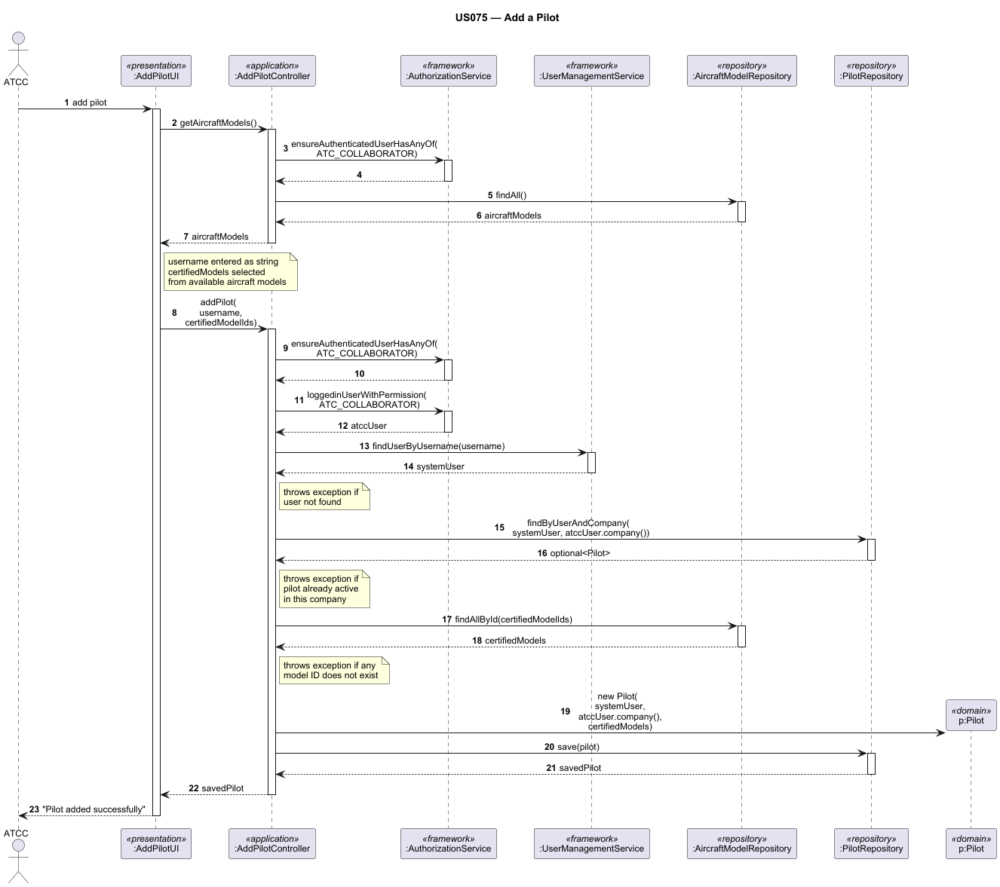

# US075 — Add a Pilot

## 1. Context

This task was assigned in Sprint 3 within the Applications Engineering (EAPLI) scope. The objective is to allow an Air Transport Company Collaborator (ATCC) to add a pilot to their company's roster, associating the pilot — who must already be a system user — with one or more certified aircraft models.

**Assigned to:** Dinis Silva

### 1.1 List of Issues

- Analysis: #77
- Design: #77
- Implement: #77
- Test: #77

---

## 2. Requirements

**US075** As an Air Transport Company Collaborator, I want to add a pilot to my company.

### Acceptance Criteria

- **US075.1** The pilot must already be a registered system user (created via US061).
- **US075.2** The pilot must be certified to pilot at least one aircraft model registered in the system.
- **US075.3** The pilot is added to the company of the authenticated ATCC — the collaborator cannot add a pilot to a different company.
- **US075.4** A pilot already active in the same company cannot be added again.
- **US075.5** Access must be restricted to users with the `ATC_COLLABORATOR` role.

### Dependencies/References

- US030 — Authentication and authorization infrastructure
- US055 — Create an aircraft model (pilot must be certified for at least one model)
- US060 — Register an air transport company
- US061 — Add a customer's collaborator (the pilot must already exist as a system user)

---

## 3. Analysis

### 3.0 LLM Assistance

Generative AI was used to support the analysis and design of this user story.

**Prompt 1:** "In a DDD Java application, when adding a pilot to a company, should the Pilot aggregate hold a reference to the AirTransportCompany aggregate root, or should the company hold a collection of pilots? What are the trade-offs?"

**LLM suggestions adopted:**
- The `Pilot` aggregate holds a reference to the `AirTransportCompany` by its ID (not a direct object reference), keeping aggregates properly decoupled and avoiding large collection loading on the company side
- Certified aircraft models are stored as a collection of `AircraftModelId` value objects inside the `Pilot` aggregate, avoiding a hard dependency on the `AircraftModel` aggregate

**Decisions made by the team:**
- A pilot is scoped to one company at a time; adding the same user as a pilot to a second company is out of scope for this user story
- The controller resolves the ATCC's company from the session's authenticated user, so the collaborator never manually selects which company to assign the pilot to
- If the selected user already has an active `Pilot` record in this company, the operation is rejected with a clear error message

### 3.1 Domain Connections

The operation creates a new `Pilot` entity within the ATCC's `AirTransportCompany`. It cross-references the `SystemUser` aggregate (to confirm the user exists) and the `AircraftModel` aggregate (to validate that the certified models exist in the system). All lookups go through their respective repositories; no direct aggregate-to-aggregate object reference is created.

---

## 4. Design

### 4.1 Realization

**Classes to create/modify:**

| Class | Module | Responsibility |
|-------|--------|----------------|
| `AddPilotUI` | `aisafe.app.atcc.console` | Prompts ATCC for user and certified models, displays outcome |
| `AddPilotController` | `aisafe.core` | Resolves the ATCC's company, validates inputs, delegates to service |
| `PilotService` | `aisafe.core` | Contains business logic for creating and persisting a new Pilot |
| `PilotRepository` | `aisafe.core` | Declares query methods (e.g., `findByUserAndCompany`, `save`) |
| `JpaPilotRepository` | `aisafe.persistence.impl` | Implements the database queries |
| `Pilot` | `aisafe.domain` | Aggregate root representing a pilot in a company |
| `AircraftModelRepository` | `aisafe.core` | Used to validate that each certified model exists |

**Sequence Diagram — Add Pilot:**

### 4.2 Acceptance Tests

**AT1 — Pilot successfully added**

Given an authenticated ATCC,
And a system user with username "jpilot@airline.com" exists and is not yet a pilot in the ATCC's company,
And aircraft model "B737" exists in the system,
When the ATCC adds the user as a pilot certified for "B737",
Then the system creates the pilot record and confirms the operation with a success message.

**AT2 — Pilot already active in the company**

Given an authenticated ATCC,
And "jpilot@airline.com" is already an active pilot in the ATCC's company,
When the ATCC attempts to add the same user again,
Then the system rejects the operation with a clear error indicating the pilot is already registered.

**AT3 — Selected user does not exist in the system**

Given an authenticated ATCC,
When the ATCC provides a username that does not correspond to any system user,
Then the system rejects the operation with a user-not-found error and no pilot record is created.

**AT4 — No certified aircraft model provided**

Given an authenticated ATCC,
And a valid system user is selected,
When the ATCC submits the form without selecting any aircraft model,
Then the system rejects the operation, as at least one certified model is required.

**AT5 — Certified model does not exist**

Given an authenticated ATCC,
And a valid system user is selected,
When the ATCC provides an aircraft model ID that does not exist in the system,
Then the system rejects the operation with a model-not-found error.

**AT6 — Unauthorized role is blocked**

Given an authenticated user with the `BACKOFFICE_OPERATOR` role,
When the user attempts to access the Add Pilot feature,
Then the system rejects the operation with an authorization error.

---

## 5. Implementation

**Key new/modified files:**

- `[List relevant files created or altered]`

*Major commits: [Insert links or hashes]*

---

## 6. Integration/Demonstration

1. Log in as an Air Transport Company Collaborator.
2. Navigate to the Pilots menu and select "Add Pilot".
3. Select an existing system user to register as a pilot.
4. Select one or more aircraft models the pilot is certified for.
5. Confirm the operation and verify the pilot appears in the company's roster (US076).

---

## 7. Observations

[Insert any technical debt, difficulties encountered, or architectural notes here]