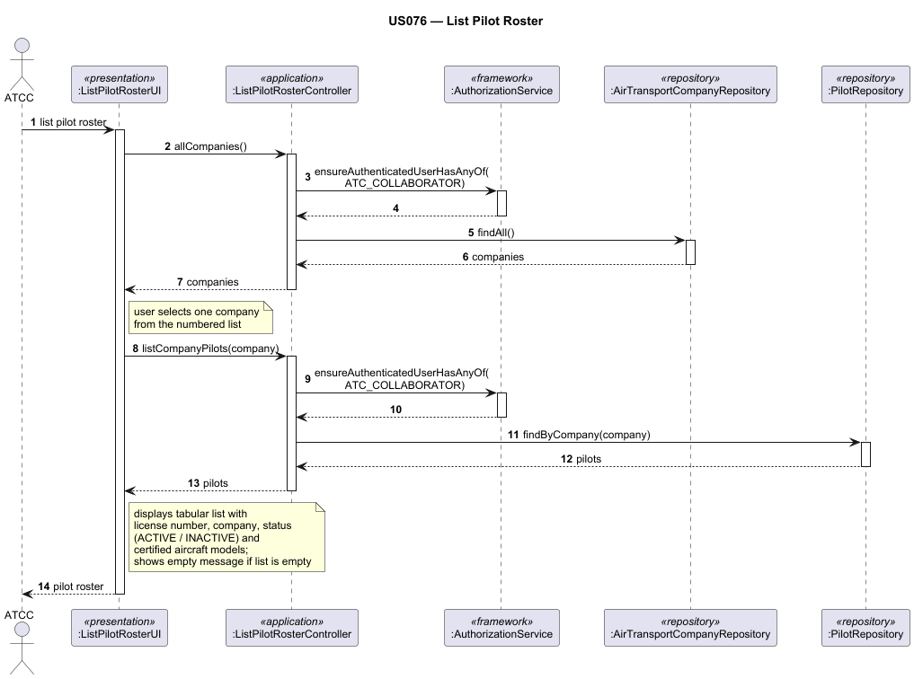

# US076 — List Pilot Roster

## 1. Context

This task was assigned in Sprint 3 within the Applications Engineering (EAPLI) scope. The objective is to allow an Air Transport Company Collaborator (ATCC) to view the full list of pilots currently associated with their company, supporting fleet and crew management decisions.

**Assigned to:** Dinis Silva

### 1.1 List of Issues

- Analysis: #78
- Design: #78
- Implement: #78
- Test: #78

---

## 2. Requirements

**US076** As an Air Transport Company Collaborator, I want to list my company's pilot roster.

### Acceptance Criteria

- **US076.1** The system must display all pilots currently associated with the authenticated ATCC's company.
- **US076.2** The list must only include active pilots — inactive pilots (removed via US077) must not appear.
- **US076.3** The authenticated ATCC can only view pilots from their own company; pilots from other companies must not be listed.
- **US076.4** Access must be restricted to users with the `ATC_COLLABORATOR` role.
- **US076.5** If the company has no active pilots, the system must display a clear message indicating the roster is empty.

### Dependencies/References

- US030 — Authentication and authorization infrastructure
- US060 — Register an air transport company
- US075 — Add a pilot (pilots must exist to be listed)
- US077 — Remove a pilot (inactive pilots must be excluded)

---

## 3. Analysis

### 3.0 LLM Assistance

Generative AI was used to support the analysis and design of this user story.

**Prompt 1:** "In a DDD Java application, what is the cleanest way to list all active pilots scoped to a specific company, given that the Pilot aggregate holds a reference to the company by ID?"

**LLM suggestions adopted:**
- The repository query filters by both `companyId` and `status = ACTIVE`, keeping the filtering logic in the persistence layer rather than in the service or controller
- The result is returned as a read-only DTO or a list of `Pilot` aggregate roots — no lazy-loaded collections are exposed to the UI layer

**Decisions made by the team:**
- The ATCC's company is resolved automatically from the authenticated session — the collaborator does not manually select a company
- The list is displayed in a simple tabular format showing at minimum the pilot's name, username, and certified aircraft models
- Sorting is alphabetical by pilot name for consistency and readability

### 3.1 Domain Connections

The operation queries the `Pilot` aggregate filtered by the `AirTransportCompany` identifier extracted from the authenticated ATCC's session. No modification of any aggregate occurs — this is a pure read operation. The `AircraftModel` aggregate may be referenced to resolve model names for display purposes.

---

## 4. Design

### 4.1 Realization

**Classes created/modified:**

| Class | Package | Responsibility |
|-------|---------|----------------|
| `ListPilotRosterController` | `eapli.aisafe.pilot.application` | `@UseCaseController` — authorises with `ATC_COLLABORATOR`; exposes `allCompanies()` (company selection), `listCompanyPilots(CompanyIATA)` (all pilots), `listActiveCompanyPilots(CompanyIATA)` (active only) |
| `PilotRepository` | `eapli.aisafe.pilot.repositories` | Interface — added `findByCompany(CompanyIATA)` and `findActiveByCompany(CompanyIATA)` query methods |
| `AirTransportCompanyRepository` | `eapli.aisafe.company.repositories` | Interface — `findAll()` used to populate company selection |

**Reused without modification:**

| Class | Role in US076 |
|-------|---------------|
| `Pilot` | Aggregate root — `isActive()` and `pilotId()` used for display |
| `PilotId` | Identity value shown in roster |
| `CompanyIATA` | Filter parameter passed to `listCompanyPilots()` / `listActiveCompanyPilots()` |

**Sequence Diagram — List Pilot Roster:**

### 4.2 Acceptance Tests

**AT1 — Roster with active pilots is displayed correctly**

Given an authenticated ATCC whose company has two active pilots,
When the ATCC requests the pilot roster,
Then the system displays both pilots with their names, usernames, and certified aircraft models.

**AT2 — Inactive pilots are excluded from the list**

Given an authenticated ATCC whose company has one active pilot and one inactive pilot (removed via US077),
When the ATCC requests the pilot roster,
Then only the active pilot is displayed and the inactive one does not appear.

**AT3 — Empty roster displays a clear message**

Given an authenticated ATCC whose company has no active pilots,
When the ATCC requests the pilot roster,
Then the system displays a message indicating the roster is currently empty.

**AT4 — Pilots from other companies are not shown**

Given an authenticated ATCC from company "AirAlpha",
And company "AirBeta" has its own active pilots registered in the system,
When the ATCC from "AirAlpha" requests the pilot roster,
Then only pilots belonging to "AirAlpha" are displayed.

**AT5 — Unauthorized role is blocked**

Given an authenticated user with the `BACKOFFICE_OPERATOR` role,
When the user attempts to access the List Pilot Roster feature,
Then the system rejects the operation with an authorization error.

---

## 5. Implementation

**New files:**

| Package | File | Role |
|---------|------|------|
| `eapli.aisafe.pilot.application` | `ListPilotRosterController.java` | `@UseCaseController` — authorises (`ATC_COLLABORATOR`), exposes `allCompanies()` for company selection, `listCompanyPilots(company)` for full roster, `listActiveCompanyPilots(company)` for active-only roster |

**Reused from US075 (no changes needed):**

| File | Role |
|------|------|
| `Pilot.java` | Aggregate root — `isActive()` flag used to distinguish active from inactive pilots |
| `PilotId.java` | Value Object — identity used for display |
| `PilotRepository.java` | Added `findByCompany(CompanyIATA)` and `findActiveByCompany(CompanyIATA)` methods |
| `AirTransportCompanyRepository.java` | `findAll()` used to populate company selection |

**Unit tests:**

| Test class | Tests | Scope |
|------------|-------|-------|
| `ListPilotRosterControllerTest` | 8 | Controller unit tests: happy path (all pilots, active only), auth guard, empty result, return type verification |

**Note:** US076 is a pure read operation — no domain entity is created or modified. There are no CSV-driven domain tests because the listing logic is entirely a repository responsibility; domain invariants are exercised by US075/US077 tests.

---

## 6. Integration/Demonstration

1. Log in as an Air Transport Company Collaborator (`atcc1` / `Password1`).
2. Add at least one pilot via US075 (Add Pilot) to have data to display.
3. Navigate to the **Pilots** menu and select **List Pilot Roster**.
4. Select a company from the list.
5. The system displays all pilots for that company (active and inactive) or only active pilots, depending on the selected view.
6. Deactivate a pilot via US077 and return to this menu — the deactivated pilot no longer appears in the active roster.

---

## 7. Observations

- **Two listing modes:** `listCompanyPilots(company)` returns all pilots (active + inactive), while `listActiveCompanyPilots(company)` returns only active pilots. The UI chooses the appropriate call based on the desired view.
- **Company selection step:** the controller exposes `allCompanies()` so the UI can let the user select which company to list pilots for. Both methods require `ATC_COLLABORATOR` authorisation.
- **No domain tests for US076:** listing is a repository and controller concern. The `Pilot` entity has no invariants related to listing — invariants are tested in US075 (creation) and US077 (deactivation) test suites.
- **Repository queries:** `PilotRepository.findByCompany(CompanyIATA)` and `findActiveByCompany(CompanyIATA)` filter by the `CompanyIATA` value object embedded in each `Pilot`. The JPA implementation uses JPQL `WHERE p.company = :c` and `WHERE p.company = :c AND p.active = true` respectively.
- **Package-private testing constructor:** `ListPilotRosterController` exposes a package-private constructor that accepts all three dependencies — used by `ListPilotRosterControllerTest` to inject mocks.