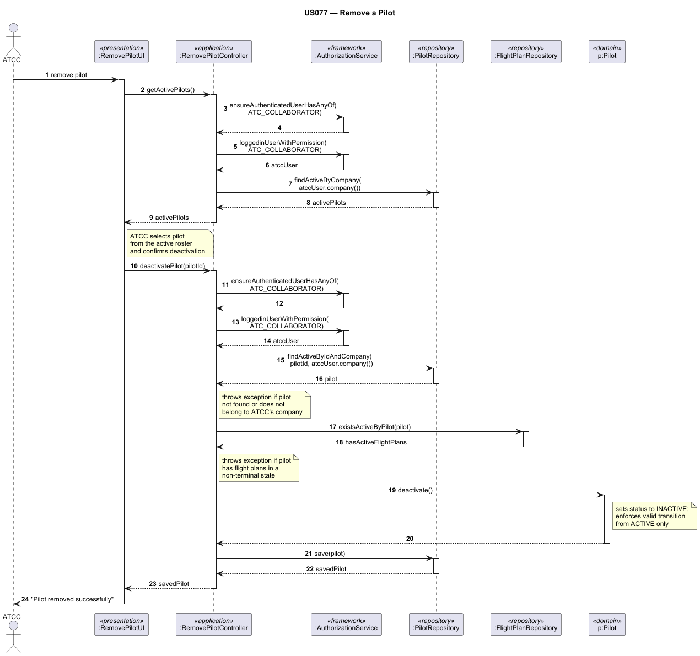

# US077 — Remove a Pilot

## 1. Context

This task was assigned in Sprint 3 within the Applications Engineering (EAPLI) scope. The objective is to allow an Air Transport Company Collaborator (ATCC) to make a pilot inactive in their company's roster, preventing the pilot from being assigned to future flights while preserving historical data integrity.

**Assigned to:** Dinis Silva

### 1.1 List of Issues

- Analysis: #79
- Design: #79
- Implement: #79
- Test: #79

---

## 2. Requirements

**US077** As an Air Transport Company Collaborator, I want to make a pilot inactive in my company's roster.

### Acceptance Criteria

- **US077.1** The ATCC can only deactivate pilots belonging to their own company.
- **US077.2** A pilot with flight plans currently assigned cannot be deactivated — the operation must be rejected with a clear error message.
- **US077.3** The pilot record is not deleted from the system — it is marked as inactive, preserving historical data.
- **US077.4** Once deactivated, the pilot must no longer appear in the active roster (US076).
- **US077.5** Access must be restricted to users with the `ATC_COLLABORATOR` role.

### Dependencies/References

- US030 — Authentication and authorization infrastructure
- US060 — Register an air transport company
- US075 — Add a pilot (pilot must exist to be removed)
- US076 — List pilot roster (deactivated pilots must be excluded)
- US080 — Create a flight plan (pilots with assigned flight plans cannot be deactivated)

---

## 3. Analysis

### 3.0 LLM Assistance

Generative AI was used to support the analysis and design of this user story.

**Prompt 1:** "In a DDD Java application, when deactivating a pilot, should the check for assigned flight plans be performed in the domain, the application service, or the repository layer? What are the trade-offs?"

**LLM suggestions adopted:**
- The check for assigned flight plans is performed in the application service layer, querying the `FlightPlanRepository` before invoking the state change on the `Pilot` aggregate — this keeps the domain focused on invariants it owns, while cross-aggregate coordination stays in the service
- The deactivation is modelled as a state transition on the `Pilot` aggregate (`pilot.deactivate()`), rather than a delete, so that historical records remain intact

**Decisions made by the team:**
- "Assigned flight plans" means flight plans in a non-terminal state (e.g., `DRAFT`, `VALIDATED`) — cancelled or completed flight plans do not block deactivation
- The ATCC selects the pilot from the active roster, so the UI reuses the listing logic from US076 to present only deactivatable candidates
- The pilot's username is shown in the confirmation prompt to avoid accidental deactivation

### 3.1 Domain Connections

The operation performs a state transition on the `Pilot` aggregate, setting its status to `INACTIVE`. Before doing so, the application service cross-checks the `FlightPlanRepository` to ensure no active flight plans reference this pilot. The `AirTransportCompany` identifier from the authenticated ATCC's session is used to scope the lookup, ensuring the collaborator cannot deactivate pilots from other companies.

---

## 4. Design

### 4.1 Realization

**Classes to create/modify:**

| Class | Module | Responsibility |
|-------|--------|----------------|
| `RemovePilotUI` | `aisafe.app.atcc.console` | Lists active pilots, prompts ATCC for selection and confirmation, displays outcome |
| `RemovePilotController` | `aisafe.core` | Resolves the ATCC's company, validates the pilot exists and is active, delegates to service |
| `PilotService` | `aisafe.core` | Checks for assigned flight plans and performs the deactivation |
| `PilotRepository` | `aisafe.core` | Declares query methods (e.g., `findActiveByCompany`, `save`) |
| `FlightPlanRepository` | `aisafe.core` | Declares the query method (e.g., `existsActiveByPilot`) |
| `JpaPilotRepository` | `aisafe.persistence.impl` | Implements the filtered database queries |
| `Pilot` | `aisafe.domain` | Aggregate root; exposes `deactivate()` method that enforces the status transition |

**Sequence Diagram — Remove Pilot:**

### 4.2 Acceptance Tests

**AT1 — Pilot successfully deactivated**

Given an authenticated ATCC whose company has an active pilot with no assigned flight plans,
When the ATCC selects that pilot and confirms deactivation,
Then the system marks the pilot as inactive and displays a success message.

**AT2 — Deactivated pilot no longer appears in the active roster**

Given an authenticated ATCC who has successfully deactivated a pilot,
When the ATCC requests the pilot roster (US076),
Then the deactivated pilot does not appear in the list.

**AT3 — Pilot with assigned flight plans cannot be deactivated**

Given an authenticated ATCC whose company has an active pilot with at least one flight plan in a non-terminal state,
When the ATCC attempts to deactivate that pilot,
Then the system rejects the operation with a clear error indicating the pilot has active flight plans assigned.

**AT4 — ATCC cannot deactivate a pilot from another company**

Given an authenticated ATCC from company "AirAlpha",
And an active pilot belonging to company "AirBeta",
When the ATCC from "AirAlpha" attempts to deactivate the pilot from "AirBeta",
Then the system rejects the operation with a not-found or authorization error.

**AT5 — Unauthorized role is blocked**

Given an authenticated user with the `BACKOFFICE_OPERATOR` role,
When the user attempts to access the Remove Pilot feature,
Then the system rejects the operation with an authorization error.

---

## 5. Implementation

**Key new/modified files:**

- `[List relevant files created or altered]`

*Major commits: [Insert links or hashes]*

---

## 6. Integration/Demonstration

1. Log in as an Air Transport Company Collaborator.
2. Navigate to the Pilots menu and select "Remove Pilot".
3. Select an active pilot with no assigned flight plans.
4. Confirm the deactivation and verify the success message.
5. Navigate to "List Pilot Roster" (US076) and confirm the pilot no longer appears.
6. Attempt to deactivate a pilot with an active flight plan and verify the rejection.

---

## 7. Observations

[Insert any technical debt, difficulties encountered, or architectural notes here]