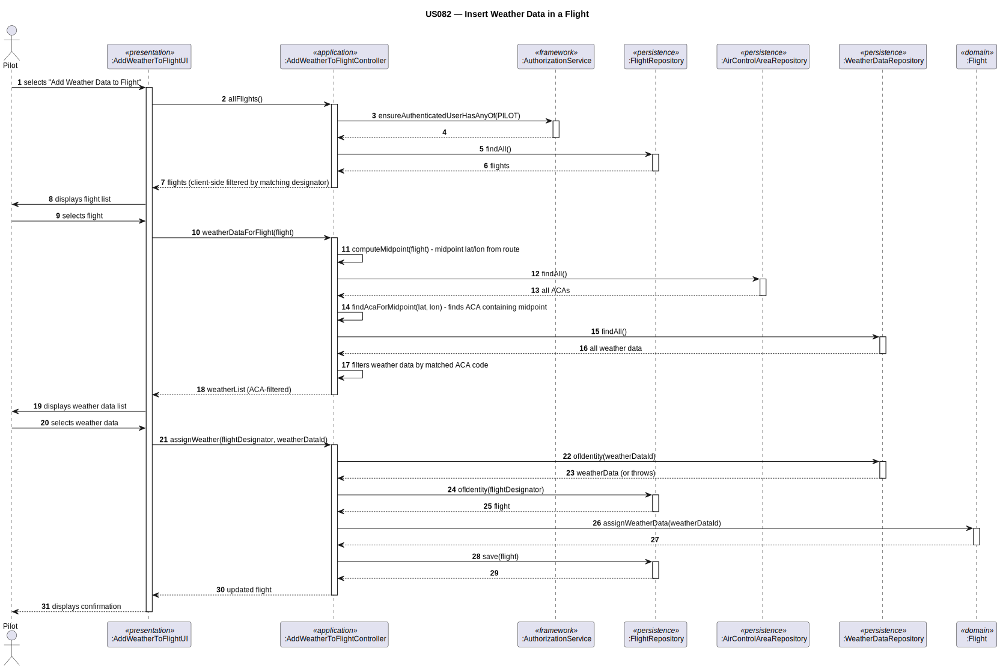

# US082 — Insert Weather Data in a Flight

## 1. Context

This task was assigned in Sprint 3. The objective is to allow a Pilot to associate weather data
with their flight plan. If the flight plan had been previously tested, adding weather data voids
the test result and resets the flight plan status to draft.

**Assigned to:** Cláudio Pinto

### 1.1 List of Issues

- Analysis: #72 
- Design: #72 
- Implement: #72 
- Test: #72 

---

## 2. Requirements

**US082** As a Pilot, I want to add weather data to my flight plan. If the flight plan has been
previously tested, the test is deemed void because of the new weather data.

### Acceptance Criteria

- **US082.1** The system must require the PILOT role.
- **US082.2** The Pilot may only add weather data to their own flight plans.
- **US082.3** The selected WeatherData must already exist in the system.
- **US082.4** If the flight plan status is TESTED, adding weather data resets it to DRAFT.
- **US082.5** A flight plan in DRAFT status remains in DRAFT after weather data is added.

### Dependencies/References

- US030 — auth infrastructure.
- US080 — flight plan must exist.
- US041/US042 — WeatherData must exist in the system.
- US010 — domain model: WeatherData reference rises to the Flight root (Decision 14).

---

## 3. Analysis

### 3.0 LLM Assistance

Generative AI (Claude, Anthropic) was used to support the analysis and design of this user story.
Below are the main prompts used, the suggestions adopted, and the decisions the team made
independently or where we deviated from the AI output.

---

#### Prompt 1 — Domain behaviour for adding weather data

> "We are implementing US082 in a DDD Java system. A Pilot adds weather data to their flight plan.
> If the flight plan was previously tested, the test is voided. The WeatherData reference is on the
> Flight root (not on the internal FlightPlan entity). Where should the logic live and how should
> the status transition be handled?"

**LLM suggestions adopted:**
- `Flight.assignWeatherData(Long weatherDataId)` as the domain method — consistent with the
  WeatherData reference being on the Flight root (domain model Decision 14)
- Status transition handled inside the same method: if any flightPlan has been tested, reset to
  DRAFT before associating the weather data

**Decisions made by the team / deviations from LLM output:**
- The LLM placed the status reset in the controller — moved into the `Flight` domain method to
  keep the invariant inside the aggregate
- The LLM suggested `addWeatherData(WeatherData)` with the full object — the team uses
  `assignWeatherData(Long weatherDataId)`, passing only the ID (cross-aggregate reference), which
  is the EAPLI/DDD convention

---

### 3.1 Key Design Decisions

**WeatherData reference on Flight root** — per domain model Decision 14, the cross-aggregate
reference to WeatherData rises to the Flight root as a `Long weatherDataId`. The controller loads
the Flight and calls `assignWeatherData()` directly.

**Status invariant inside the aggregate** — `Flight.assignWeatherData()` enforces the rule: if any
internal FlightPlan is in TEST_PASSED or TEST_FAILED status, it is reset to DRAFT before the
association is made. The controller does not need to know about this transition.

**ACA auto-detection via route midpoint** — the controller computes the midpoint of the flight's
route using a coordinate map (`AIRPORT_COORDS`), then finds the `AirControlArea` that contains
that midpoint via `findAcaForMidpoint()`. Weather data is filtered by the matched ACA code,
ensuring the Pilot only sees relevant weather records.

**Client-side flight filtering** — the controller returns all flights via `allFlights()`; the UI
filters to show only flights whose designator matches an imported flight plan. The Pilot selects
the target flight from this filtered list.

---

## 4. Design

### 4.1 Realization

| Class | Module | Responsibility |
|-------|--------|----------------|
| `AddWeatherToFlightUI` | `aisafe.app.backoffice.console` | Lists flights (client-filtered); lists ACA-filtered weather data; calls controller |
| `AddWeatherToFlightController` | `aisafe.core` | Auth; computes route midpoint; finds ACA for midpoint; filters weather data by ACA; loads Flight and WeatherData; calls domain method; saves |
| `Flight` (modified) | `aisafe.core` | Adds `assignWeatherData(Long weatherDataId)` enforcing the status invariant |
| `FlightRepository` | `aisafe.core` | Finds all flights |
| `AirControlAreaRepository` | `aisafe.core` | Lists all ACAs to find one containing the route midpoint |
| `WeatherDataRepository` | `aisafe.core` | Lists all weather data (filtered by matched ACA code) |

**Sequence Diagram:**

### 4.2 Controller Acceptance Tests

**AT1 — allFlights delegates to repo (US082.1)**
- **Test:** `AddWeatherToFlightControllerTest.ensureAllFlightsDelegatesToRepo`
- Given a logged-in Pilot,
- When `allFlights()` is called,
- Then `flightRepo.findAll()` is invoked and flights are returned.

**AT2 — allFlights checks authorization (US082.1)**
- **Test:** `AddWeatherToFlightControllerTest.ensureAllFlightsChecksAuthorization`
- Given a user without the PILOT role,
- When `allFlights()` is called,
- Then `authz.ensureAuthenticatedUserHasAnyOf(PILOT)` is invoked.

**AT3 — flightByDesignator returns flight**
- **Test:** `AddWeatherToFlightControllerTest.ensureFlightByDesignatorReturnsFlight`
- Given a valid flight designator,
- When `flightByDesignator()` is called,
- Then the matching `Flight` is returned.

**AT4 — flightByDesignator throws for unknown**
- **Test:** `AddWeatherToFlightControllerTest.ensureFlightByDesignatorThrowsForUnknown`
- Given an invalid flight designator,
- When `flightByDesignator()` is called,
- Then `IllegalArgumentException` is thrown.

**AT5 — assignWeather persists flight (US082.3)**
- **Test:** `AddWeatherToFlightControllerTest.ensureAssignWeatherSavesFlight`
- Given an existing flight and existing weather data,
- When `assignWeather()` is called,
- Then `flight.assignWeatherData()` is called and `flightRepo.save()` persists the flight.

**AT6 — assignWeather rejects unknown flight (US082.3)**
- **Test:** `AddWeatherToFlightControllerTest.ensureAssignWeatherWithUnknownFlightThrows`
- Given a non-existent flight designator,
- When `assignWeather()` is called,
- Then `IllegalArgumentException` is thrown.

**AT7 — assignWeather rejects unknown weather (US082.3)**
- **Test:** `AddWeatherToFlightControllerTest.ensureAssignWeatherWithUnknownWeatherThrows`
- Given a non-existent weather data ID,
- When `assignWeather()` is called,
- Then `IllegalArgumentException` is thrown.

**AT8 — assignWeather is idempotent**
- **Test:** `AddWeatherToFlightControllerTest.ensureAssignWeatherIsIdempotent`
- Given a flight that already has weather data assigned,
- When `assignWeather()` is called with the same weather data,
- Then the operation succeeds without error.

### 4.3 Domain Tests

- **FlightTest.ensureAssignWeatherDataAssociatesWeatherToFlight** — verifies that after calling
  `assignWeatherData(weatherDataId)`, the flight's `weatherDataId()` returns the expected value.
- **FlightTest.ensureAssignWeatherDataResetsTestedFlightPlansToDraft** (US082.4) — verifies that
  flight plans in TEST_PASSED/TEST_FAILED are reset to DRAFT after `assignWeatherData()`.
- **FlightTest.ensureAssignWeatherDataDoesNotChangeDraftFlightPlans** (US082.5) — verifies that
  flight plans already in DRAFT status remain DRAFT.

---

## 5. Implementation

- `eapli.aisafe.flight.domain.Flight` — add `assignWeatherData(Long weatherDataId)`
- `eapli.aisafe.flight.application.AddWeatherToFlightController`
- `eapli.aisafe.app.backoffice.console.presentation.flight.AddWeatherToFlightUI`

---

## 6. Integration/Demonstration

To demonstrate this user story:

1. Bootstrap or manually create a flight with a flight plan in DRAFT status (US080).
2. Bootstrap or manually register weather data for the relevant air control area (US041/US042).
3. Log in as the Pilot assigned to the flight.
4. Select "Add Weather Data to Flight (US082)", choose the flight and a weather data record.
5. Verify the weather data is associated and the flight plan status remains DRAFT.

To demonstrate the void behaviour (US082.4):

1. Start from a flight plan in TESTED status (run US085 first).
2. Add weather data via this use case.
3. Verify the flight plan status is reset to DRAFT.

---

## 7. Observations

The status reset from TESTED to DRAFT is an invariant of the Flight aggregate and must not be
enforced outside it. The controller is responsible only for loading the correct aggregate instances
and persisting the result.

The ACA is automatically detected from the flight route midpoint — the Pilot does not manually
select an ACA. This ensures weather data shown is always relevant to the flight's area.
