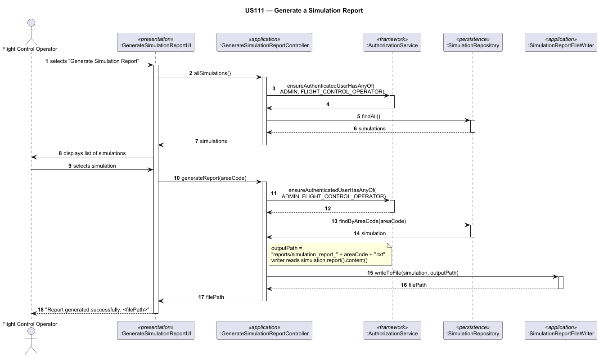

# US111 — Generate a Simulation Report

## 1. Context

This user story is assigned to **Sprint 3** as part of the EAPLI-related work. It is the first time this feature is being developed. The objective is to allow a Flight Control Operator to receive a summary report of the simulation results, so that they can determine if the programmed flights are safe to run.

**Assigned to:** Flight Control Operator feature set

### 1.1 List of Issues

- Analysis: #89
- Design: #89
- Implement: #89
- Test: #89

---

## 2. Requirements

**US111** As a Flight Control Operator, I want to receive a summary of the simulation results so that I can determine if the programmed flights are safe to run.

### Acceptance Criteria

- **US111.1** The system must generate a report file from the SCOMP simulation output and store it in the `reports/` directory.
- **US111.2** The report must contain the full output produced by the SCOMP simulator.
- **US111.3** The report filename must identify the Air Control Area (e.g. `simulation_report_LPPC.txt`).
- **US111.4** The UI must confirm the file path to the operator after generation.

### Dependencies/References

- **US100** — Simulate flights in a given area (simulation must exist before a report can be generated).
- **US101** — Capture and process flight movements (position data used in the report).
- **US102** — Detect aircraft safety violations in real time (violation events included in the report).
- **US109** — Generate and store final simulation report (US111 is the EAPLI-side trigger; US109 is the SCOMP-side implementation of the report generation thread).
- **US030** — Authentication and authorization infrastructure.
- **NFR08** — Database by configuration (in-memory vs RDBMS).
- **NFR09** — Authentication and authorization must be enforced.

---

## 3. Analysis

### 3.0 LLM Assistance

Generative AI (Claude, Anthropic) was used to support the analysis and design of this user story.

**Prompt 1:** "How should a simulation report be modelled in a DDD context? Should it be an aggregate or a value object?"

**LLM suggestions adopted:**
- `SimulationReport` is modelled as a **value object** embedded in `Simulation`, since its identity derives entirely from the file path — it has no independent lifecycle.
- The report is generated on demand by the Flight Control Operator after the simulation finishes, triggered via the EAPLI UI.

**Decisions made by the team:**
- The report content is the raw SCOMP output text stored verbatim in `SimulationReport.content()`.
- The EAPLI layer is responsible for writing that content to a `.txt` file and confirming the path to the user.
- The actual simulation execution is performed by the SCOMP component (US109); the EAPLI side stores and re-exports the result.

### 3.1 Domain Rules

| Rule | Where enforced |
|------|---------------|
| Report content is stored alongside the simulation | `SimulationReport` — value object embedded in `Simulation`; holds `filePath` and `content` |
| Report must be saved to a file | `SimulationReportFileWriter` — writes `simulation.report().content()` to a `.txt` file |
| Overall validation outcome must be recorded | `Simulation.validationResult()` — `PASSED`, `FAILED`, or `PENDING` |
| Only authorized users can generate a report | `GenerateSimulationReportController` — calls `ensureAuthenticatedUserHasAnyOf(ADMIN, FLIGHT_CONTROL_OPERATOR)` |

### 3.2 Key Domain Concepts

- **Simulation** — Aggregate root. Identified by a surrogate `Long` key. Holds the `AreaCode`, `SimulationTimeRange`, `SafetyThreshold`, the embedded `SimulationReport`, and a `ValidationResult`.
- **SimulationReport** — Value object embedded in `Simulation`. Stores `filePath` (original SCOMP output path) and `content` (full text of the output file, persisted as CLOB).
- **SafetyThreshold** — Value object. A positive `value` and a non-blank `unit` (e.g. `500.0 kg/h`).
- **SimulationTimeRange** — Value object. A `startDateTime`/`endDateTime` window; end must be strictly after start.
- **ValidationResult** — Enum. Either `PASSED`, `FAILED`, or `PENDING` (initial state before assessment).

---

## 4. Design

### 4.1 Realization

**Classes involved:**

| Class | Module | Responsibility |
|-------|--------|----------------|
| `Simulation` | `eapli.aisafe.simulation.domain` | Aggregate root; holds area code, time range, safety threshold, report content, and validation result |
| `SimulationReport` | `eapli.aisafe.simulation.domain` | Value object; wraps SCOMP output `filePath` + `content` |
| `SafetyThreshold` | `eapli.aisafe.simulation.domain` | Value object; threshold value and unit |
| `SimulationTimeRange` | `eapli.aisafe.simulation.domain` | Value object; simulation time window |
| `ValidationResult` | `eapli.aisafe.simulation.domain` | Enum: `PASSED` / `FAILED` / `PENDING` |
| `SimulationRepository` | `eapli.aisafe.simulation.repositories` | Repository interface; `findAll()`, `findByAreaCode(AreaCode)`, `findByValidationResult(ValidationResult)` |
| `GenerateSimulationReportController` | `eapli.aisafe.simulation.application` | Application controller; enforces authorization, retrieves simulation by area code, delegates file writing |
| `SimulationReportFileWriter` | `eapli.aisafe.simulation.application` | Service; writes `simulation.report().content()` to the given output path and returns the path |
| `GenerateSimulationReportUI` | `eapli.aisafe.ui.simulation` | Console UI; lists all simulations, lets FCO select one, triggers report generation and shows the file path |
| `JpaSimulationRepository` | `eapli.aisafe.persistence.jpa` | JPA implementation of `SimulationRepository` (NFR08) |
| `InMemorySimulationRepository` | `eapli.aisafe.persistence.inmemory` | In-memory implementation of `SimulationRepository` (NFR08) |

**Sequence Diagram — Generate Simulation Report:**

### 4.2 Acceptance Tests

**AT1 — Report file is generated and path is returned (US111.1, US111.3, US111.4)**

Given a persisted simulation for area code `LPPC`,
When the FCO selects that simulation and triggers report generation,
Then the system writes the SCOMP output content to `reports/simulation_report_LPPC.txt` and returns that path.

**AT2 — UI displays the file path after generation (US111.4)**

Given a successfully written report,
When `generateReport("LPPC")` completes,
Then the returned string equals the path `reports/simulation_report_LPPC.txt` and the UI displays it to the operator.

**AT3 — No simulation found for area code raises exception**

Given no simulation exists for area code `ZZZZ`,
When `generateReport("ZZZZ")` is called,
Then a `NoSuchElementException` is thrown and the UI shows an error message.

**AT4 — Null or blank area code is rejected (input validation)**

Given a null or blank area code,
When `generateReport(null)` or `generateReport("   ")` is called,
Then an `IllegalArgumentException` is thrown before any repository or writer access.

**AT5 — Unauthorized access is rejected (US030)**

Given a user not authenticated as `ADMIN` or `FLIGHT_CONTROL_OPERATOR`,
When they attempt to generate a simulation report,
Then the system denies access with an authorization error.

---

## 5. Implementation

**Key files:**

| File | Package |
|------|---------|
| `Simulation.java` | `eapli.aisafe.simulation.domain` |
| `SimulationReport.java` | `eapli.aisafe.simulation.domain` |
| `SafetyThreshold.java` | `eapli.aisafe.simulation.domain` |
| `SimulationTimeRange.java` | `eapli.aisafe.simulation.domain` |
| `ValidationResult.java` | `eapli.aisafe.simulation.domain` |
| `SimulationRepository.java` | `eapli.aisafe.simulation.repositories` |
| `GenerateSimulationReportController.java` | `eapli.aisafe.simulation.application` |
| `SimulationReportFileWriter.java` | `eapli.aisafe.simulation.application` |
| `GenerateSimulationReportUI.java` | `eapli.aisafe.ui.simulation` |
| `GenerateSimulationReportAction.java` | `eapli.aisafe.ui.simulation` |

**Major commits:**

- `387c17e` — US74 and US111 implementation: closes: #89 #87 — domain, controller, repository, UI, TDD, docs, TCP integration SCOMP→EAPLI, reports saved to reports/ folder
- `0597326` — US111 TDD Green: implement GenerateSimulationReportController and SimulationReportFileWriter: references #89
- `423ba7b` — Analysis and Design of US111: references #89

---

## 6. Integration/Demonstration

1. Run a simulation (US100/US74) until SCOMP produces a report.
2. Log in as Flight Control Operator.
3. Select "Generate Simulation Report" from the menu.
4. Select the simulation from the list (area code shown).
5. System writes `reports/simulation_report_<AREA>.txt` → file path shown to the user.
6. Open the file and verify it contains the SCOMP output.

---

## 7. Observations

- US111 (EAPLI) and US109 (SCOMP) are closely related: US109 describes the report generation thread in C (SCOMP side), while US111 describes the Java/EAPLI side trigger and presentation. The integration point is the SCOMP output text received over TCP (US74) and stored in `SimulationReport.content`.
- `SimulationReport` is a value object embedded inside `Simulation`, not a separate aggregate — there is no `SimulationReportRepository`.
- Per NFR08, both `JpaSimulationRepository` and `InMemorySimulationRepository` are provided for the `Simulation` aggregate.
