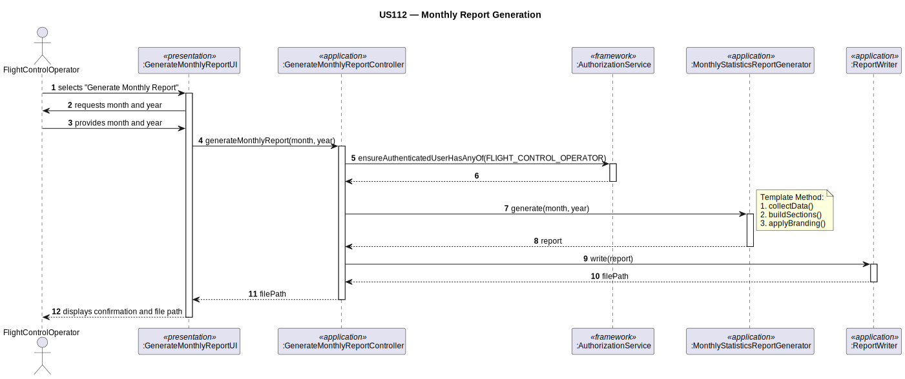

# US112 — Monthly Report Generation

## 1. Context

This task was assigned in Sprint 3. The objective is to allow a Flight Control Operator to generate
a monthly statistics report. This implementation must be foundational — the report structure,
branding, and generation pipeline must support future report types (compliance, incident, etc.)
without requiring redesign.

**Assigned to:** Cláudio Pinto

### 1.1 List of Issues

- Analysis: #74 (Monthly Report Generation)
- Design: #74 (Monthly Report Generation)
- Implement: #74 (Monthly Report Generation)
- Test: #74 (Monthly Report Generation)

---

## 2. Requirements

**US112** As a Flight Control Operator, I want to generate a monthly statistics report.
This will be one of a number of reports the system will have to generate in the future and this
work should be foundational to guarantee all follow a consistent branding and structure. Each
report type has a specific way of collecting data, specific sections and graphics.

### Acceptance Criteria

- **US112.1** The system must require the FLIGHT_CONTROL_OPERATOR role.
- **US112.2** The operator must select the target month and year.
- **US112.3** The report must include monthly flight statistics.
- **US112.4** The report must follow a consistent branding and structure reusable by future report
  types.
- **US112.5** The report must be saved to a file.

### Dependencies/References

- US030 — auth infrastructure.
- US100/US111 — simulation and flight data that feeds the statistics.

---

## 3. Analysis

### 3.0 LLM Assistance

Generative AI (Claude, Anthropic) was used to support the analysis and design of this user story.
Below are the main prompts used, the suggestions adopted, and the decisions the team made
independently or where we deviated from the AI output.

---

#### Prompt 1 — Extensible report generation design

> "We are implementing a monthly statistics report in Java. The design must be foundational for
> future report types (compliance, incident, etc.), each with specific data collection, sections,
> and graphics, but all sharing consistent branding and structure. Suggest a design pattern that
> enforces the shared structure while allowing each report type to define its own content."

**LLM suggestions adopted:**
- Template Method pattern: abstract `ReportGenerator` defines the fixed skeleton (`generate()`)
  — header, sections, footer with branding — and declares abstract methods for the parts that
  vary per report type (`collectData()`, `buildSections()`)
- `MonthlyStatisticsReportGenerator` is the first concrete implementation, extending
  `ReportGenerator` and providing monthly flight statistics as its content
- Report output written to a file via a shared `ReportWriter` so all report types use the same
  output mechanism

**Decisions made by the team / deviations from LLM output:**
- The LLM suggested Strategy for the data collection step — kept inside the concrete subclass
  instead, since data collection is tightly coupled to the report type and does not need to vary
  independently
- The LLM proposed generating HTML output — the team opted for PDF to better support the
  "consistent branding" requirement (layout, fonts, and graphics are fixed in PDF)

---

### 3.1 Key Design Decisions

**Template Method for report structure** — `ReportGenerator` enforces consistent branding and
section ordering across all future report types. Adding a new report type only requires extending
`ReportGenerator` and implementing the abstract methods — no changes to the generation pipeline.

**Separation of data collection from rendering** — `collectData()` is a separate step within the
template, so each report type queries only the data it needs without affecting the shared
rendering logic.

---

## 4. Design

### 4.1 Realization

| Class | Module | Responsibility |
|-------|--------|----------------|
| `GenerateMonthlyReportUI` | `aisafe.app.backoffice.console` | Prompts for month/year; calls controller |
| `GenerateMonthlyReportController` | `aisafe.core` | Auth; instantiates generator; triggers generation |
| `ReportGenerator` | `aisafe.core` | Abstract class — defines report skeleton (Template Method) |
| `MonthlyStatisticsReportGenerator` | `aisafe.core` | Concrete report — monthly flight statistics |
| `ReportWriter` | `aisafe.core` | Writes the final report to a file |

**Sequence Diagram:**

### 4.2 Acceptance Tests

**AT1 — Report generated for a valid month/year (US112.2, US112.3)**

Given a valid month and year with flight data in the system,
When the Flight Control Operator requests the monthly report,
Then the system generates the report file containing the flight statistics for that period.

**AT2 — Report follows consistent structure (US112.4)**

Given any generated report,
When the file is opened,
Then it contains the standard header, branding, sections, and footer defined in `ReportGenerator`.

**AT3 — Unauthorised user rejected (US112.1)**

Given a user without the FLIGHT_CONTROL_OPERATOR role,
When they attempt to generate the report,
Then the system rejects the operation.

---

## 5. Implementation

- `eapli.aisafe.report.application.GenerateMonthlyReportController`
- `eapli.aisafe.report.application.ReportGenerator`
- `eapli.aisafe.report.application.MonthlyStatisticsReportGenerator`
- `eapli.aisafe.report.application.ReportWriter`
- `eapli.aisafe.app.backoffice.console.presentation.report.GenerateMonthlyReportUI`

---

## 6. Integration/Demonstration

To demonstrate this user story:

1. Ensure flight and simulation data exists in the system for a given month (run US100/US111).
2. Log in as a Flight Control Operator.
3. Select "Generate Monthly Report" and provide a month and year with existing data.
4. Verify the report file is created and contains the expected statistics, branding, and structure.

To demonstrate extensibility (US112.4):

1. Create a new class extending `ReportGenerator` (e.g. `ComplianceReportGenerator`).
2. Implement `collectData()` and `buildSections()` for the new report type.
3. Verify that no existing class was modified and the new report shares the same branding and
   structure.

---

## 7. Observations

`ReportGenerator` is the extension point for all future report types. Any new report (compliance,
incident, etc.) must extend it and implement the abstract methods — the branding, structure, and
output mechanism are inherited automatically.