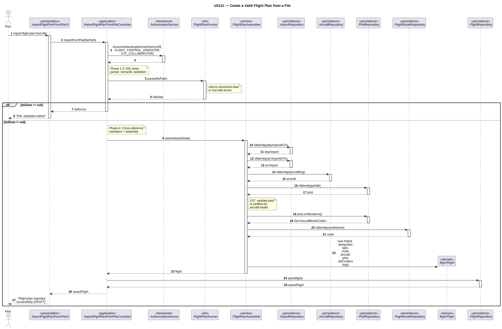

# US121 – Create a Valid Flight Plan from a File

## 1. Context

This user story integrates the Flight DSL (developed in US120) with the EAPLI domain layer, enabling a Pilot to import a `.flightplan` file and automatically create the corresponding `FlightPlan` aggregate in the system.

The DSL pipeline — lexer, parser, semantic validation — was already implemented in US120. This user story adds the final step: building EAPLI domain entities from the parsed AST and persisting them.

**Assigned to:** Whole team (LPROG)

### 1.1 List of Issues

- Analysis: #86
- Design: #86
- Implement: #86
- Test: #86

---

## 2. Requirements

**US121** – As a Pilot, I want to create a valid flight plan from a file, so that I can import flight plans defined in the Flight DSL.

### Acceptance Criteria

- **US121.1** The system must accept a `.flightplan` file as input.
- **US121.2** The file must be processed through the existing DSL pipeline (lexer, parser, semantic validation).
- **US121.3** The system must validate that all referenced entities exist in the database: airports, aircraft registration, pilot ID, and flight route.
- **US121.4** The pilot referenced in the file must belong to the same air transport company as the aircraft.
- **US121.5** On success, the `FlightPlan` is persisted with status `DRAFT`.
- **US121.6** On validation failure, the system must report all errors — both DSL errors and cross-reference errors — without persisting anything.
- **US121.7** Access must be restricted to users with the `FLIGHT_CONTROL_OPERATOR` or `ATC_COLLABORATOR` role.

### Dependencies / References

- US120 — Flight DSL specification and validation (grammar, lexer, parser, semantic validation)
- US073 — Create a flight route (origin/destination airports must exist)
- US075 — Add a pilot (pilot must exist and belong to the correct company)
- US080 — Create a flight plan (shared `FlightPlan` aggregate design)
- US070 — Add an aircraft (aircraft must exist and be active)

---

## 3. Analysis

### Conceptual Model

The import pipeline combines the DSL processing chain with EAPLI domain construction:

```
.flightplan file
    ↓
FlightPlanRunner.parse()      ← US120: lexical + syntactic + semantic validation
    ↓
ParseTree / Visitor output
    ↓
FlightPlanAssembler           ← NEW: builds domain entities from parsed data
    ↓
Cross-reference validation    ← NEW: queries repositories for existence/consistency
    ↓
FlightPlanRepository.save()
```

The `FlightPlan` aggregate has the following structure:

```
FlightPlan (Aggregate Root)
├── FlightPlanId flightId
├── FlightPlanStatus status (DRAFT)
├── RouteName routeId           ← cross-ref to FlightRoute
├── RegistrationNumber aircraftId ← cross-ref to Aircraft
├── PilotId pilotId             ← cross-ref to Pilot
├── FlightType type             ← REGULAR | CHARTER
└── List<Leg> legs
        ├── LegId legId
        ├── AirportIATA depAirport
        ├── LocalDateTime depDatetime
        ├── DayOfWeek depDay (regular only)
        ├── AirportIATA arrAirport
        ├── LocalDateTime arrDatetime
        ├── double fuelKg
        └── List<Segment> segments
                ├── SegmentId segId
                ├── Coordinates from
                ├── Coordinates to
                ├── List<AltitudeSlot> altitudes
                └── WindCondition wind
```

### Domain Connections

This US bridges two modules:

| Module | Role |
|--------|------|
| `aisafe.lprog` (LPROG) | Provides the DSL parsing pipeline — `FlightPlanRunner`, generated lexer/parser, `SemanticValidationListener` |
| `aisafe.core.flightplan` (EAPLI) | Defines the `FlightPlan` aggregate, repository, and `FlightPlanAssembler` service |
| `aisafe.core.pilot` (EAPLI) | Provides `PilotRepository` for pilot existence/company validation |
| `aisafe.core.aircraft` (EAPLI) | Provides `AircraftRepository` for aircraft existence validation |
| `aisafe.core.airport` (EAPLI) | Provides `AirportRepository` for airport code validation |
| `aisafe.core.flightroute` (EAPLI) | Provides `FlightRouteRepository` for route existence validation |

### Key Design Decisions

- **Shared aggregate:** The `FlightPlan` aggregate is shared with US080 (manual creation) — one domain model, two input paths.
- **Cross-references by identity:** All references to other aggregates use their identity VOs (e.g., `RegistrationNumber`, `RouteName`), never direct object references — consistent with the DDD pattern used throughout the project.
- **Validation separation:** DSL-level validation (syntax, semantics) is handled by US120 code. Cross-reference validation (entity existence, company consistency) is handled by the `FlightPlanAssembler` in the application layer.
- **Assembler pattern:** A `FlightPlanAssembler` service converts the DSL visitor output into domain entities, keeping the controller lean and testable.

---

## 4. Design

### 4.1 Realization

**Classes to create/modify:**

| Class | Module | Responsibility |
|-------|--------|----------------|
| `FlightPlan` | `aisafe.core.flightplan.domain` | Aggregate root |
| `FlightPlanId` | `aisafe.core.flightplan.domain` | Value Object wrapping the flight identifier |
| `FlightPlanStatus` | `aisafe.core.flightplan.domain` | Enum: `DRAFT`, `VALIDATED` |
| `FlightType` | `aisafe.core.flightplan.domain` | Enum: `REGULAR`, `CHARTER` |
| `Leg` | `aisafe.core.flightplan.domain` | Local entity within FlightPlan |
| `LegId` | `aisafe.core.flightplan.domain` | Value Object for leg identification |
| `Segment` | `aisafe.core.flightplan.domain` | Local entity within Leg |
| `SegmentId` | `aisafe.core.flightplan.domain` | Value Object for segment identification |
| `AltitudeSlot` | `aisafe.core.flightplan.domain` | Value Object: altitude + optional width |
| `FlightPlanRepository` | `aisafe.core.flightplan.repositories` | Repository interface |
| `JpaFlightPlanRepository` | `aisafe.persistence.impl` | JPA implementation |
| `FlightPlanAssembler` | `aisafe.core.flightplan.application` | Converts DSL parse tree → domain entities |
| `ImportFlightPlanFromFileController` | `aisafe.core.flightplan.application` | Controller orchestrating the import |
| `ImportFlightPlanFromFileUI` | `aisafe.app.pilot.console` | Console UI for the Pilot |

**Sequence Diagram — Import Flight Plan from File:**



### 4.2 Acceptance Tests

#### Acceptance Test 1 — Valid regular flight plan is imported successfully

**Objective:** Validate that a correctly formatted regular `.flightplan` file creates a `FlightPlan`.

**Procedure:**
1. Log in as a Pilot.
2. Select "Import Flight Plan from File".
3. Provide a valid regular `.flightplan` file (e.g., `valid_direct_flight.flightplan`).
4. Confirm.

**Expected Result:** The system reports success and the new `FlightPlan` appears with status `DRAFT`.

**Refers to Acceptance Criteria:** US121.1, US121.2, US121.5

---

#### Acceptance Test 2 — Valid charter flight plan is imported successfully

**Objective:** Validate that a charter `.flightplan` file is accepted.

**Procedure:**
1. Log in as a Pilot.
2. Import a valid charter `.flightplan` file (datetime only, no day).

**Expected Result:** The system reports success and creates a `FlightPlan` with `CHARTER` type.

**Refers to Acceptance Criteria:** US121.1, US121.2, US121.5

---

#### Acceptance Test 3 — Non-existent aircraft is rejected

**Objective:** Validate cross-reference check for aircraft.

**Procedure:**
1. Create a `.flightplan` file referencing a non-existent aircraft registration (e.g., `XX-XXX`).
2. Attempt to import the file.

**Expected Result:** The system rejects with an error: "Aircraft 'XX-XXX' not found in the system".

**Refers to Acceptance Criteria:** US121.3

---

#### Acceptance Test 4 — Non-existent pilot is rejected

**Objective:** Validate cross-reference check for pilot.

**Procedure:**
1. Create a `.flightplan` file referencing a non-existent pilot ID.
2. Attempt to import the file.

**Expected Result:** The system rejects with an error: "Pilot not found".

**Refers to Acceptance Criteria:** US121.3

---

#### Acceptance Test 5 — Pilot company mismatch is rejected

**Objective:** Validate company consistency between pilot and aircraft.

**Procedure:**
1. Create a `.flightplan` file where the pilot belongs to company "TP" but the aircraft belongs to company "FR".
2. Attempt to import the file.

**Expected Result:** The system rejects with: "Pilot does not belong to the same company as the aircraft".

**Refers to Acceptance Criteria:** US121.4

---

#### Acceptance Test 6 — Invalid DSL file is rejected with errors

**Objective:** Validate that DSL validation errors are reported.

**Procedure:**
1. Create a `.flightplan` file with a syntax error (e.g., missing semicolon).
2. Attempt to import the file.

**Expected Result:** The system reports DSL validation errors and nothing is persisted.

**Refers to Acceptance Criteria:** US121.2, US121.6

---

#### Acceptance Test 7 — Unauthorized role is blocked

**Objective:** Validate that only authorized roles can import files.

**Procedure:**
1. Log in as a `BACKOFFICE_OPERATOR`.
2. Attempt to access the Import Flight Plan feature.

**Expected Result:** The system rejects with an authorization error.

**Refers to Acceptance Criteria:** US121.7

---

## 5. Implementation

### Main Files

| File | Location | Status |
|------|----------|--------|
| `FlightPlan.java` | `aisafe.base/core/../flightplan/domain/` | New |
| `FlightPlanId.java` | `aisafe.base/core/../flightplan/domain/` | New |
| `FlightPlanStatus.java` | `aisafe.base/core/../flightplan/domain/` | New |
| `FlightType.java` | `aisafe.base/core/../flightplan/domain/` | New |
| `Leg.java` | `aisafe.base/core/../flightplan/domain/` | New |
| `LegId.java` | `aisafe.base/core/../flightplan/domain/` | New |
| `Segment.java` | `aisafe.base/core/../flightplan/domain/` | New |
| `SegmentId.java` | `aisafe.base/core/../flightplan/domain/` | New |
| `AltitudeSlot.java` | `aisafe.base/core/../flightplan/domain/` | New |
| `FlightPlanRepository.java` | `aisafe.base/core/../flightplan/repositories/` | New |
| `JpaFlightPlanRepository.java` | `aisafe.base/persistence/../jpa/` | New |
| `FlightPlanAssembler.java` | `aisafe.base/core/../flightplan/application/` | New |
| `ImportFlightPlanFromFileController.java` | `aisafe.base/core/../flightplan/application/` | New |
| `ImportFlightPlanFromFileUI.java` | `aisafe.base/app/../pilot/console/` | New |

### Changes to existing files

| File | Change |
|------|--------|
| `RepositoryFactory.java` | Add `flightPlanRepository()` method |
| `JpaRepositoryFactory.java` | Wire `JpaFlightPlanRepository` |
| `InMemoryRepositoryFactory.java` | Wire `InMemoryFlightPlanRepository` |
| `FlightPlanRunner.java` | May need a method that returns structured data instead of printing |

---

## 6. Integration / Demonstration

1. Log in as a Pilot (FLIGHT_CONTROL_OPERATOR) — e.g., `fco1` / `Password1`.
2. Navigate to "Import Flight Plan from File".
3. Provide a path to a `.flightplan` file (e.g., one of the example files in `aisafe.dsl/src/main/resources/examples/`).
4. The system:
   - Parses the file through the DSL pipeline.
   - Validates cross-references against the database.
   - Persists the `FlightPlan` with status `DRAFT`.
5. Verify the flight plan appears in the system.

### Demonstration prerequisites

- Bootstrap must load demo data: airports, aircraft, pilots, routes.
- US073 (FlightRoute), US075 (Pilot), US070 (Aircraft) must be implemented.
- US120 (DSL) must be complete and compiling.

### Integration points

| Component | Integration |
|-----------|-------------|
| `aisafe.lprog` | Called by `ImportFlightPlanFromFileController` via `FlightPlanRunner.run()` |
| `aisafe.core.flightplan` | New package, follows the same DDD patterns as all other aggregates |
| `aisafe.core.pilot` | Queries `PilotRepository` for pilot existence and company validation |
| `aisafe.core.aircraft` | Queries `AircraftRepository` for aircraft existence and company validation |
| `aisafe.core.airport` | Queries `AirportRepository` for airport code validation |
| `aisafe.core.flightroute` | Queries `FlightRouteRepository` for route existence validation |

---

## 7. Observations

- The `FlightPlan` aggregate is shared with US080 (manual creation via UI). Both use cases write to the same database table but through separate controllers.
- The `FlightPlanAssembler` keeps the controller free of DSL concerns — if the DSL changes, only the assembler needs updating.
- Cross-reference validation is deliberately separated from DSL validation: DSL errors are caught early (before any DB queries), while cross-reference errors are caught after parsing succeeds. This gives the user clear, separated error messages.
- The `.flightplan` example files from `aisafe.dsl/src/main/resources/examples/` can be reused for integration testing.
- No changes to the ANTLR grammar are expected — the grammar already supports all constructs needed for flight plan creation.
- Generative AI tools (Claude) were used to support the design of the assembler pattern and the separation of validation concerns.
