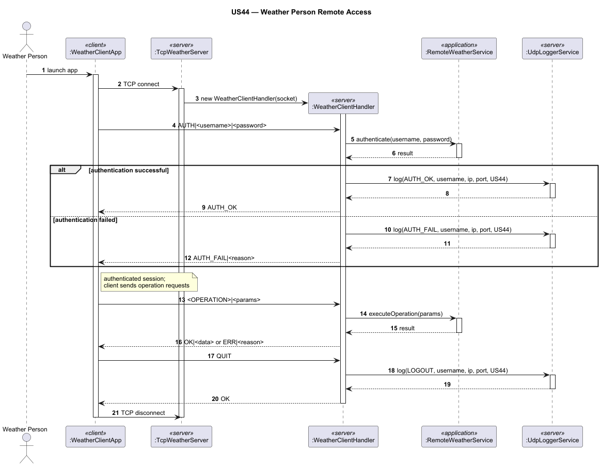

# US044 — Weather Person Remote Access

## 1. Context

This task was assigned in Sprint 3 within the Computer Networks (RCOMP) scope. The objective is to develop a standalone client application that allows a Weather Person to securely interact with the core system remotely over a network, without directly accessing the database.

**Assigned to:** Dinis Silva

### 1.1 List of Issues

- Analysis: #60
- Design: #60
- Implement: #60
- Test: #60

---

## 2. Requirements

**US044** As a Weather Person, I want to remotely access the system in order to upload weather data.

### Acceptance Criteria

- **US044.1** A specific TCP-based network client application must be created to communicate with the server application embedded in the main system.
- **US044.2** The client application's interaction with the system must be strictly limited to the TCP connection. Any direct interaction with the database from the client is unacceptable.
- **US044.3** All Weather Person user stories must be accessible remotely via this client application:
  - **US041** — Register weather data
  - **US042** — Import bulk weather data
  - **US043** — Consult weather data
- **US044.4** Authentication and authorization must be enforced over the remote connection.

### Dependencies/References

- US030 — Authentication and authorization (must be applied to remote logins).
- US041, US042, US043 — The Weather Person functionality that must be exposed remotely.
- US090 — External logging of remote accesses (logs every login/logout/disconnect via UDP).
- NFR08 — Remote RDBMS configuration must be respected.

---

## 3. Analysis

### 3.0 LLM Assistance

Generative AI was used to support the analysis and design of this user story.

**Prompt 1:** "[Insert LLM Prompt used for defining the custom TCP application protocol or handling concurrent client connections]"

**LLM suggestions adopted:**
- [Insert adopted suggestion, e.g., using a specific message format with fields for Version, Code, Data Length, and Payload]

**Decisions made by the team:**
- [Insert specific team decisions, e.g., how the server delegates requests to the existing EAPLI controllers rather than rewriting business logic]

### 3.1 Network Architecture & Protocol

The system requires a **Client-Server Architecture**.
1. **Server:** A concurrent TCP server running within the main AISafe application. It listens on a dedicated port for Weather Person connections, accepts incoming connections, and spawns a thread for each client.
2. **Client:** A lightweight console application that connects to the server IP and port, sending text-based requests and receiving responses.
3. **Protocol:** A custom application-layer text protocol is defined. Each message is terminated with `\n` and fields are separated by `|`.

**Client to Server messages:**

| Code | Format | Description |
|------|--------|-------------|
| `AUTH` | `AUTH\|<username>\|<password>` | Authenticate the session |
| `REGISTER_WEATHER` | `REGISTER_WEATHER\|<area_code>\|<date>\|<params>` | Register weather data (US041) |
| `IMPORT_WEATHER` | `IMPORT_WEATHER\|<area_code>\|<csv_payload>` | Import bulk weather data (US042) |
| `CONSULT_WEATHER` | `CONSULT_WEATHER\|<area_code>\|<date>` | Consult weather data (US043) |
| `QUIT` | `QUIT` | Gracefully close the session |

**Server to Client messages:**

| Code | Meaning |
|------|---------|
| `AUTH_OK` | Authentication successful |
| `AUTH_FAIL\|<reason>` | Authentication failed |
| `OK\|<optional_data>` | Operation succeeded |
| `ERR\|<reason>` | Operation failed |

---

## 4. Design

### 4.1 Realization

**Classes to create/modify:**

| Class | Module | Responsibility |
|-------|--------|----------------|
| `WeatherClientApp` | `aisafe.app.weather.client` | Entry point for the client application; manages UI |
| `TcpNetworkClient` | `aisafe.app.weather.client` | Handles TCP socket creation and stream I/O on the client |
| `WeatherServerDaemon` | `aisafe.app.server` | Background service in the main app listening for TCP connections on the Weather Person port |
| `WeatherClientHandler` | `aisafe.app.server` | Thread/Runnable that processes requests for a specific connected client |
| `WeatherProtocolParser` | `aisafe.network.common` | Parses raw text messages into structured request objects |
| `RemoteWeatherService` | `aisafe.app.server` | Delegates to existing US041–US043 application services; no direct DB access |

**Sequence Diagram — Remote Login and Request Execution:**

### 4.2 Acceptance Tests

**AT1 — No Direct Database Access**

Given the client application is running on a machine without database credentials or drivers,
When the user requests to consult weather data (US043),
Then the client successfully retrieves and displays the data by communicating solely over the TCP socket.

**AT2 — Enforced Authentication**

Given an unauthenticated TCP connection,
When the client attempts to send a `REGISTER_WEATHER` protocol message,
Then the server rejects the request with `ERR|NOT_AUTHENTICATED` and does not execute the operation.

**AT3 — Successful Remote Execution**

Given an authenticated connection for a user with the `WEATHER_PERSON` role,
When the client sends a formatted `REGISTER_WEATHER` request,
Then the server processes it using the core domain logic and replies with `OK`, updating the central system.

**AT4 — Wrong Role is Rejected**

Given a user with valid credentials but holding a different role (e.g., `ATC_COLLABORATOR`),
When the client sends `AUTH` on the Weather Person server port,
Then the server responds with `AUTH_FAIL|INSUFFICIENT_ROLE` and the session remains unauthenticated.

---

## 5. Implementation

**Key new/modified files:**

- `[TBD]`

*Major commits: [TBD]*

---

## 6. Integration/Demonstration

1. Start the main AISafe server application (which initializes the remote database connection and starts the TCP listening thread for the Weather Person port).
2. On a separate terminal or machine, launch the `WeatherClientApp`.
3. Provide the server's IP address and port.
4. Authenticate using valid Weather Person credentials.
5. Execute a domain action (e.g., Register Weather Data) and verify the data matches the central system.
6. Verify via network monitoring (e.g., Wireshark) that communication is restricted strictly to the defined TCP port and protocol.

---

## 7. Observations

[TBD]