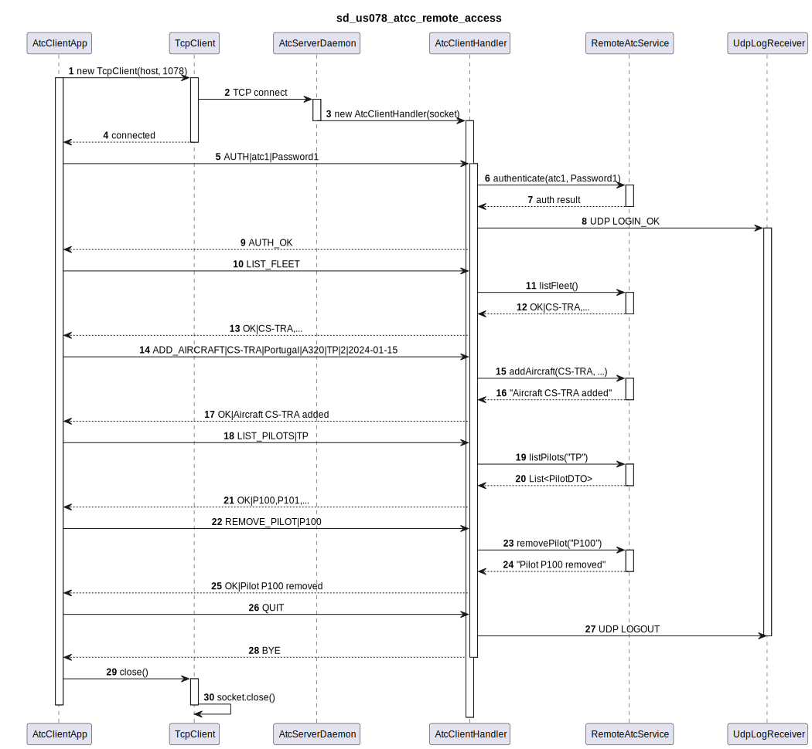
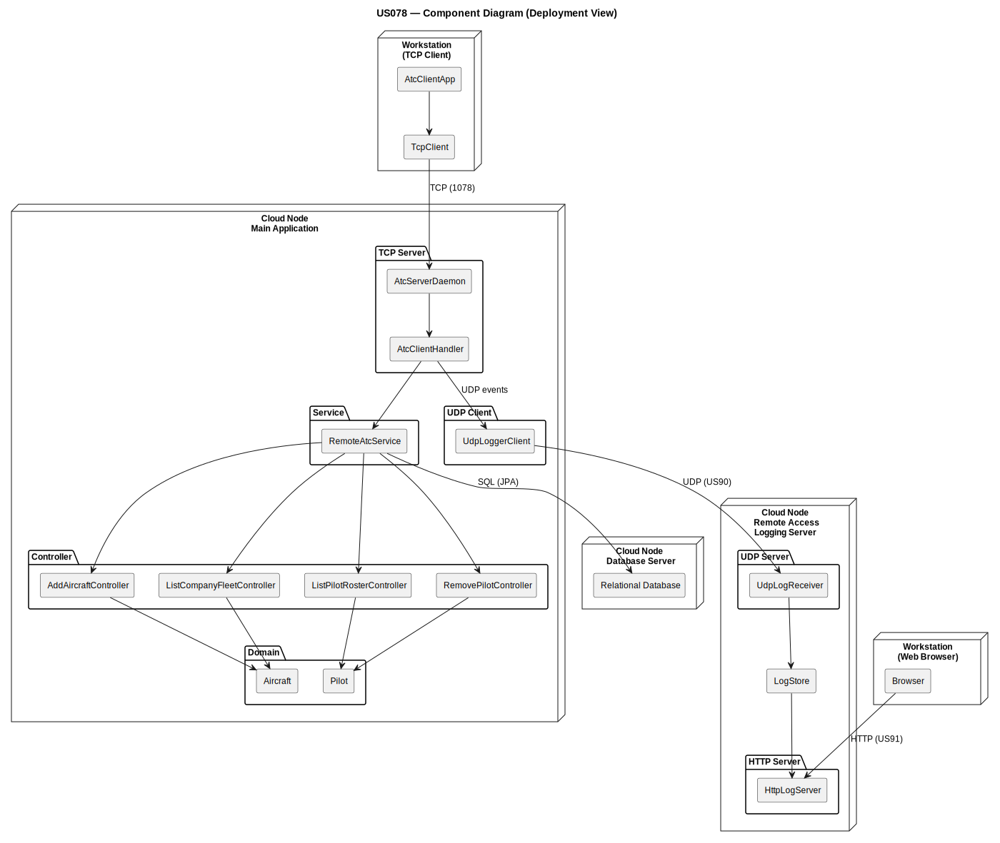

# US078 — ATCC Remote Access (RCOMP)

## 1. Context

This task was assigned in Sprint 3 within the Computer Networks (RCOMP) scope. The objective is to develop a standalone client application that allows an ATCC Collaborator to securely interact with the core system remotely over a network, without directly accessing the database.

**Assigned to:** Dinis Silva

### 1.1 List of Issues

- Analysis: #60
- Design: #60
- Implement: #60
- Test: #60

---

## 2. Requirements

**US078** As an ATCC Collaborator, I want to remotely access the system in order to manage aircraft, flight crews, and routes.

### Acceptance Criteria

- **US078.1** A specific TCP-based network client application must be created to communicate with the server application embedded in the main system.
- **US078.2** The client application's interaction with the system must be strictly limited to the TCP connection. Any direct interaction with the database from the client is unacceptable.
- **US078.3** All ATCC Collaborator user stories must be accessible remotely via this client application:
  - **US070** — Add aircraft
  - **US071** — Decommission aircraft
  - **US072** — List fleet
  - **US073** — Create flight route
  - **US074** — Deactivate flight route
  - **US075** — Add pilot
  - **US076** — List pilots
  - **US077** — Remove pilot
- **US078.4** Authentication and authorization must be enforced over the remote connection.

### Dependencies/References

- US030 — Authentication and authorization (must be applied to remote logins).
- US070, US071, US072, US073, US074, US075, US076, US077 — The ATCC functionality that must be exposed remotely.
- US090 — External logging of remote accesses (logs every login/logout/disconnect via UDP).
- NFR08 — Remote RDBMS configuration must be respected.

---

## 3. Analysis

### 3.1 Network Architecture

The system follows a two-tier remote access model:

- A standalone **ATCC Collaborator Client App** (Java console) connects via TCP to a dedicated port exposed by the main system
- The **TCP Server** is embedded in the main system and spawns one handler thread per accepted connection
- All business logic (US070–US077) executes on the server side through existing application services
- The client sends text requests and receives text responses — it never touches the database
- The server enforces that the authenticated user holds the `ATC_COLLABORATOR` role before any operation is dispatched

### 3.2 Application-Level Protocol

A simple text-based request/response protocol is defined for this connection.
Each message is terminated with `\n`. Fields are separated by `|`.

**Client to Server messages:**

| Code | Format | Description |
|------|--------|-------------|
| AUTH | `AUTH|<username>|<password>` | Authenticate the session |
| ADD_AIRCRAFT | `ADD_AIRCRAFT|<registration>|<country>|<model>|<operator>|<numCrew>|<certDate>` | Add aircraft (US070) |
| DECOMMISSION_AIRCRAFT | `DECOMMISSION_AIRCRAFT|<registration>|<country>` | Decommission aircraft (US071) |
| LIST_FLEET | `LIST_FLEET` | List all aircraft (US072) |
| CREATE_ROUTE | `CREATE_ROUTE|<routeName>|<operator>|<departure>|<arrival>` | Create route (US073) |
| DELETE_ROUTE | `DELETE_ROUTE|<routeName>|<date>` | Deactivate route (US074) |
| ADD_PILOT | `ADD_PILOT|<licenseNumber>|<operator>|<certDate>|<aircraftTypes>` | Add pilot (US075) |
| LIST_PILOTS | `LIST_PILOTS|<operator>` | List pilots (US076) |
| REMOVE_PILOT | `REMOVE_PILOT|<licenseNumber>` | Remove pilot (US077) |
| LIST_ROUTES | `LIST_ROUTES` | List all routes |
| QUIT | `QUIT` | Gracefully close the session |

**Server to Client messages:**

| Code | Meaning |
|------|---------|
| `AUTH_OK` | Authentication successful |
| `AUTH_FAIL|<reason>` | Authentication failed |
| `OK|<optional_data>` | Operation succeeded |
| `ERR|<reason>` | Operation failed — reason included |
| `BYE` | Server acknowledges QUIT |

### 3.3 Session Flow

1. Client establishes TCP connection to the server on the ATCC-dedicated port (1078)
2. Server accepts and spawns a handler thread for that connection
3. Client sends `AUTH|<username>|<password>`
4. Server validates credentials via EAPLI `AuthzRegistry`
5. Server checks `securityClearanceExpiryDate` (US030.4)
6. Server verifies the authenticated user holds the `ATC_COLLABORATOR` role
7. If all valid: server responds `AUTH_OK` and session is bound to that ATCC user
8. If invalid: server responds `AUTH_FAIL|<reason>` — connection stays open for retry or QUIT
9. Server emits a UDP log event to the Remote Accesses Logging Server (US090) for both outcomes
10. Any request other than AUTH or QUIT received before authentication is answered with `ERR|NOT_AUTHENTICATED`
11. After QUIT or disconnect, the server closes the socket and cleans up the session

### 3.4 Architecture with DTOs

The system follows the **DTO pattern** to isolate the domain model from the TCP protocol layer.

**DTOs in the ATC remote subdomain:**

| DTO | Fields | Factory |
|-----|--------|---------|
| `AircraftDTO` | registrationNumber, registrationCountry, aircraftModelCode, companyIata, crewMembers, totalCapacity, operationalStatus, registrationDate, ageInYears | `AircraftDTO.from(Aircraft)` |
| `FlightRouteDTO` | routeName, companyIata, originIata, destinationIata, active, deactivationDate | `FlightRouteDTO.from(FlightRoute)` |
| `PilotDTO` | licenseNumber, companyIata, certifiedModels, certificationDate, active | `PilotDTO.from(Pilot)` |

**DTO Flow (intended, see note in Observations):**
```
Domain Entity → DTO.from(entity) → DTO record → TCP Handler → format → Client
```

### 3.5 Diagrams

**Sequence Diagram — Remote ATCC Access:**



*PlantUML source: `sds/uml/sd_us078_atcc_remote_access.puml`*

**Component Diagram — Client-Server Architecture:**



*PlantUML source: `sds/uml/component_us078_client_server.puml`*

---

## 4. Design

### 4.1 Realization

**Key classes (RCOMP side):**

| Class / File | Location | Responsibility |
|--------------|----------|---------------|
| `AtcClientApp` | `rcomp/us078/src/rcomp/client/` | Standalone console client with validation |
| `TcpClient` | `rcomp/us078/src/rcomp/client/` | Reusable TCP client |
| `run-atcc-client.bat` | `rcomp/us078/` | Windows build & run script |

**Key classes (EAPLI side):**

| Class | Location | Responsibility |
|-------|----------|---------------|
| `AtcServerDaemon` | `aisafe.base/app/src/.../server/` | Listens on port 1078; accepts connections |
| `AtcClientHandler` | `aisafe.base/app/src/.../server/` | Per-connection handler: protocol parsing, dispatch, response |
| `RemoteAtcService` | `aisafe.base/core/src/.../remote/atc/` | Facade wrapping ATC controllers |
| `RemoteProtocol` | `aisafe.base/core/src/.../remote/` | Protocol constants and helpers |
| `UdpAccessLogger` | `aisafe.base/core/src/.../remote/` | UDP logging client for US090 |
| `AircraftDTO` | `aisafe.base/core/src/.../remote/atc/` | DTO for aircraft data |
| `FlightRouteDTO` | `aisafe.base/core/src/.../remote/atc/` | DTO for flight route data |
| `PilotDTO` | `aisafe.base/core/src/.../remote/atc/` | DTO for pilot data |

### 4.2 Acceptance Tests

**AT1 — No Direct Database Access**

Given the client application is running on a machine without database credentials or drivers,
When the user requests to list the fleet (US072),
Then the client successfully retrieves and displays the fleet by communicating solely over the TCP socket.

**AT2 — Enforced Authentication**

Given an unauthenticated TCP connection,
When the client attempts to send a `LIST_FLEET` protocol message,
Then the server rejects the request with `ERR|NOT_AUTHENTICATED` and does not execute the operation.

**AT3 — Successful Remote Execution**

Given an authenticated connection for a user with the `ATC_COLLABORATOR` role,
When the client sends a formatted `ADD_AIRCRAFT` request,
Then the server processes it using the core domain logic and replies with `OK`, updating the central system.

**AT4 — Wrong Role is Rejected**

Given a user with valid credentials but holding a different role (e.g., `WEATHER_PERSON`),
When the client sends `AUTH` on the ATCC server port,
Then the server responds with `AUTH_FAIL|INSUFFICIENT_ROLE` and the session remains unauthenticated.

---

## 5. Implementation

### 5.1 Files (RCOMP)

| File | Responsibility |
|------|---------------|
| `rcomp/us078/src/rcomp/client/AtcClientApp.java` | Console client with loop-based validation and intuitive prompts |
| `rcomp/us078/src/rcomp/client/TcpClient.java` | TCP transport layer — kept at original repository state |
| `rcomp/us078/run-atcc-client.bat` | Windows build & run script (`javac` + `java`) |

### 5.2 UI Improvements

- **Loop-based validation**: Each input field validates immediately and re-prompts on invalid input
- **Explicit format hints**: Each field shows the expected format (e.g., "Date format: YYYY-MM-DD")
- **No area selection**: The ATC client does not require area selection — this is specific to the Weather Person client (US044)
- **Null-safe**: Handles connection errors gracefully without crashing

---

## 6. Integration/Demonstration

1. Start the main application — TCP server binds to the ATCC-dedicated port (1078).
2. Start the Remote Accesses Logging Server (US090) to receive UDP event logs.
3. Launch the ATCC Collaborator Client App on a different network node.
4. Connect to the main application IP and ATCC port.
5. Authenticate as `atc1` / `Password1`.
6. Add aircraft, list fleet, create routes, manage pilots.
7. Check US090 logging server received login/logout events.
8. Verify no direct database calls originated from the client process.

---

## 7. Observations

- The RCOMP component depends on `RemoteAtcService` from EAPLI — this is the only integration point.
- The DTO classes (`AircraftDTO`, `FlightRouteDTO`, `PilotDTO`) exist in the `remote/atc` package but are not yet consumed by `RemoteAtcService` — it currently formats domain entities directly into strings. A future refactor should integrate the DTO layer.
- US090 (UDP logging) must be operational for login/logout events to be recorded.
- The text protocol is identical in structure to US044 and US086 — only the command codes and port differ.
- All input validation happens on the client side with retry loops for robust user experience.
