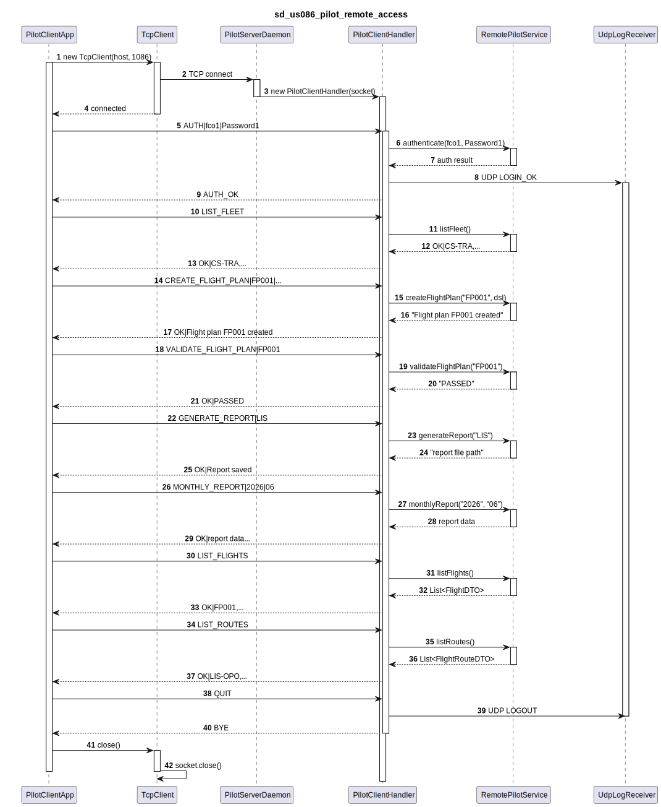
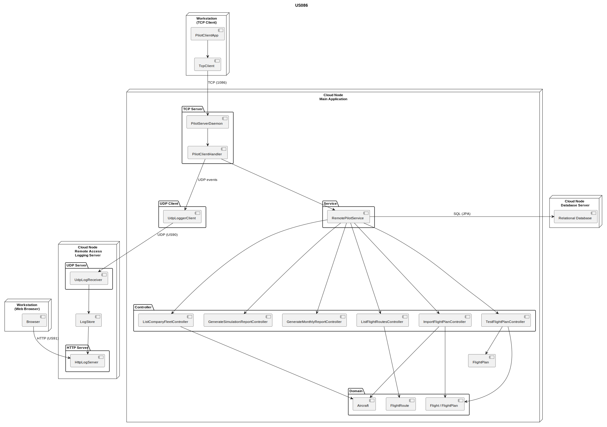

# US86 — Pilot Remote Access (RCOMP)

## 1. Context

This task is assigned in Sprint 3. It is the first time this feature is being developed.
The objective is to allow a Pilot (Flight Control Operator — FCO) to remotely access the
system through a dedicated TCP-based client application, making all FCO functionality
available over the network without any direct database interaction from the client side.

**Issue:** #62
**Assigned to:** Fábio Costa (both EAPLI and RCOMP sides)

### 1.1 List of Issues

- Analysis: #62
- Design: #62
- Implement: #62
- Test: #62

---

## 2. Requirements

**US86** As a Pilot (Flight Control Operator), I want to remotely access the system in order to manage flight plans and view reports.

### Acceptance Criteria

- **US86.1** A specific TCP-based client application must be developed to communicate with a server application embedded in the main system.
- **US86.2** The client application must interact with the system exclusively through the TCP connection — any direct interaction with the database is strictly unacceptable.
- **US86.3** All Pilot/FCO user stories must be remotely available via this client application:
  - **US072** — List company fleet
  - **US080** — Create a flight plan
  - **US085** — Test/validate a flight plan
  - **US111** — Generate a simulation report
  - **US112** — Monthly report generation
  - **US121** — Create a valid flight plan from a file
- **US86.4** Authentication and authorization must be enforced before any operation is executed.

### Dependencies/References

- US072, US080, US085, US111, US112, US121 — FCO operations (Sprint 2/3)
- US030 — Authentication and authorization infrastructure (Sprint 2)
- US90 — External logging of remote accesses (logs every login/logout/disconnect via UDP)
- NFR09 — Authentication and authorization enforced on all functionalities

---

## 3. Analysis

### 3.0 LLM Assistance

Generative AI (Claude, Anthropic) was used to support the analysis of this user story.

**Prompt 1:** "In a Java TCP client-server system with multiple remote client types (Weather Person, ATCC, Pilot), should each have its own TCP server on a different port, or should a single server handle all?"

**LLM suggestions adopted:**
- Each client type gets its own dedicated TCP server running on a distinct port — this keeps handler logic simple and role enforcement straightforward
- Authentication reuses the shared EAPLI `AuthzRegistry` on the server side regardless of port
- The server validates after authentication that the authenticated user holds the `FLIGHT_CONTROL_OPERATOR` role, rejecting users with other roles

**Decisions made by the team:**
- The Pilot Client App is a standalone console application, separate from the backoffice app and from other client apps
- One TCP connection = one session; the session is tied to a specific Pilot
- Security clearance expiry check (US030.4) applies to remote login as it does locally
- Existing EAPLI controllers are reused server-side without modification

---

### 3.1 Network Architecture

The system follows a two-tier remote access model:

- A standalone **Pilot Client App** (Java console) connects via TCP to a dedicated port exposed by the main system
- The **TCP Server** is embedded in the main system and spawns one handler thread per accepted connection
- All business logic (US072, US080, US085, US111, US112, US121) executes on the server side through existing application services
- The client sends text requests and receives text responses — it never touches the database
- The server enforces that the authenticated user holds the `FLIGHT_CONTROL_OPERATOR` role before any operation is dispatched
- All data is transferred using **DTOs** (Data Transfer Objects) between the service layer and the TCP handler

---

### 3.2 Application-Level Protocol

A simple text-based request/response protocol is defined for this connection.
Each message is terminated with `\n`. Fields are separated by `|`.

**Client to Server messages:**

| Code | Format | Description |
|------|--------|-------------|
| AUTH | `AUTH|<username>|<password>` | Authenticate the session |
| LIST_FLEET | `LIST_FLEET` | List company fleet (US072) |
| CREATE_FLIGHT_PLAN | `CREATE_FLIGHT_PLAN|<flight_id>|<dsl_content>` | Create a flight plan in draft (US080) |
| IMPORT_FLIGHT_PLAN | `IMPORT_FLIGHT_PLAN|<flight_id>|<dsl_content>` | Import flight plan (US121) |
| VALIDATE_FLIGHT_PLAN | `VALIDATE_FLIGHT_PLAN|<flight_plan_id>` | Test/validate a flight plan (US085) |
| GENERATE_REPORT | `GENERATE_REPORT|<area_code>` | Generate simulation report (US111) |
| MONTHLY_REPORT | `MONTHLY_REPORT|<year>|<month>` | Generate monthly report (US112) |
| LIST_FLIGHTS | `LIST_FLIGHTS` | List all flights |
| LIST_ROUTES | `LIST_ROUTES` | List all routes |
| QUIT | `QUIT` | Gracefully close the session |

**Server to Client messages:**

| Code | Meaning |
|------|---------|
| `OK|<optional_data>` | Operation succeeded |
| `ERR|<reason>` | Operation failed — reason included |
| `AUTH_OK` | Authentication successful |
| `AUTH_FAIL|<reason>` | Authentication failed (wrong credentials, expired clearance, or wrong role) |
| `BYE` | Server acknowledges QUIT |

---

### 3.3 Session Flow

1. Client establishes TCP connection to the server on the Pilot-dedicated port (1086)
2. Server accepts and spawns a handler thread for that connection
3. Client sends `AUTH|<username>|<password>`
4. Server validates credentials via EAPLI `AuthzRegistry`
5. Server checks `securityClearanceExpiryDate` (US030.4)
6. Server verifies the authenticated user holds the `FLIGHT_CONTROL_OPERATOR` role
7. If all valid: server responds `AUTH_OK` and session is bound to that Pilot
8. If invalid: server responds `AUTH_FAIL|<reason>` — connection stays open for retry or QUIT
9. Server emits a UDP log event to the Remote Accesses Logging Server (US90) for both outcomes
10. Any request other than AUTH or QUIT received before authentication is answered with `ERR|NOT_AUTHENTICATED`
11. After QUIT or disconnect, the server closes the socket and cleans up the session

---

### 3.4 Architecture with DTOs

The system follows the **DTO pattern** as described by Martin Fowler (PoEAA):
"An object that carries data between processes in order to reduce the number of method calls."

**DTOs in the Pilot remote subdomain:**

| DTO | Fields | Factory |
|-----|--------|---------|
| `AircraftDTO` | registrationNumber, aircraftModelCode, operationalStatus, totalCapacity | `AircraftDTO.from(Aircraft)` |
| `FlightDTO` | flightDesignator, departureTime, routeName, aircraftRegistration, pilotLicense, flightType | `FlightDTO.from(Flight)` |
| `FlightRouteDTO` | routeName, origin, destination, active | `FlightRouteDTO.from(FlightRoute)` |

**DTOs in the Weather remote subdomain:**

| DTO | Fields | Factory |
|-----|--------|---------|
| `AirControlAreaDTO` | areaCode, name, minLat, maxLat, minLon, maxLon, maxAltitudeMetres | `AirControlAreaDTO.from(AirControlArea)` |
| `WeatherDataDTO` | areaCode, latitude, longitude, altitudeMetres, windSpeedKnots, windDirectionDegrees, temperatureCelsius, sourceProvider, recordedDateTime | `WeatherDataDTO.from(WeatherData)` |

**DTOs in the ATC remote subdomain:**

| DTO | Fields | Factory |
|-----|--------|---------|
| `AircraftDTO` | registrationNumber, registrationCountry, aircraftModelCode, companyIata, crewMembers, totalCapacity, operationalStatus, registrationDate, ageInYears | `AircraftDTO.from(Aircraft)` |
| `FlightRouteDTO` | routeName, companyIata, originIata, destinationIata, active, deactivationDate | `FlightRouteDTO.from(FlightRoute)` |
| `PilotDTO` | licenseNumber, companyIata, certifiedModels, certificationDate, active | `PilotDTO.from(Pilot)` |

**DTO Flow:**
```
Domain Entity → DTO.from(entity) → DTO record → TCP Handler → format → Client
```

DTOs ensure:
- Low coupling between domain and presentation layers
- No direct exposure of domain entities to the client
- Optimized data transfer (only necessary fields)
- Isolation of domain logic from network protocol

---

### 3.5 Diagrams

**Sequence Diagram — TCP message flow between client, server and logging server:**

**(See file: `sds/sd_us086_pilot_remote_access.puml`)**

This simplified SD shows the communication between the three components:
- **PilotClientApp** — the RCOMP client
- **AISafeBackoffice** — the main application with TCP server
- **LoggingServerApp** — the US90 UDP logging server

The diagram illustrates the full lifecycle:
1. Connection → Authentication (with UDP LOGIN_OK event)
2. Fleet listing (DTO transformation)
3. Flight plan creation
4. Flight plan validation
5. Monthly report generation
6. Route listing
7. Logout (with UDP LOGOUT event)

**Detailed Sequence Diagram — Pilot Remote Access:**



*PlantUML source: `sds/uml/sd_us086_pilot_remote_access.puml`*

**Component Diagram — Client-server architecture:**



*PlantUML source: `sds/uml/component_us086_client_server.puml`*

---

### 3.6 Acceptance Tests

**AT1 — Unauthenticated request is rejected (US86.4)**

Given a client connected to the server but not yet authenticated,
When the client sends a LIST_FLEET request,
Then the server responds with `ERR|NOT_AUTHENTICATED` and does not execute the operation.

**AT2 — Authentication with wrong role is denied (US86.4)**

Given a user with valid credentials and valid security clearance but holding the `WEATHER_PERSON` role,
When the client sends AUTH with those credentials on the Pilot server port,
Then the server responds with `AUTH_FAIL|INSUFFICIENT_ROLE` and the session remains unauthenticated.

**AT3 — Authentication with expired security clearance is denied (US86.4 + US030.4)**

Given a Pilot whose `securityClearanceExpiryDate` is in the past,
When the client sends AUTH with valid credentials,
Then the server responds with `AUTH_FAIL|SECURITY_CLEARANCE_EXPIRED` and the session remains unauthenticated.

**AT4 — Successful authentication grants access to all FCO operations (US86.3)**

Given a Pilot with valid credentials, valid security clearance and the `FLIGHT_CONTROL_OPERATOR` role,
When the client authenticates successfully,
Then the client can execute US072, US080, US085, US111, US112 and US121 operations, each receiving an `OK` or domain-level `ERR` response.

**AT5 — No direct database access from client (US86.2)**

Given a running authenticated client session,
When any operation is performed,
Then all data access occurs exclusively on the server side through the application services; the client sends and receives only text protocol messages over the TCP connection.

**AT6 — Create flight plan succeeds with valid DSL (US080)**

Given an authenticated Pilot,
When the client sends a CREATE_FLIGHT_PLAN request with valid DSL content and an existing flight ID,
Then the server responds with `OK` and the flight plan is persisted in draft status.

**AT7 — Import flight plan from file succeeds (US121)**

Given an authenticated Pilot,
When the client sends an IMPORT_FLIGHT_PLAN request with valid DSL flight plan content,
Then the server responds with `OK` and the flight plan is imported.

**AT8 — Validate flight plan reports status (US085)**

Given an authenticated Pilot and an existing flight plan in draft status with weather data assigned,
When the client sends a VALIDATE_FLIGHT_PLAN request,
Then the server responds with `OK|<status>` indicating whether the plan passed or failed validation.

---

## 4. Design

### 4.1 Realization

The SD shows the TCP message flow: connect → authenticate (`AUTH`) → create flight plan (`CREATE_FLIGHT_PLAN`) → validate (`VALIDATE_FLIGHT_PLAN`) → disconnect (`QUIT`). The component diagram shows the architecture: Client App → TCP Server → Handler → `RemotePilotService` → FCO Controllers → DB, with UDP logging to US90.

All domain data transferred across the network uses DTOs (see [3.4](#34-architecture-with-dtos) above).

**Key classes (RCOMP side):**

| Class | Location | Responsibility |
|-------|----------|---------------|
| `PilotClientApp` | `rcomp/us086/src/rcomp/client/` | Standalone console client: menu, TCP send/receive, response display |
| `TcpClient` | `rcomp/us086/src/rcomp/client/` | Reusable TCP client for AISafe remote services |

**Key classes (EAPLI side):**

| Class | Location | Responsibility |
|-------|----------|---------------|
| `PilotServerDaemon` | `aisafe.base/app/src/.../server/` | Listens on port 1086; accepts connections |
| `PilotClientHandler` | `aisafe.base/app/src/.../server/` | Per-connection handler: protocol parsing, dispatch, response |
| `RemotePilotService` | `aisafe.base/core/src/.../remote/pilot/` | Facade wrapping all FCO controllers |
| `RemoteProtocol` | `aisafe.base/core/src/.../remote/` | Protocol constants and helpers |
| `UdpAccessLogger` | `aisafe.base/core/src/.../remote/` | UDP logging client for US90 |

---

## 5. Implementation

### 5.1 Files (RCOMP)

| File | Responsibility |
|------|---------------|
| `rcomp/us086/src/rcomp/client/PilotClientApp.java` | Console client with loop-based validation and intuitive prompts |
| `rcomp/us086/src/rcomp/client/TcpClient.java` | TCP transport layer |
| `sds/sd_us086_pilot_remote_access.puml` | Sequence diagram (client ↔ server ↔ logging) |

### 5.2 UI Improvements

All three client applications (US044, US078, US086) implement the following UI improvements:

- **Loop-based validation**: Each input field is validated immediately with a retry loop — invalid input does not abort the operation, but re-prompts the user in the specific field
- **Explicit format hints**: Each field shows the expected format (e.g. `Date (yyyy-mm-dd): `)
- **Error messages are field-specific**: Instead of generic errors, each validation failure tells the user exactly what was wrong with their input
- **Null-safe server responses**: All client code handles null responses (connection closed) gracefully without crashing
- **AUTH_FAIL display**: Authentication failure reasons are displayed to the user (wrong credentials, insufficient role, expired clearance)

---

## 6. Integration/Demonstration

1. Start the main application — TCP server binds to the Pilot-dedicated port (1086).
2. Start the Remote Accesses Logging Server (US90) to receive UDP event logs.
3. Launch the Pilot Client App on a different network node.
4. Connect to the main application IP and Pilot port.
5. Authenticate as `fco1` / `Password1`.
6. Execute LIST_FLEET, CREATE_FLIGHT_PLAN, VALIDATE_FLIGHT_PLAN — verify responses.
7. Check US90 logging server received login/logout events.
8. Verify no direct database calls originated from the client process.

---

## 7. Observations

- The RCOMP component depends on `RemotePilotService` from EAPLI — this is the only integration point.
- US90 (UDP logging) must be operational for login/logout events to be recorded.
- The text protocol is identical in structure to US44 and US78 — only the command codes and port differ.
- Security clearance check (US030.4) applies equally to remote logins.
- DTOs are implemented as Java records with static `from()` factory methods, isolating the domain model from the TCP protocol layer.
- The SD in `sds/sd_us086_pilot_remote_access.puml` provides a simplified view of the client-server-logging communication flow.
