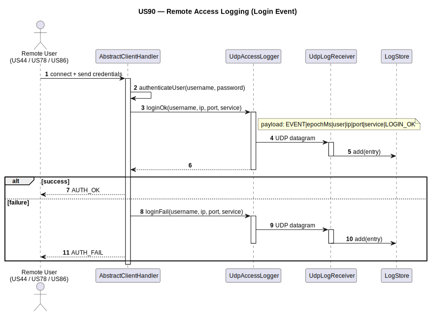
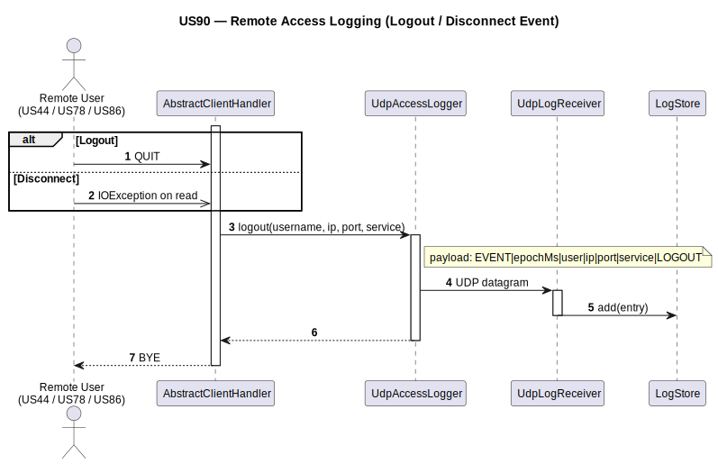
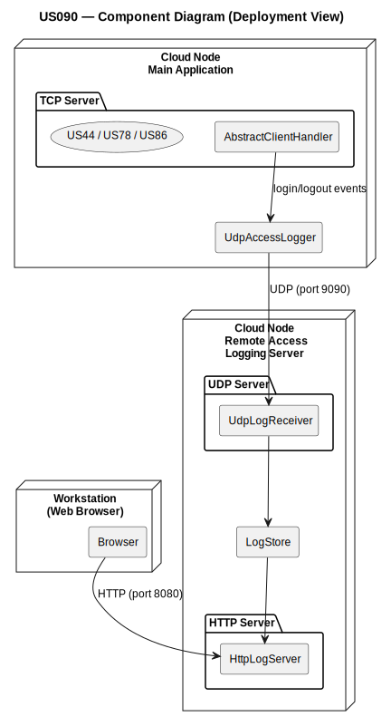

# US90 — External Logging of Remote Accesses

## 1. Context

This task is assigned in Sprint 3. It is the first time this feature is being developed.
The objective is to ensure that every remote access event (successful login, failed login,
logout, disconnect) occurring on the TCP servers (US44, US78, US86) is transmitted via UDP
datagram to a dedicated Remote Accesses Logging Server running on a cloud node, where it is
stored and made available for visualization (US91).

**Assigned to:** (to be filled by the team)

### 1.1 List of Issues

- Analysis: #63 (External Logging of Remote Accesses)
- Design: #63 (External Logging of Remote Accesses)
- Implement: #63 (External Logging of Remote Accesses)
- Test: #63 (External Logging of Remote Accesses)

---

## 2. Requirements

**US90** As Administrator, I want to have logs for every remote access to the system.

### Acceptance Criteria

- **US90.1** Remote access events must be transmitted to a remote application, the Remote
  Accesses Logging Server, by using UDP datagrams.
- **US90.2** Both successful logins and failed logins must be registered; logouts and
  disconnects must also be logged.
- **US90.3** Logged data must include: a timestamp, the username, the client's IP address,
  the client's port number, and the service (US44, US78, or US86).
- **US90.4** The Remote Accesses Logging Server application must run at a dedicated network
  node in a cloud.

### Dependencies/References

- US44 — Weather Person remote access; one of the TCP servers that must send log events.
- US78 — Air Transport Company Collaborator remote access; one of the TCP servers that must send log events.
- US86 — Pilot remote access; one of the TCP servers that must send log events.
- US91 — Remote Accesses Logging Visualization; the server that receives, stores, and
  displays the UDP datagrams produced by this US.

---

## 3. Analysis

### 3.0 LLM Assistance

Generative AI (Claude, Anthropic) was used to support the analysis and design of this user story.
Below are the main prompts used, the suggestions adopted, and the decisions the team made
independently or where we deviated from the AI output.

---

#### Prompt 1 — Integrating UDP logging into an existing TCP server

> "How should UDP datagram sending be integrated into a Java TCP client handler without
> blocking or degrading the main TCP communication flow? Where is the correct place to
> intercept login success, login failure, logout and disconnect events?"

**LLM suggestions adopted:**
- A dedicated `UdpAccessLogger` class (in the main application) is responsible for building
  the datagram payload and sending it via `DatagramSocket` — keeps logging logic decoupled
  from the TCP handler
- The UDP send operation is placed immediately after the authentication result is known and
  on session teardown (logout request or connection drop detection)
- UDP is fire-and-forget: the send call is wrapped in a try-catch; failures are silently
  ignored so the main TCP flow is never interrupted

**Decisions made by the team / deviations from LLM output:**
- The LLM suggested a separate logging thread with a queue to avoid any blocking — rejected
  as unnecessarily complex given UDP's non-blocking nature at this scale
- The LLM proposed JSON as the datagram payload format — replaced with a simple
  pipe-delimited string for lower overhead and easier parsing on the logging server side

---

#### Prompt 2 — UDP datagram payload format

> "What is a simple and robust format for a UDP log entry containing timestamp, username,
> IP, port, service identifier and event type?"

**LLM suggestions adopted:**
- Pipe-delimited plain text: `timestamp|username|clientIp|clientPort|serviceId|eventType`
- ISO-8601 timestamp format for unambiguous date/time representation

**Decisions made by the team / deviations from LLM output:**
- Fields are fixed-order — no field names needed, reducing payload size
- The logging server (US91) parses by splitting on `|`, which is guaranteed not to appear
  in any of the field values

---

### 3.1 System Architecture

The US90 component is not a standalone application — it is a logging hook integrated into
each of the three TCP servers (US44, US78, US86). Each TCP server, upon processing an
authentication attempt or a session termination, calls the shared `UdpLoggerService` which
sends a UDP datagram to the Remote Accesses Logging Server.

```
┌─────────────────────────────────────────┐       ┌──────────────────────────────┐
│              AISafe Server              │       │   Cloud Node                 │
│                                         │       │                              │
│  ┌─────────────────────────────────┐    │  UDP  │  ┌────────────────────────┐  │
│  │ TcpClientHandler (US44)         │ ──────────►│  │                        │  │
│  │  calls UdpLoggerService on:     │    │       │  │  RemoteAccesses        │  │
│  │  - login success / failure      │    │       │  │  Logging Server        │  │
│  │  - logout / disconnect          │    │       │  │  (UDP receiver — US91) │  │
│  └─────────────────────────────────┘    │       │  │                        │  │
│  ┌─────────────────────────────────┐    │  UDP  │  │                        │  │
│  │ TcpClientHandler (US78)         │ ──────────►│  │                        │  │
│  └─────────────────────────────────┘    │       │  │                        │  │
│  ┌─────────────────────────────────┐    │  UDP  │  │                        │  │
│  │ TcpClientHandler (US86)         │ ──────────►│  └────────────────────────┘  │
│  └─────────────────────────────────┘    │       │                              │
│                                         │       │                              │
│  ┌─────────────────────────────────┐    │       └──────────────────────────────┘
│  │ UdpLoggerService (shared)       │    │
│  │  - builds payload string        │    │
│  │  - sends DatagramPacket         │    │
│  └─────────────────────────────────┘    │
└─────────────────────────────────────────┘
```

---

### 3.2 UDP Datagram Payload Format

Each datagram contains a single log entry as a pipe-delimited string:

```
EVENT|<epochMs>|<username>|<clientIP>|<clientPort>|<service>|<eventType>
```

Example:
```
EVENT|1717252321000|weather1|192.168.1.10|52341|US44|LOGIN_OK
```

| Field | Type | Description |
|-------|------|-------------|
| `EVENT` | literal | Fixed prefix identifying this as a log event |
| `epochMs` | long (millis) | Unix epoch milliseconds of the event |
| `username` | string | Username of the user attempting access |
| `clientIP` | string | IP address of the remote client |
| `clientPort` | integer | TCP port number of the remote client |
| `service` | enum string | `US44`, `US78`, or `US86` |
| `eventType` | enum string | `LOGIN_OK`, `LOGIN_FAIL`, `LOGOUT`, `DISCONNECT` |

---

### 3.3 Event Trigger Points

| Event | Trigger point in TCP handler |
|-------|------------------------------|
| `LOGIN_SUCCESS` | Immediately after successful authentication |
| `LOGIN_FAILURE` | Immediately after failed authentication attempt |
| `LOGOUT` | When the client sends a logout/exit request |
| `DISCONNECT` | When the TCP connection drops unexpectedly (IOException on read) |

---

### 3.4 Key Classes

| Class | Location | Responsibility |
|-------|----------|---------------|
| `UdpAccessLogger` | `aisafe.base/.../remote/` | Builds the pipe-delimited payload and sends a `DatagramPacket` to the logging server |
| `UdpLogReceiver` | `rcomp/us090/src/` | Listens on UDP port, receives datagrams, stores them in `LogStore` |
| `LogStore` | `rcomp/us090/src/` | Thread-safe in-memory log store; persists to `access_log.csv` |
| `LogEntry` | `rcomp/us090/src/` | Log entry model with static `parse()` factory for wire format |
| `LoggingServerApp` | `rcomp/us090/src/` | Main entry point; starts the UDP receiver and HTTP server sharing the same `LogStore` |
| `TcpClientHandler` (US44/US78/US86) | `aisafe.base/.../server/` | TCP session handler; calls `UdpAccessLogger` at each event trigger point |

---

### 3.5 Acceptance Tests

**AT1 — Successful login is logged (US90.2, US90.3)**

Given a Weather Person (US44) who successfully authenticates via TCP,
When the login is processed by the TCP server,
Then a UDP datagram is sent to the logging server containing: timestamp, username,
client IP, client port, service = US44, eventType = LOGIN_SUCCESS.

**AT2 — Failed login is logged (US90.2, US90.3)**

Given a Pilot (US86) who provides incorrect credentials,
When the login attempt is processed by the TCP server,
Then a UDP datagram is sent containing: timestamp, username, client IP, client port,
service = US86, eventType = LOGIN_FAILURE.

**AT3 — Logout is logged (US90.2)**

Given an authenticated ATC Collaborator (US78) who sends a logout request,
When the session is terminated,
Then a UDP datagram is sent containing: timestamp, username, client IP, client port,
service = US78, eventType = LOGOUT.

**AT4 — Disconnect is logged (US90.2)**

Given an authenticated user whose TCP connection drops unexpectedly,
When the TCP server detects the disconnection via an IOException,
Then a UDP datagram is sent containing the session data and eventType = DISCONNECT.

**AT5 — Logging server address is configurable (US90.4)**

Given a configured logging server IP and port in the application properties,
When the system starts,
Then `UdpLoggerService` uses those values for all subsequent UDP datagrams.

**AT6 — UDP failure does not interrupt TCP flow (US90.1)**

Given the logging server is unreachable,
When a remote access event occurs,
Then the UDP send fails silently and the TCP session continues normally.

---

## 4. Design

### 4.1 Realization

A sequence diagram is provided covering all event types:

**Sequence Diagram — External Logging of Remote Accesses:**




*PlantUML source: `sds/uml/sd_us90_external_logging_remote_accesses.puml`*

**Component Diagram — Client-Server-Architecture:**



*PlantUML source: `sds/uml/component_us090_client_server.puml`*

---

## 5. Implementation

| File | Responsibility |
|------|---------------|
| `UdpAccessLogger.java` (aisafe.base) | Builds payload string and sends UDP datagram from TCP server |
| `LoggingServerApp.java` (rcomp) | Main entry point for the logging server |
| `UdpLogReceiver.java` (rcomp) | UDP receiver thread |
| `LogStore.java` (rcomp) | Thread-safe in-memory store with CSV persistence |
| `LogEntry.java` (rcomp) | Log entry model and parser |

*Major commits: (to be filled after implementation)*

---

## 6. Integration/Demonstration

To demonstrate this user story:

1. Start the Remote Accesses Logging Server (US91) on the configured cloud node.
2. Configure the logging server IP and port in the application properties.
3. Connect as a Weather Person (US44) with valid credentials → verify LOGIN_SUCCESS
   appears on the US91 events page within 5 seconds.
4. Attempt login with invalid credentials → verify LOGIN_FAILURE appears.
5. Log out → verify LOGOUT appears.
6. Drop the TCP connection without logging out → verify DISCONNECT appears.
7. Confirm all entries include the correct timestamp, username, IP, port and service.

---

## 7. Observations

- `UdpLoggerService` is shared by all three TCP servers (US44, US78, US86); only the
  `serviceId` parameter differs per call. It should be instantiated once and injected
  into each TCP handler.
- UDP is intentionally fire-and-forget — this US must never degrade the performance or
  reliability of the TCP services it hooks into.
- The logging server (US91) and this US share the same payload format contract — any
  change to the datagram structure must be coordinated between both implementations.
- `RemoteAccessEventStore` (defined in US91) is the consumer of the datagrams sent by
  this US; both must agree on the pipe-delimited format described in section 3.2.
