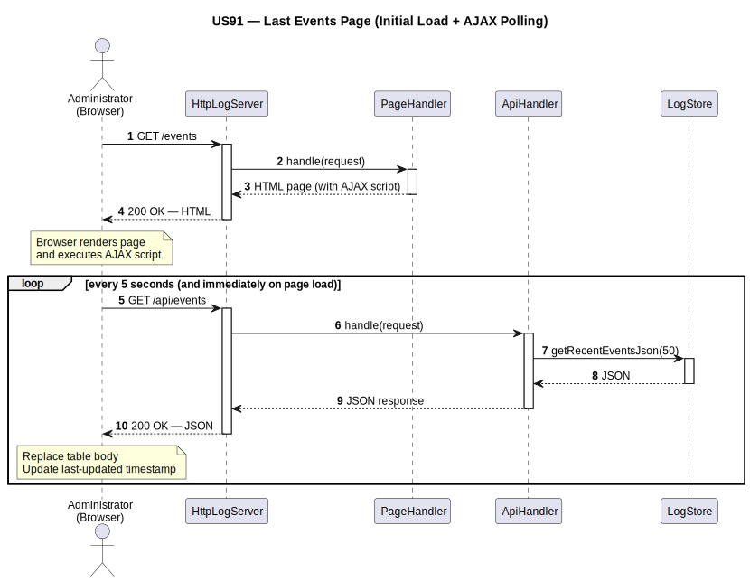
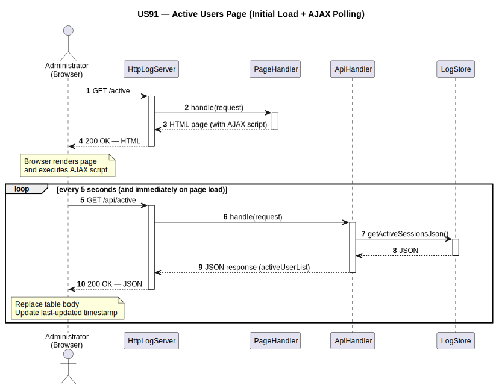
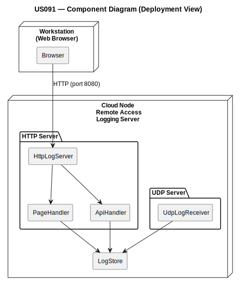

# US91 — Remote Accesses Logging Visualization

## 1. Context

This task is assigned in Sprint 3. It is the first time this feature is being developed.
The objective is to provide the Administrator with a web-based visualization of all remote
access events stored by the Remote Accesses Logging Server, keeping the displayed data
continuously updated without requiring the user to reload the page.

**Assigned to:** Cláudio Pinto

### 1.1 List of Issues

- Analysis: #64 (Remote Accesses Logging Visualization)
- Design: #64 (Remote Accesses Logging Visualization)
- Implement: #64 (Remote Accesses Logging Visualization)
- Test: #64 (Remote Accesses Logging Visualization)

---

## 2. Requirements

**US91** As Administrator, I want to view the logs stored at the Remote Accesses Logging Server.

### Acceptance Criteria

- **US91.1** The Remote Accesses Logging Server application must include an embedded HTTP server
  that serves status pages to clients running a standard web browser.
- **US91.2** At least two pages must be available: a page presenting the list of the last recorded
  remote access events, and a page presenting the list of remote users currently active.
- **US91.3** Both pages must be kept updated to reflect the current state of the system without
  requiring the user to reload the page manually.
- **US91.4** AJAX must be used to update the presented data dynamically.

### Dependencies/References

- US90 — External logging of remote accesses; provides the event data that this US visualizes.
- US44, US78, US86 — The three remote services whose events are logged and displayed.

---

## 3. Analysis

### 3.0 LLM Assistance

Generative AI (Claude, Anthropic) was used to support the analysis and design of this user story.
Below are the main prompts used, the suggestions adopted, and the decisions the team made
independently or where we deviated from the AI output.

---

#### Prompt 1 — Embedded HTTP server without external dependencies

> "We are implementing an embedded HTTP server in a Java application that must serve two HTML pages
> and two JSON endpoints consumed via AJAX. No external frameworks are allowed. What is the simplest
> approach using only the JDK?"

**LLM suggestions adopted:**
- `com.sun.net.httpserver.HttpServer` (built into the JDK) — avoids external dependencies and is
  sufficient for the scope of this use case
- Dedicated handler classes per endpoint, registered on the same server instance
- JSON endpoints read directly from the in-memory event store maintained by US90's UDP receiver —
  no additional persistence layer needed

**Decisions made by the team / deviations from LLM output:**
- The LLM suggested WebSockets for real-time updates — replaced with AJAX polling every 5 seconds,
  as required by the acceptance criteria and simpler to implement
- The LLM proposed a single handler class with conditional routing — split into one class per
  endpoint for clarity and alignment with the Single Responsibility Principle

---

#### Prompt 2 — Deriving active users from the event log

> "Given an in-memory log of remote access events (LOGIN_SUCCESS, LOGIN_FAIL, LOGOUT, DISCONNECT),
> how should we derive the list of currently active users without storing state separately?"

**LLM suggestions adopted:**
- A user is considered active if their last recorded event is LOGIN_SUCCESS with no subsequent
  LOGOUT or DISCONNECT for the same session (username + clientIp + clientPort)
- The derivation is computed on each API request from the shared event store — no separate
  active-users data structure needed

**Decisions made by the team / deviations from LLM output:**
- The LLM suggested maintaining a separate active-users map updated on each event — rejected to
  avoid synchronization complexity; on-demand derivation from the event log is sufficient at the
  5-second polling interval

---

### 3.1 System Architecture

The Remote Accesses Logging Server combines three responsibilities in a single process:

- **UDP Receiver** (US90): listens for UDP datagrams from the TCP servers and appends events to
  the shared store.
- **HTTP Server** (US91): serves HTML pages and JSON endpoints to any web browser.
- **RemoteAccessEventStore**: thread-safe in-memory store shared between the UDP receiver and the
  HTTP handlers.

Both the UDP receiver and the HTTP server run as concurrent threads, sharing the event store
through synchronization.

---

### 3.2 HTTP Endpoints

| Method | Path | Description |
|--------|------|-------------|
| GET | `/` | Redirects to `/events` |
| GET | `/events` | Serves the Last Events HTML page |
| GET | `/active` | Serves the Active Users HTML page |
| GET | `/api/events` | Returns the last recorded events as JSON |
| GET | `/api/active` | Returns the currently active users as JSON |

---

### 3.3 JSON Response Format

**GET /api/events:**

```json
[
  {
    "timestamp": "2026-06-10T14:32:01",
    "username": "weather.person@aisafe.com",
    "clientIp": "192.168.1.45",
    "clientPort": 54321,
    "service": "US44",
    "eventType": "LOGIN_SUCCESS"
  }
]
```

**GET /api/active:**

```json
[
  {
    "username": "atcc.user@airline.com",
    "clientIp": "192.168.1.72",
    "clientPort": 61234,
    "service": "US78",
    "connectedSince": "2026-06-10T14:20:00"
  }
]
```

---

### 3.4 AJAX Update Mechanism

Both pages use the same client-side pattern:

1. On page load, immediately fetch data from the JSON endpoint and render the table.
2. Use `setInterval` to repeat the fetch every 5 seconds.
3. On each interval, replace only the table body (`innerHTML`) with the newly received data.
4. Display a last-updated timestamp so the administrator can confirm data is live.

No external JavaScript libraries are required — native `fetch` API and vanilla DOM manipulation.

---

### 3.5 Key Classes

| Class | Location | Responsibility |
|-------|----------|---------------|
| `HttpLogServer` | `rcomp/us091/src/` | Registers all endpoint handlers and starts the HTTP server thread |
| `PageHandler` | `rcomp/us091/src/` | Serves both `/events` and `/active` HTML pages (param: page name) |
| `ApiHandler` | `rcomp/us091/src/` | Serves both `/api/events` and `/api/active` JSON endpoints (param: activeOnly bool) |
| `LogStore` | `rcomp/us090/src/` | Thread-safe in-memory store shared between UDP receiver and HTTP handlers |

---

### 3.6 Acceptance Tests

**AT1 — Last events page accessible via browser (US91.1)**

Given the Remote Accesses Logging Server is running,
When an administrator navigates to `/events` in a standard web browser,
Then an HTML page is rendered showing a table of the most recently recorded remote access events.

**AT2 — Active users page accessible via browser (US91.2)**

Given the Remote Accesses Logging Server is running and at least one remote user is connected,
When an administrator navigates to `/active` in a standard web browser,
Then an HTML page is rendered showing a table of currently active remote users.

**AT3 — Pages update without reload (US91.3, US91.4)**

Given an administrator has the events page open in a browser,
When a new remote access event is received by the UDP server,
Then within 5 seconds the new event appears in the table without the administrator reloading
the page.

**AT4 — Active user removed after logout (US91.2, US91.3)**

Given an administrator has the active users page open and a remote user is listed as active,
When that user disconnects or logs out and the event is received by the UDP server,
Then within 5 seconds the user is removed from the active users table without a page reload.

---

## 4. Design

### 4.1 Realization

Two sequence diagrams are provided:

- **SD1** — Last Events page: initial load and AJAX polling cycle.
**SD2** — Active Users page: initial load and AJAX polling cycle.



*PlantUML source: `sds/uml/sd_us91_events_page.puml`*



*PlantUML source: `sds/uml/sd_us91_active_users_page.puml`*

**Component Diagram — Client-Server-Architecture:**



*PlantUML source: `sds/uml/component_us091_client_server.puml`*

---

## 5. Implementation

| File | Responsibility |
|------|---------------|
| `HttpLogServer.java` | Starts HTTP server; registers all handlers |
| `PageHandler.java` | Serves `/events` and `/active` HTML pages |
| `ApiHandler.java` | Serves `/api/events` and `/api/active` JSON |
| `LogStore.java` (us090) | Thread-safe in-memory event store (shared with US90) |

---

## 6. Integration/Demonstration

To demonstrate this user story:

1. Start the Remote Accesses Logging Server (US90 must be running and receiving events).
2. Open a web browser and navigate to `http://<server-ip>:<port>/events`.
3. Verify the last recorded events table is displayed.
4. Navigate to `/active` and verify the active users table is displayed.
5. Trigger a new remote access event (e.g. log in via the Weather Person client, US44).
6. Without reloading the page, verify the new event appears within 5 seconds.
7. Log out from the remote client and verify the user is removed from the active users page
   within 5 seconds.

---

## 7. Observations

- The HTTP server and UDP receiver share `RemoteAccessEventStore` — all access to it must be
  synchronized to avoid race conditions between the two threads.
- Active user derivation is computed on demand per API request. If performance becomes a concern
  with large event logs, a separate maintained map can be introduced without changing the API.
- The 5-second polling interval is a deliberate simplification over WebSockets, as required by
  the acceptance criteria (AJAX).